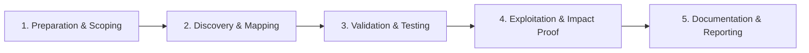

# GraphQL Batching Attacks

Abuse query batching to bypass rate limits and brute force.

## Overview Diagram

Visual summary of the **attack/data flow** and the **five-phase testing workflow** for this topic.

### Attack / Data Flow

<div class="sr-diagram" markdown="1">

```mermaid
sequenceDiagram
    participant A as Attacker
    participant API as GraphQL
    A->>API: Batch 1000 queries in 1 HTTP request
    API->>API: Rate limit bypassed
    API-->>A: Mass data / brute force
classDef attacker fill:#ef4444,stroke:#b91c1c,color:#fff
classDef target fill:#6c3ce0,stroke:#5429c4,color:#fff
classDef tool fill:#f59e0b,stroke:#d97706,color:#1a1a1a
classDef success fill:#10b981,stroke:#059669,color:#fff
classDef warn fill:#f97316,stroke:#ea580c,color:#fff

```

</div>

### Testing Workflow

<div class="sr-diagram sr-diagram-methodology" markdown="1">



</div>

## How It Works

Many GraphQL servers accept an **array of operations** in a single HTTP POST body, executing them sequentially or in parallel and returning an array of results. Libraries such as Apollo Server enable batching by default in some versions. Similarly, **query aliases** let multiple identical or distinct operations run in one request:

```graphql
mutation {
  a: login(user: "victim@corp.com", pass: "0000") { token }
  b: login(user: "victim@corp.com", pass: "0001") { token }
  # ... dozens more aliases
}
```

Rate limiters and WAFs often count **HTTP requests**, not **GraphQL operations**. An attacker can brute-force passwords, OTP codes, or coupon tokens by packing hundreds of attempts into one request that appears as a single API call in logs.

## Exploitation

1. **Identify batch support** — POST `[{"query":"..."},{"query":"..."}]` and observe whether the response is a JSON array.
2. **Baseline rate limits** — Send single login mutations until throttled; record HTTP 429 thresholds and lockout behavior.
3. **Replay as a batch** — Wrap 50–100 login or `verifyOtp` mutations in one array; compare success rate vs. individual requests.
4. **Use aliases for fan-out** — Brute force without arrays if the server rejects batch arrays but allows aliases on one mutation.
5. **Combine with credential stuffing** — Parallel `login` across many users in one batch to evade per-IP limits.
6. **Measure server-side impact** — Note DB connection pool exhaustion or CPU spikes for DoS reporting.
7. **Capture evidence** — Show one HTTP request attempting N passwords and receiving N responses without throttling.

## Defense & Mitigation

- **Disable query batching** on public endpoints unless there is a clear need.
- **Rate-limit by GraphQL operation count and cost**, not only per HTTP request.
- **Apply stricter limits to auth mutations** (`login`, `register`, `resetPassword`, `verifyOtp`) including per-user and per-IP backoff.
- **Cap aliases per query** and reject documents exceeding complexity budgets.
- **Use CAPTCHA or proof-of-work** after a small number of failed auth attempts, regardless of batching.
- **Log and alert** when a single request contains multiple auth mutations.

## Pro Tips

Practical advice from real engagements — use these to test faster and report better.

!!! tip "Array of operations"
    Wrap queries: `[{query: ...}, {query: ...}]` in single POST.

!!! tip "Alias duplication"
    `{ a1: user(id:1){email} a2: user(id:2){email} ... }`

!!! tip "Rate limit bypass"
    Document requests-per-HTTP vs requests-per-operation difference.

!!! warning "OTP brute force"
    Batch 10k OTP attempts if server counts HTTP not operations.

!!! tip "Cost analysis"
    Measure server time vs batch size for DoS report evidence.

## Testing Methodology

Work through each phase in order. Every step has a checkbox — complete them all for thorough, reproducible coverage.

### Phase 1 — Preparation & Scoping

- [ ] Confirm target is in program scope and ROE allows this test type
- [ ] Set up isolated lab or proxy (Burp/ZAP) with scope filters
- [ ] Document baseline application behavior and account roles
- [ ] Identify test accounts for each privilege level
- [ ] Confirm rate limits on GraphQL endpoint

### Phase 2 — Discovery & Mapping

- [ ] Send array of queries in single HTTP request
- [ ] Test alias-based field duplication
- [ ] Measure server response time vs query count
- [ ] Identify auth checks per sub-query

### Phase 3 — Validation & Testing

- [ ] Bypass rate limits with 100+ batched login attempts
- [ ] Brute force OTP or coupon codes via batching
- [ ] Demonstrate DoS with expensive nested queries
- [ ] Compare single vs batch request outcomes

### Phase 4 — Exploitation & Impact Proof

- [ ] Show account enumeration or 2FA bypass via batch
- [ ] Document rate limit bypass with request counts
- [ ] Recommend query cost analysis

### Phase 5 — Documentation & Reporting

- [ ] Write step-by-step reproduction with HTTP requests/responses
- [ ] Capture screenshots or video showing impact (redact sensitive data)
- [ ] Rate severity using program CVSS or impact matrix
- [ ] Provide concrete remediation guidance for developers
- [ ] Retest after fix if program allows verification

## Tools

| Tool | Usage |
|------|-------|
| `burp` | [Intercept, repeater & scanner](../../TOOLS_GUIDE.md#burp-suite) |
| `custom scripts` | [Python/Bash automation for repeatable tests](../../TOOLS_GUIDE.md) |

## Verification Checklist

- [ ] Review scope and rules of engagement
- [ ] Document baseline behavior
- [ ] Test edge cases and parser differentials
- [ ] Capture proof-of-concept safely
- [ ] Write remediation guidance
