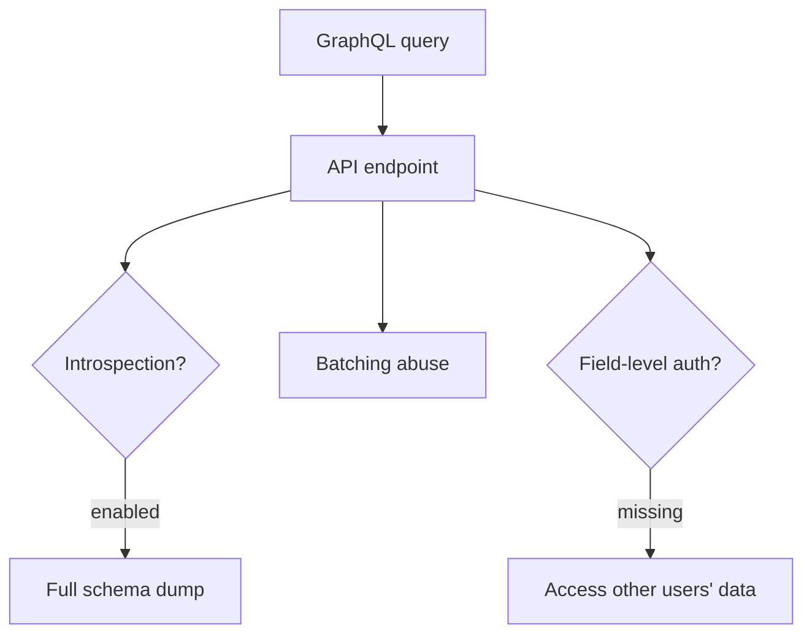
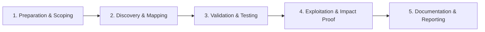

# GraphQL Security

Test GraphQL APIs for introspection, batching, and authorization flaws.

## Overview Diagram

Visual summary of the **attack/data flow** and the **five-phase testing workflow** for this topic.

### Attack / Data Flow

### Testing Workflow

## How It Works

GraphQL exposes a single HTTP endpoint (typically `/graphql`) where clients send declarative queries describing exactly which fields and nested objects they need. Unlike REST, the server resolves a graph of types—`Query`, `Mutation`, and `Subscription`—and fetches only requested fields. This flexibility creates a distinct attack surface:

- **Schema introspection** (`__schema`, `__type`) can reveal the entire data model, including admin-only mutations and sensitive fields.
- **Depth and complexity** are unbounded unless the server enforces limits; deeply nested queries can cause denial of service or expensive database joins.
- **Batching and aliases** let attackers send dozens of operations in one HTTP request, often bypassing per-request rate limits.
- **Authorization is field-level**, not route-level: a resolver may check auth on `getUser` but forget `user.email` or nested `user.orders.paymentMethod`.
- **Persisted queries, subscriptions, and file uploads** add secondary endpoints that are easy to misconfigure.

Common stacks (Apollo Server, Hasura, Strawberry, gqlgen) differ in default introspection, batching, and depth-limit behavior—always test the deployed configuration, not assumptions from the framework docs.

## Exploitation

1. **Discover the endpoint** — Probe `/graphql`, `/api/graphql`, `/v1/graphql`, and check JS bundles, mobile traffic, and `robots.txt` for references.
2. **Confirm GraphQL** — POST a minimal query such as `{"query":"{ __typename }"}`; a JSON body with `data` or `errors` confirms GraphQL.
3. **Run introspection** — If enabled, dump the schema with standard introspection queries or tools like `clairvoyance`, `graphql-cop`, or Burp's InQL extension.
4. **Map authorization gaps** — For each sensitive type/mutation, replay requests as an unauthenticated user, low-privilege user, and victim user (IDOR via global IDs or relay cursors).
5. **Test batching and aliases** — Send arrays of login/OTP mutations or alias multiple `user(id: N)` fields in one query to bypass rate limits.
6. **Stress depth/complexity** — Gradually increase nesting (`user { friends { friends { ... } } }`) and argument fan-out to find DoS or data-leak via over-fetching.
7. **Hunt debug surfaces** — GraphiQL, GraphQL Playground, Voyager, and Apollo Studio sandbox endpoints often ship enabled in staging.
8. **Document impact** — Show concrete data exposure or auth bypass with minimal reproducible queries; note whether WAF/CDN blocks introspection but allows equivalent hand-crafted queries.

## Defense & Mitigation

- **Disable introspection in production** (or restrict to authenticated admin roles behind network controls); treat schema as sensitive intellectual property.
- **Enforce query cost limits**: max depth, max complexity/aliases, pagination defaults, and timeouts on resolver execution.
- **Apply authorization at every resolver**, including nested fields and list items—use a consistent policy layer (e.g., field-level ACLs, Open Policy Agent).
- **Rate-limit by operation and user**, not only by HTTP request; reject or split batched arrays when abuse is detected.
- **Disable batching** on authentication-sensitive endpoints if not required.
- **Use persisted/allowlisted queries** for mobile and public clients where feasible.
- **Log query names, complexity scores, and anomalies**; alert on introspection attempts and high-cost queries.
- **Remove GraphiQL/Playground** from internet-facing deployments; follow the [OWASP GraphQL Cheat Sheet](https://cheatsheetseries.owasp.org/cheatsheets/GraphQL_Cheat_Sheet.html).

## Testing Methodology

Work through each phase in order. Every step has a checkbox — complete them all for thorough, reproducible coverage.

### Phase 1 — Preparation & Scoping

- [ ] Confirm target is in program scope and ROE allows this test type
- [ ] Set up isolated lab or proxy (Burp/ZAP) with scope filters
- [ ] Document baseline application behavior and account roles
- [ ] Identify test accounts for each privilege level
- [ ] Obtain GraphQL endpoint and test credentials for each role

### Phase 2 — Discovery & Mapping

- [ ] Run introspection query or clairvoyance if disabled
- [ ] Map types, queries, mutations, and subscriptions
- [ ] Identify sensitive fields (PII, admin, payment)
- [ ] Review batching and alias abuse potential

### Phase 3 — Validation & Testing

- [ ] Test field-level auth on every mutation
- [ ] Replay operations as unauthenticated and low-priv user
- [ ] Fuzz variables for injection and IDOR
- [ ] Test depth/complexity limits for DoS

### Phase 4 — Exploitation & Impact Proof

- [ ] Extract unauthorized data via IDOR or introspection
- [ ] Demonstrate batching brute-force if applicable
- [ ] Show cost/DoS impact with measured query complexity

### Phase 5 — Documentation & Reporting

- [ ] Write step-by-step reproduction with HTTP requests/responses
- [ ] Capture screenshots or video showing impact (redact sensitive data)
- [ ] Rate severity using program CVSS or impact matrix
- [ ] Provide concrete remediation guidance for developers
- [ ] Retest after fix if program allows verification
- [ ] Recommend disabling introspection in prod and field-level auth

## Tools

| Tool | Usage |
|------|-------|
| `clairvoyance` | [GraphQL schema recovery](../../TOOLS_GUIDE.md#clairvoyance) |
| `graphql-voyager` | [Schema visualization](https://github.com/graphql-kit/graphql-voyager) |
| `burp` | [Intercept, repeater & scanner](../../TOOLS_GUIDE.md#burp-suite) |
| `inql` | [GraphQL security (Burp)](https://github.com/doyensec/inql) |

## Resources

- [OWASP GraphQL Cheat Sheet](https://cheatsheetseries.owasp.org/cheatsheets/GraphQL_Cheat_Sheet.html)

## Verification Checklist

- [ ] Review scope and rules of engagement
- [ ] Document baseline behavior
- [ ] Test edge cases and parser differentials
- [ ] Capture proof-of-concept safely
- [ ] Write remediation guidance
