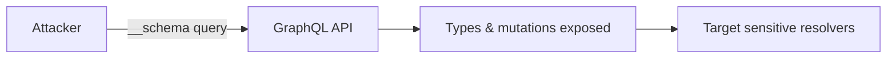
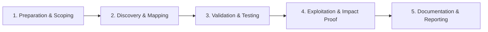

# GraphQL Introspection

Enumerate schema when introspection is enabled.

## Overview Diagram

Visual summary of the **attack/data flow** and the **five-phase testing workflow** for this topic.

### Attack / Data Flow

### Testing Workflow

## How It Works

GraphQL introspection is a built-in meta-query capability defined in the GraphQL specification. Clients can query special fields `__schema` and `__type` to discover all types, fields, arguments, enums, interfaces, and directives the server supports. A standard introspection query recursively walks `queryType`, `mutationType`, and `subscriptionType`, exporting names like `adminDeleteUser`, `internalApiKey`, or `ssn` that were never documented publicly.

Introspection is invaluable during development but dangerous when exposed to attackers: it turns black-box API testing into full schema-driven fuzzing. Some frameworks disable it by default in production; others require explicit configuration. WAF rules that block the word `__schema` are brittle—attackers can use fragments, whitespace tricks, or pre-built schema files from CI leaks.

## Exploitation

1. **Send the standard introspection query** — Use Burp, `curl`, or `graphql-cli` with the full `IntrospectionQuery` payload against `/graphql`.
2. **Try variants if blocked** — Alternate HTTP methods (GET with `query` param), different `Content-Type` values, or POST to `/graphql?query=` endpoints used by some CDNs.
3. **Check staging and old hosts** — Staging, preview, and legacy subdomains often leave introspection enabled while production disables it.
4. **Use blind schema recovery** — If introspection is disabled, tools like `clairvoyance` infer the schema from error messages (`Cannot query field "foo" on type "Query"`).
5. **Prioritize high-value types** — Search exported SDL for `Mutation` names containing `admin`, `internal`, `delete`, `export`, `impersonate`, `password`.
6. **Cross-reference with auth** — For each discovered mutation, test without tokens, with expired tokens, and across user roles.
7. **Export for automation** — Feed the schema into `graphql-voyager`, custom fuzzers, or InQL to systematically test every field.

## Defense & Mitigation

- **Turn off introspection in production** via server config (Apollo: `introspection: false`; Hasura: disable from console settings).
- **Never rely on WAF keyword blocking alone**; enforce at the GraphQL execution layer.
- **Restrict schema access** to CI, schema registry, and internal VPN if developers need SDL at runtime.
- **Return generic errors** in production to hinder clairvoyance-style inference.
- **Audit deployments** so preview environments are not publicly routable without auth.
- **Monitor for `__schema` and `__type` in request bodies** and alert on spikes.

## Pro Tips

Practical advice from real engagements — use these to test faster and report better.

!!! tip "GET introspection"
    Some servers allow introspection via GET query param.

!!! tip "GraphiQL exposure"
    /graphiql, /playground, /console — often have introspection on.

!!! tip "Staging only?"
    Production may block introspection but staging.graphql.target.com may not.

!!! tip "Partial introspection"
    Some fields hidden but mutations still listed — read carefully.

!!! tip "Save schema"
    Export schema JSON for offline analysis and IDOR field hunting.

## Testing Methodology

Work through each phase in order. Every step has a checkbox — complete them all for thorough, reproducible coverage.

### Phase 1 — Preparation & Scoping

- [ ] Confirm target is in program scope and ROE allows this test type
- [ ] Set up isolated lab or proxy (Burp/ZAP) with scope filters
- [ ] Document baseline application behavior and account roles
- [ ] Identify test accounts for each privilege level
- [ ] Locate GraphQL endpoint URLs

### Phase 2 — Discovery & Mapping

- [ ] Send `__schema` and `__type` introspection queries
- [ ] Try clairvoyance wordlist recovery if blocked
- [ ] Check GET vs POST introspection
- [ ] Review GraphiQL/Playground exposure

### Phase 3 — Validation & Testing

- [ ] Validate full schema download
- [ ] Identify hidden admin mutations
- [ ] Compare introspection across environments
- [ ] Test introspection with auth vs without

### Phase 4 — Exploitation & Impact Proof

- [ ] Document sensitive types discovered via schema
- [ ] Map unauthorized mutations for further testing
- [ ] Do not exfiltrate production user data

### Phase 5 — Documentation & Reporting

- [ ] Write step-by-step reproduction with HTTP requests/responses
- [ ] Capture screenshots or video showing impact (redact sensitive data)
- [ ] Rate severity using program CVSS or impact matrix
- [ ] Provide concrete remediation guidance for developers
- [ ] Retest after fix if program allows verification

## Tools

| Tool | Usage |
|------|-------|
| `clairvoyance` | [GraphQL schema recovery](../../TOOLS_GUIDE.md#clairvoyance) |
| `graphql-cop` | [GraphQL security audit](https://github.com/dolevf/graphql-cop) |

## Verification Checklist

- [ ] Review scope and rules of engagement
- [ ] Document baseline behavior
- [ ] Test edge cases and parser differentials
- [ ] Capture proof-of-concept safely
- [ ] Write remediation guidance
