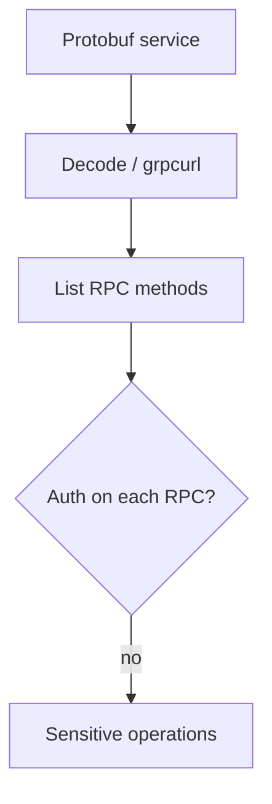
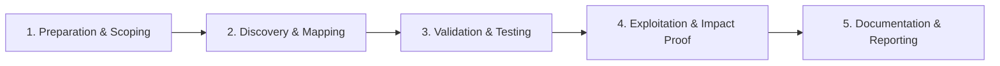

# gRPC & Protobuf

Test gRPC services and protobuf-encoded APIs.

## Overview Diagram

Visual summary of the **attack/data flow** and the **five-phase testing workflow** for this topic.

### Attack / Data Flow

### Testing Workflow

## How It Works

gRPC uses HTTP/2 with Protocol Buffers (protobuf) for compact binary messages. Services expose RPC methods (`/package.Service/Method`) instead of REST paths. **gRPC server reflection** allows clients to list services and message types at runtime—similar to GraphQL introspection. Many internal microservices speak gRPC on ports like 50051, sometimes exposed through gRPC-Web, Envoy transcoding, or misconfigured load balancers.

Protobuf is not encryption: messages can be decoded with a `.proto` file or inferred via reflection. Metadata headers carry JWTs and API keys; mTLS is optional and often missing on "internal" networks reachable from SSRF or VPN gaps.

## Exploitation

1. **Discover gRPC ports** — Scan for 50051, 443 with HTTP/2, and `content-type: application/grpc` responses.
2. **Enable reflection** — `grpcurl -plaintext host:50051 list` or `grpcui` to enumerate services when reflection is on.
3. **Obtain `.proto` files** — From repos, APKs, reflection, or transcoding gateway configs; use `protoc` or Burp gRPC assistant to craft messages.
4. **Call methods without auth** — Invoke `GetUser`, `Admin`, `Export` RPCs with empty or forged metadata.
5. **Fuzz fields** — Protobuf parsers may ignore unknown fields; test oversized strings, negative IDs, and enum overflows.
6. **Test metadata tokens** — Replay JWTs across services; try missing/alternate `:authority` headers.
7. **Exploit gRPC-Web bridges** — Browser-facing transcoding may weaken auth applied on native gRPC hops.
8. **SSRF to gRPC** — If an app can reach internal gRPC, pivot from HTTP SSRF to binary RPC calls.

## Defense & Mitigation

- **Disable server reflection in production**; distribute protos only through secure artifact registries.
- **Require mTLS and/or signed JWTs** on every RPC; enforce per-method authorization.
- **Do not expose raw gRPC to the internet**; use API gateways with policy enforcement.
- **Network segmentation** so only trusted meshes (service mesh sidecars) can reach gRPC backends.
- **Validate all protobuf fields** server-side; never trust client-supplied IDs for access control.
- **Log RPC method, peer identity, and latency**; alert on reflection probes and unauthenticated calls.

## Testing Methodology

Work through each phase in order. Every step has a checkbox — complete them all for thorough, reproducible coverage.

### Phase 1 — Preparation & Scoping

- [ ] Confirm target is in program scope and ROE allows this test type
- [ ] Set up isolated lab or proxy (Burp/ZAP) with scope filters
- [ ] Document baseline application behavior and account roles
- [ ] Identify test accounts for each privilege level
- [ ] Identify gRPC ports and .proto definitions if available

### Phase 2 — Discovery & Mapping

- [ ] Use grpcurl to list services and methods
- [ ] Decode protobuf with grpcui or custom descriptors
- [ ] Intercept gRPC-over-HTTP/2 in Burp
- [ ] Map authentication metadata headers

### Phase 3 — Validation & Testing

- [ ] Fuzz each RPC with malformed protobuf
- [ ] Test auth on every method independently
- [ ] Replay privileged RPCs with low-priv metadata
- [ ] Check reflection service exposure

### Phase 4 — Exploitation & Impact Proof

- [ ] Call sensitive RPC without authorization
- [ ] Demonstrate data read or state change
- [ ] Document service/method names and impact

### Phase 5 — Documentation & Reporting

- [ ] Write step-by-step reproduction with HTTP requests/responses
- [ ] Capture screenshots or video showing impact (redact sensitive data)
- [ ] Rate severity using program CVSS or impact matrix
- [ ] Provide concrete remediation guidance for developers
- [ ] Retest after fix if program allows verification
- [ ] Disable reflection in production; enforce per-RPC auth

## Tools

| Tool | Usage |
|------|-------|
| `grpcurl` | [gRPC CLI client](../../TOOLS_GUIDE.md#grpcurl) |
| `grpcui` | gRPC web UI — [fullstorydev/grpcui](https://github.com/fullstorydev/grpcui) |
| `burp grpc assistant` | [gRPC testing in Burp](../../TOOLS_GUIDE.md#burp-suite) |

## Resources

- [gRPC Security](https://grpc.io/docs/guides/auth/)

## Verification Checklist

- [ ] Review scope and rules of engagement
- [ ] Document baseline behavior
- [ ] Test edge cases and parser differentials
- [ ] Capture proof-of-concept safely
- [ ] Write remediation guidance
