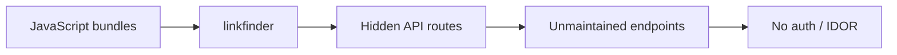
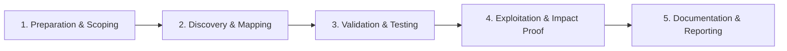

# Shadow & Zombie APIs

Uncover undocumented and forgotten API endpoints.

## Overview Diagram

Visual summary of the **attack/data flow** and the **five-phase testing workflow** for this topic.

### Attack / Data Flow

### Testing Workflow

## How It Works

**Shadow APIs** are undocumented endpoints—microservices, serverless functions, admin panels, or feature branches reachable in production but absent from official docs. **Zombie APIs** are formerly documented services that should have been retired but still accept traffic (old load balancer rules, forgotten containers, or DNS to decommissioned environments that were cloned).

They often lack WAF coverage, OAuth scopes, audit logging, and patch cadence. Discovery vectors include JavaScript bundles, mobile apps, proxy logs, certificate transparency, cloud API gateways, and leaked OpenAPI files in `.git` or S3 buckets.

## Exploitation

1. **Mine client-side code** — Run `LinkFinder`, `katana`, and `nuclei` on JS bundles for `/api/`, `/internal/`, GraphQL, and WebSocket URLs.
2. **Intercept mobile traffic** — Proxy iOS/Android apps to find alternate base URLs and hidden REST/gRPC backends.
3. **Scan for spec leaks** — Probe `/swagger.json`, `/openapi.yaml`, `/api-docs`, `/redoc`, and `/.well-known/` paths.
4. **Review infrastructure** — Cloud API Gateway stages, Lambda function URLs, and Kubernetes ingress rules may expose services engineers forgot.
5. **Use historical data** — `gau`, Wayback Machine, and breach dumps for old subdomains and paths.
6. **Diff deployments** — Compare responses before/after releases; new routes sometimes appear without documentation.
7. **Test without auth** — Shadow endpoints frequently ship before auth middleware is wired up.
8. **Chain findings** — A zombie admin API on `staging-api.example.com` may share production credentials.

## Defense & Mitigation

- **Central API gateway** with mandatory auth, logging, and schema registration for all public traffic.
- **Automated asset inventory** tied to CI/CD—block deploy if routes are not registered.
- **Decommission runbooks**: remove DNS, certs, LB rules, and cloud resources together; verify with external scans.
- **Restrict internal hostnames** to private networks; never reuse production secrets on shadow environments.
- **Scan repositories and buckets** for OpenAPI leaks; rotate any exposed keys.
- **Continuous external attack surface monitoring** (EASM) to detect unknown endpoints early.

## Pro Tips

Practical advice from real engagements — use these to test faster and report better.

!!! tip "linkfinder on JS"
    `python linkfinder.py -i https://target.com/app.js -o cli`

!!! tip "wayback URLs"
    Old API paths in Wayback Machine still respond on legacy servers.

!!! tip "APK strings"
    `strings app.apk | grep -i api` finds hidden endpoints.

!!! tip "Swagger leaks"
    /swagger.json, /openapi.json, /api-docs — unauthenticated docs.

!!! tip "404 vs 401"
    Shadow APIs often return 401 not 404 — fuzz paths and watch auth differences.

## Testing Methodology

Work through each phase in order. Every step has a checkbox — complete them all for thorough, reproducible coverage.

### Phase 1 — Preparation & Scoping

- [ ] Confirm target is in program scope and ROE allows this test type
- [ ] Set up isolated lab or proxy (Burp/ZAP) with scope filters
- [ ] Document baseline application behavior and account roles
- [ ] Identify test accounts for each privilege level
- [ ] Collect JS bundles, mobile apps, and old documentation

### Phase 2 — Discovery & Mapping

- [ ] Run linkfinder and katana on all web assets
- [ ] Extract API paths from APK/IPA strings
- [ ] Search Swagger/OpenAPI leaks and Postman collections
- [ ] Review GitHub for exposed API specs

### Phase 3 — Validation & Testing

- [ ] Probe discovered endpoints for responses
- [ ] Compare auth on shadow vs documented APIs
- [ ] Test zombie endpoints still accepting requests
- [ ] Map internal/staging APIs referenced in code

### Phase 4 — Exploitation & Impact Proof

- [ ] Demonstrate IDOR or missing auth on hidden API
- [ ] Document discovery source (JS line, app version)
- [ ] Report zombie endpoints for decommission

### Phase 5 — Documentation & Reporting

- [ ] Write step-by-step reproduction with HTTP requests/responses
- [ ] Capture screenshots or video showing impact (redact sensitive data)
- [ ] Rate severity using program CVSS or impact matrix
- [ ] Provide concrete remediation guidance for developers
- [ ] Retest after fix if program allows verification

## Tools

| Tool | Usage |
|------|-------|
| `linkfinder` | [JS endpoint discovery](../../TOOLS_GUIDE.md#linkfinder) |
| `katana` | [Web crawler](../../TOOLS_GUIDE.md#katana) |
| `nuclei` | [Template-based vuln scanner](../../TOOLS_GUIDE.md#nuclei) |

## Verification Checklist

- [ ] Review scope and rules of engagement
- [ ] Document baseline behavior
- [ ] Test edge cases and parser differentials
- [ ] Capture proof-of-concept safely
- [ ] Write remediation guidance
