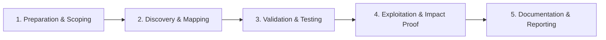

# API Versioning Issues

Find deprecated API versions with weaker security controls.

## Overview Diagram

Visual summary of the **attack/data flow** and the **five-phase testing workflow** for this topic.

### Attack / Data Flow

<div class="sr-diagram" markdown="1">

```mermaid
flowchart TD
    V1[/api/v1 deprecated] --> OLD[Weak auth / debug]
    V2[/api/v2 current] --> NEW[Hardened]
    A[Attacker] --> V1
    OLD --> BYPASS[Bypass v2 controls]
classDef attacker fill:#ef4444,stroke:#b91c1c,color:#fff
classDef target fill:#6c3ce0,stroke:#5429c4,color:#fff
classDef tool fill:#f59e0b,stroke:#d97706,color:#1a1a1a
classDef success fill:#10b981,stroke:#059669,color:#fff
classDef warn fill:#f97316,stroke:#ea580c,color:#fff

```

</div>

### Testing Workflow

<div class="sr-diagram sr-diagram-methodology" markdown="1">



</div>

## How It Works

APIs evolve through versioned paths (`/v1/`, `/v2/`), headers (`Accept-Version`, `X-Api-Version`), query parameters, or separate hostnames (`api-old.example.com`). Teams frequently ship stricter auth, input validation, and rate limiting on new versions while **legacy versions remain online** for mobile apps, partners, or internal tools.

This creates a **version skew** vulnerability class (related to OWASP API #9 Improper Inventory Management): attackers target deprecated endpoints that still accept weak API keys, lack MFA checks, expose verbose errors, or skip object-level authorization added only in newer code paths.

## Exploitation

1. **Enumerate versions** — Fuzz `/v1`, `/v2`, `/v3`, `/beta`, `/internal`, `/mobile`, `/legacy`, and date-stamped paths (`/2023-01/`).
2. **Compare OpenAPI/Swagger** — Diff `/swagger/v1/swagger.json` vs `/v2/` for removed auth requirements or extra endpoints.
3. **Replay attacks across versions** — Take a blocked IDOR or auth bypass payload from `/v2/users/123` and retry on `/v1/users/123`.
4. **Inspect mobile apps** — Hardcoded base URLs often point at older API versions with weaker controls.
5. **Check version headers** — Send `X-Api-Version: 1` on routes that default to v2 behavior.
6. **Hunt debug builds** — `/v1/debug`, `/v2/test`, and feature-flagged routes may exist only in specific versions.
7. **Document differential behavior** — Show the same token or none at all succeeding only on the legacy path.

## Defense & Mitigation

- **Maintain an authoritative API inventory** with owner, auth model, and sunset date for every version.
- **Deprecate aggressively**: return `Sunset` headers, monitor traffic, then decommission old versions on a fixed timeline.
- **Backport critical security fixes** to all supported versions or force client upgrades.
- **Apply consistent authorization middleware** shared across versions, not copy-pasted per router.
- **Block internet access** to internal/beta versions; require VPN or mTLS.
- **Automate contract tests** so new security controls cannot ship only in the latest route tree.

## Testing Methodology

Work through each phase in order. Every step has a checkbox — complete them all for thorough, reproducible coverage.

### Phase 1 — Preparation & Scoping

- [ ] Confirm target is in program scope and ROE allows this test type
- [ ] Set up isolated lab or proxy (Burp/ZAP) with scope filters
- [ ] Document baseline application behavior and account roles
- [ ] Identify test accounts for each privilege level
- [ ] Discover API versions: /v1/, /v2/, headers, Accept types

### Phase 2 — Discovery & Mapping

- [ ] Fuzz version numbers and deprecated paths
- [ ] Compare auth between old and new versions
- [ ] Find debug endpoints only in old versions
- [ ] Review changelog and mobile app for legacy APIs

### Phase 3 — Validation & Testing

- [ ] Access v1 endpoints with weaker auth from v2
- [ ] Test removed IDOR fixes still present in v1
- [ ] Validate shadow APIs in mobile binaries
- [ ] Document version sunset policy gaps

### Phase 4 — Exploitation & Impact Proof

- [ ] Demonstrate bypass of v2 security via v1
- [ ] Show data access only possible on deprecated API
- [ ] Recommend version deprecation and uniform auth

### Phase 5 — Documentation & Reporting

- [ ] Write step-by-step reproduction with HTTP requests/responses
- [ ] Capture screenshots or video showing impact (redact sensitive data)
- [ ] Rate severity using program CVSS or impact matrix
- [ ] Provide concrete remediation guidance for developers
- [ ] Retest after fix if program allows verification

## Tools

| Tool | Usage |
|------|-------|
| `ffuf` | [Web fuzzer](../../TOOLS_GUIDE.md#ffuf) |
| `burp` | [Intercept, repeater & scanner](../../TOOLS_GUIDE.md#burp-suite) |
| `kiterunner` | [API route brute force](../../TOOLS_GUIDE.md#kiterunner-kr) |

## Resources

- [OWASP API Security Top 10](https://owasp.org/API-Security/)

## Verification Checklist

- [ ] Review scope and rules of engagement
- [ ] Document baseline behavior
- [ ] Test edge cases and parser differentials
- [ ] Capture proof-of-concept safely
- [ ] Write remediation guidance
