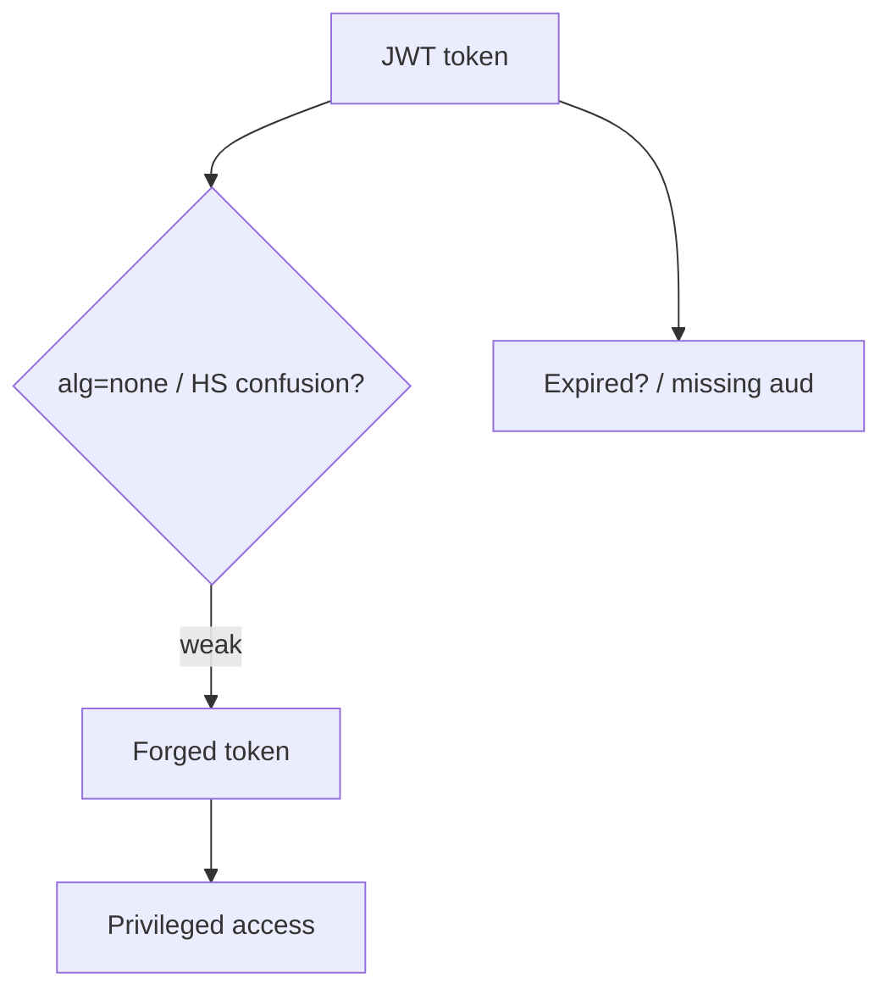
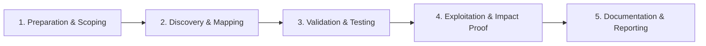

# JWT Attacks

Exploit weak JSON Web Token implementations.

## Overview Diagram

Visual summary of the **attack/data flow** and the **five-phase testing workflow** for this topic.

### Attack / Data Flow

### Testing Workflow

## How It Works

JSON Web Tokens (JWTs) are compact, signed (or MAC'd) claims objects, typically `header.payload.signature` in Base64url. The header declares `alg` (HS256, RS256, etc.); the payload holds claims like `sub`, `role`, and `exp`. Servers verify integrity using a shared secret (HMAC) or public key (RSA/ECDSA).

Common flaws:
- **`alg: none`** — libraries that accept unsigned tokens.
- **Algorithm confusion** — RS256 public key used as HMAC secret (`alg: HS256`).
- **Weak HMAC secrets** — brute-forced `secret`, `password`, `changeme`.
- **`jku` / `x5u` / `kid` abuse** — server fetches attacker-controlled keys.
- **Missing `exp` / `nbf` validation** and accepting tokens after logout.
- **Sensitive data in payload** — JWTs are base64, not encrypted, unless JWE is used.

## Exploitation

1. **Decode the token** — Inspect header and payload in Burp or `jwt.io` (use only for public tokens, not production secrets).
2. **Test `alg: none`** — Change algorithm to `none` and strip the signature; try variants `None`, `NONE`.
3. **Key confusion** — If RS256, embed the public key in an HS256 token and sign with it (`jwt_tool -X k`).
4. **Brute-force HMAC** — `hashcat -a 0 -m 16500 jwt.txt wordlist.txt` or `jwt_tool -C -d wordlist.txt`.
5. **Tamper claims** — Change `role` to `admin`, `sub` to another user ID after forging a valid signature.
6. **`jku` injection** — Point `jku` to attacker-hosted JWK set; host matching public key.
7. **`kid` manipulation** — SQL injection or path traversal in `kid` lookup (`../../../../dev/null` for empty HMAC secret).
8. **Replay expired tokens** — Remove `exp` if verification is lax; test tokens after password change.
9. **Cross-service replay** — Use tokens intended for API A against API B if audience is not checked.

## Defense & Mitigation

- **Allowlist algorithms** server-side; never trust the header's `alg` blindly.
- **Reject `none`** and enforce asymmetric verification with pinned public keys.
- **Use strong secrets** (≥256-bit random) for HMAC; prefer RS256/ES256 for multi-service setups.
- **Validate all standard claims**: `exp`, `nbf`, `iss`, `aud`; use short TTLs and refresh tokens.
- **Disable `jku`/`x5u` fetching** or pin keys; sanitize `kid` resolution (no filesystem/SQL lookups on attacker input).
- **Store revocation state** for logout and compromise; do not put secrets or PII in payloads.
- **Rotate keys** with `kid` versioning; monitor for signature failures and algorithm anomalies.
- Reference [PortSwigger JWT attacks](https://portswigger.net/web-security/jwt) for test cases to block.

## Pro Tips

Practical advice from real engagements — use these to test faster and report better.

!!! tip "jwt_tool all tests"
    `python3 jwt_tool.py TOKEN -M at` runs all attacks.

!!! tip "alg=none"
    Set header `{"alg":"none"}` and remove signature — still works on bad libs.

!!! tip "HS/RS confusion"
    Sign with public key as HMAC secret when server expects RS256.

!!! tip "kid injection"
    `{"kid": "../../dev/key"}` or SQLi in kid field.

!!! tip "Check exp claim"
    Many APIs ignore expiration — test expired tokens.

## Testing Methodology

Work through each phase in order. Every step has a checkbox — complete them all for thorough, reproducible coverage.

### Phase 1 — Preparation & Scoping

- [ ] Confirm target is in program scope and ROE allows this test type
- [ ] Set up isolated lab or proxy (Burp/ZAP) with scope filters
- [ ] Document baseline application behavior and account roles
- [ ] Identify test accounts for each privilege level
- [ ] Collect JWTs for each role and note signing algorithm

### Phase 2 — Discovery & Mapping

- [ ] Decode header and payload (jwt_tool)
- [ ] Check alg=none, HS/RS confusion, weak secrets
- [ ] Review exp, aud, iss claims enforcement
- [ ] Test token in header, cookie, and body

### Phase 3 — Validation & Testing

- [ ] Forge token with modified claims (role, user id)
- [ ] Brute force weak HMAC secrets
- [ ] Swap RS256 public key for self-signed
- [ ] Test expired and revoked token acceptance

### Phase 4 — Exploitation & Impact Proof

- [ ] Escalate to admin with forged JWT
- [ ] Demonstrate account takeover via kid/jku injection
- [ ] Document algorithm and claim bypass

### Phase 5 — Documentation & Reporting

- [ ] Write step-by-step reproduction with HTTP requests/responses
- [ ] Capture screenshots or video showing impact (redact sensitive data)
- [ ] Rate severity using program CVSS or impact matrix
- [ ] Provide concrete remediation guidance for developers
- [ ] Retest after fix if program allows verification
- [ ] Use RS256, validate all claims, rotate keys, short TTL

## Tools

| Tool | Usage |
|------|-------|
| `jwt_tool` | [JWT analysis & attacks](../../TOOLS_GUIDE.md#jwt_tool) |
| `burp` | [Intercept, repeater & scanner](../../TOOLS_GUIDE.md#burp-suite) |

## Resources

- [PortSwigger JWT](https://portswigger.net/web-security/jwt)

## Verification Checklist

- [ ] Review scope and rules of engagement
- [ ] Document baseline behavior
- [ ] Test edge cases and parser differentials
- [ ] Capture proof-of-concept safely
- [ ] Write remediation guidance
