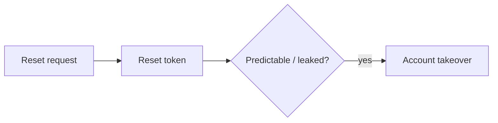
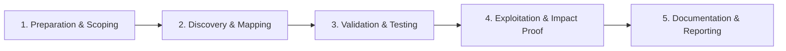

# Password Reset Flaws

Exploit weak password reset and account recovery flows.

## Overview Diagram

Visual summary of the **attack/data flow** and the **five-phase testing workflow** for this topic.

### Attack / Data Flow

### Testing Workflow

## How It Works

Password reset flows typically: (1) user submits an email, (2) server generates a one-time token and emails a link, (3) user clicks the link and sets a new password. Weaknesses appear at every step: **predictable tokens** (timestamp, user ID, weak PRNG), **tokens that never expire or are reusable**, **user enumeration** via different responses, **Host header poisoning** that embeds attacker domains in reset links, **parameter tampering** (`email`, `userId`, `account`), and **race conditions** between token validation and password update.

Some implementations leak tokens in Referer headers, browser history, or server logs; others allow resetting another user's password when only the token is required without re-binding to the initiating session.

## Exploitation

1. **Request reset for your account** — Capture the token format, length, entropy, and URL structure.
2. **Test predictability** — Request multiple tokens; check for sequential IDs, base64-encoded emails, or HMAC with weak secrets.
3. **Host / X-Forwarded-Host poisoning** — Submit reset with `Host: evil.com` and see if the email link points to the attacker domain.
4. **Token reuse** — Complete a reset, then reuse the same link; try using one token twice in parallel tabs.
5. **Change email parameter** — Modify `email` or `user_id` in POST body while using another user's token (or none).
6. **Race conditions** — Send concurrent reset-completion requests with the same token using Burp Turbo Intruder.
7. **Enumerate users** — Compare timing, status codes, and message text for valid vs invalid accounts.
8. **Intercept delivery** — If SMS reset, test SIM-swap social paths; if security questions exist, test weak answers.
9. **Check mobile deep links** — Custom URL schemes may pass tokens without HTTPS.

## Defense & Mitigation

- **Generate tokens with CSPRNG** (≥128 bits); store only a hashed token server-side.
- **Single-use, short TTL** (15–60 minutes); invalidate all sessions after reset.
- **Bind tokens to user agent or session** where UX allows; require current password for logged-in users.
- **Ignore client Host headers**; build reset URLs from a configured canonical base URL.
- **Uniform responses** — always return "If an account exists, we sent email".
- **Rate-limit reset requests** per email and IP; monitor brute-force on token endpoints.
- **Use HTTPS-only links**; add `Referrer-Policy: no-referrer` on reset pages.
- Follow the [OWASP Forgot Password Cheat Sheet](https://cheatsheetseries.owasp.org/cheatsheets/Forgot_Password_Cheat_Sheet.html).

## Testing Methodology

Work through each phase in order. Every step has a checkbox — complete them all for thorough, reproducible coverage.

### Phase 1 — Preparation & Scoping

- [ ] Confirm target is in program scope and ROE allows this test type
- [ ] Set up isolated lab or proxy (Burp/ZAP) with scope filters
- [ ] Document baseline application behavior and account roles
- [ ] Identify test accounts for each privilege level
- [ ] Create two test accounts for reset flow testing

### Phase 2 — Discovery & Mapping

- [ ] Map reset request, token delivery, and password change steps
- [ ] Analyze token format: random, JWT, timestamp
- [ ] Check token binding to email/session/IP
- [ ] Review rate limiting on reset requests

### Phase 3 — Validation & Testing

- [ ] Reuse reset token after password change
- [ ] Modify userId/email in reset POST body
- [ ] Brute force short tokens
- [ ] Hostile subdomain takeover on reset link domain

### Phase 4 — Exploitation & Impact Proof

- [ ] Take over account via token leak or parameter tampering
- [ ] Demonstrate host header poisoning on reset email
- [ ] Document full chain with timestamps

### Phase 5 — Documentation & Reporting

- [ ] Write step-by-step reproduction with HTTP requests/responses
- [ ] Capture screenshots or video showing impact (redact sensitive data)
- [ ] Rate severity using program CVSS or impact matrix
- [ ] Provide concrete remediation guidance for developers
- [ ] Retest after fix if program allows verification
- [ ] Use single-use cryptographic tokens bound to user session

## Tools

| Tool | Usage |
|------|-------|
| `burp` | [Intercept, repeater & scanner](../../TOOLS_GUIDE.md#burp-suite) |

## Resources

- [OWASP Forgot Password](https://cheatsheetseries.owasp.org/cheatsheets/Forgot_Password_Cheat_Sheet.html)

## Verification Checklist

- [ ] Review scope and rules of engagement
- [ ] Document baseline behavior
- [ ] Test edge cases and parser differentials
- [ ] Capture proof-of-concept safely
- [ ] Write remediation guidance
