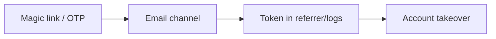
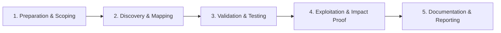

# Passwordless & WebAuthn

Test magic links, OTP, and passkey implementations.

## Overview Diagram

Visual summary of the **attack/data flow** and the **five-phase testing workflow** for this topic.

### Attack / Data Flow

### Testing Workflow

## How It Works

Passwordless authentication replaces passwords with **magic links** (email URLs with embedded tokens), **OTP codes** (SMS/email/TOTP), or **WebAuthn/FIDO2 passkeys** (public-key cryptography bound to origin and challenge). Each mechanism has distinct risks:

- Magic links: token entropy, transport security, device sharing, open redirects on landing URLs.
- OTP: short code brute force, race conditions, SIM swapping, lack of attempt limits.
- WebAuthn: incorrect `rpId` validation, missing challenge binding, permissive `userVerification`, and account enumeration via credential ID lookup.

Because there is no password, **the token or authenticator becomes the sole secret**—any guessable or interceptable factor fully compromises the account.

## Exploitation

1. **Magic link analysis** — Request a link; inspect token length, encoding, and whether it works after multiple uses or from different IPs.
2. **Brute-force OTP** — If 4–6 digit codes, attempt all combinations with parallel requests; test whether lockout applies per session vs per IP.
3. **Bypass delivery** — Register with attacker-controlled email/phone on victim alias (plus addressing, disposable domains) if verification is weak.
4. **Fixation** — Start login on attacker device, trick victim into completing WebAuthn on attacker's session if challenges are not bound.
5. **Enumerate accounts** — Different errors for registered vs unregistered emails or WebAuthn credential IDs.
6. **Race OTP validation** — Submit the same code simultaneously from multiple clients before invalidation.
7. **Deep link hijacking** — Mobile apps handling magic links via intents may leak tokens to other apps.
8. **WebAuthn downgrade** — Force `userVerification: discouraged` or cross-origin flows if the server allows it.

## Defense & Mitigation

- **High-entropy, single-use tokens** for magic links; expire within minutes.
- **Rate-limit OTP verification** aggressively; use 6+ digit or alphanumeric codes with lockout and backoff.
- **Bind challenges to session** for WebAuthn; verify `origin`, `rpId`, and `challenge` server-side.
- **Require user verification** (biometric/PIN) for sensitive accounts.
- **Uniform messaging** to prevent account enumeration.
- **Prefer WebAuthn over SMS OTP** where possible; monitor SIM-swap risk for SMS.
- **Invalidate sessions** after passwordless login on new devices; notify users of new sign-ins.
- See [WebAuthn Guide](https://webauthn.guide/) for implementation details.

## Pro Tips

Practical advice from real engagements — use these to test faster and report better.

!!! tip "Magic link leakage"
    Check Referer header leaks token to third-party resources.

!!! tip "OTP rate limits"
    Test 6-digit OTP — 1M combos need rate limit or lockout.

!!! tip "Same link twice"
    Magic links should be single-use — test double redemption.

!!! tip "WebAuthn challenge"
    Replay old challenge/response if server doesn't store nonce.

!!! tip "Email pre-account"
    Request magic link for unregistered email — user enumeration.

## Testing Methodology

Work through each phase in order. Every step has a checkbox — complete them all for thorough, reproducible coverage.

### Phase 1 — Preparation & Scoping

- [ ] Confirm target is in program scope and ROE allows this test type
- [ ] Set up isolated lab or proxy (Burp/ZAP) with scope filters
- [ ] Document baseline application behavior and account roles
- [ ] Identify test accounts for each privilege level
- [ ] Map magic link, OTP, and WebAuthn flows

### Phase 2 — Discovery & Mapping

- [ ] Analyze token entropy and expiration
- [ ] Check if OTP is rate limited
- [ ] Review magic link binding to browser/session
- [ ] Test WebAuthn challenge replay

### Phase 3 — Validation & Testing

- [ ] Intercept magic link on shared machine scenario
- [ ] Brute force short OTP codes
- [ ] Reuse magic link multiple times
- [ ] Swap credential ID in WebAuthn assertion

### Phase 4 — Exploitation & Impact Proof

- [ ] Demonstrate account access without possession factor
- [ ] Show OTP bypass or link replay
- [ ] Document token lifetime and binding gaps

### Phase 5 — Documentation & Reporting

- [ ] Write step-by-step reproduction with HTTP requests/responses
- [ ] Capture screenshots or video showing impact (redact sensitive data)
- [ ] Rate severity using program CVSS or impact matrix
- [ ] Provide concrete remediation guidance for developers
- [ ] Retest after fix if program allows verification
- [ ] Bind tokens to session, rate limit OTP, single-use links

## Tools

| Tool | Usage |
|------|-------|
| `burp` | [Intercept, repeater & scanner](../../TOOLS_GUIDE.md#burp-suite) |

## Resources

- [WebAuthn Guide](https://webauthn.guide/)

## Verification Checklist

- [ ] Review scope and rules of engagement
- [ ] Document baseline behavior
- [ ] Test edge cases and parser differentials
- [ ] Capture proof-of-concept safely
- [ ] Write remediation guidance
