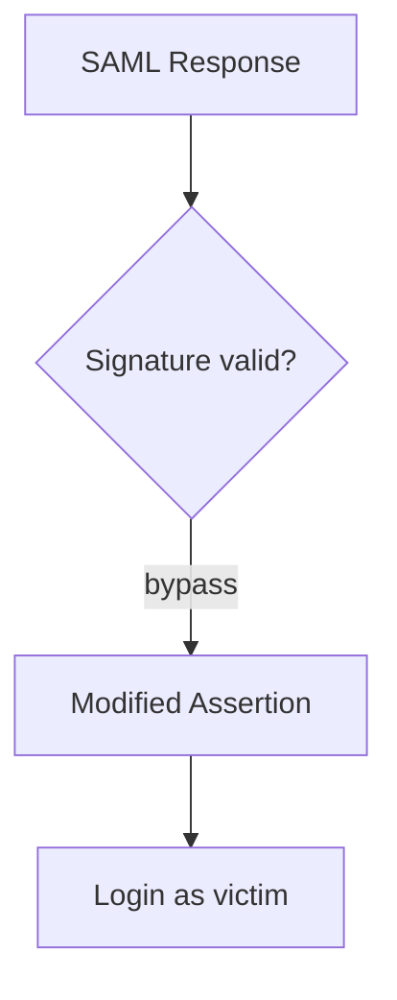

# SSO & SAML

Test single sign-on and SAML assertion handling.

## Overview Diagram

## How It Works

Single Sign-On (SSO) federates authentication to an Identity Provider (IdP). **SAML 2.0** flows exchange XML assertions—often via POST bindings—containing attributes like email and group membership. The Service Provider (SP) must **validate XML signatures**, check `NotBefore`/`NotOnOrAfter`, match `Audience`, and prevent **XML signature wrapping (XSW)** attacks where attackers smuggle unsigned assertions alongside valid signed copies.

**OAuth 2.0 / OpenID Connect** variants introduce `redirect_uri` validation bugs, authorization code interception, **mix-up attacks** (confusing codes between clients), and weak `state`/`nonce` handling. Misconfigured SAML metadata, certificate rollover, and unsigned `Response` elements are common in enterprise integrations.

## Exploitation

1. **Capture a legitimate SAML Response** — Use Burp during login; note signature placement, `NameID`, `Conditions`, and `Recipient`.
2. **Test signature wrapping** — Duplicate assertions, move signatures, or inject unsigned assertions with attacker `NameID` (tools: SAML Raider, `samltool`).
3. **Tamper with attributes** — Modify `Role`, `Groups`, or `email` fields if signature verification is flawed or only signs part of the document.
4. **Replay assertions** — Resend captured responses; check if `InResponseTo` and timestamps are enforced.
5. **OAuth redirect abuse** — Open redirect in `redirect_uri`, subdomain takeover on allowed callback URLs, or path traversal (`/callback/../evil`).
6. **Mix-up / confusion** — Swap authorization codes between mobile and web client IDs if the token endpoint does not bind `client_id`.
7. **Metadata poisoning** — If you can supply IdP metadata URL, point SP at attacker-controlled signing keys.
8. **Downgrade flows** — Force SAML instead of stronger OIDC, or disable encryption if both are optional.

## Defense & Mitigation

- **Strictly validate SAML signatures** on the assertion or entire response per library best practice; reject unsigned assertions.
- **Use well-tested libraries** (python3-saml, OneLogin toolkit) and keep them patched against XSW variants.
- **Enforce one-time use** of assertions (`InResponseTo`, short `NotOnOrAfter`, replay caches).
- **Pin IdP certificates**; monitor metadata fetch endpoints for tampering.
- **OAuth/OIDC**: exact-match `redirect_uri` allowlists, PKCE for public clients, mandatory `state` and `nonce`.
- **Rotate keys safely**; log failed signature validations and anomalous attribute changes.
- Review [OWASP SAML Security guidance](https://owasp.org/www-community/vulnerabilities/SAML_Security_Cheat_Sheet).

## Methodology

- [ ] Review SAML response signature validation
- [ ] Test XML signature wrapping
- [ ] Check redirect URI in OAuth/OIDC flows
- [ ] Attempt token replay and mix-up attacks

## Tools

| Tool | Usage |
|------|-------|
| `burp` | [Intercept, repeater & scanner](../../TOOLS_GUIDE.md#burp-suite) |
| `saml raider` | SAML testing Burp extension — [SAML Raider](https://github.com/SAMLRaider/SAMLRaider) |

## Resources

- [OWASP SAML Security](https://owasp.org/www-community/vulnerabilities/SAML_Security_Cheat_Sheet)

## Verification Checklist

- [ ] Review scope and rules of engagement
- [ ] Document baseline behavior
- [ ] Test edge cases and parser differentials
- [ ] Capture proof-of-concept safely
- [ ] Write remediation guidance
