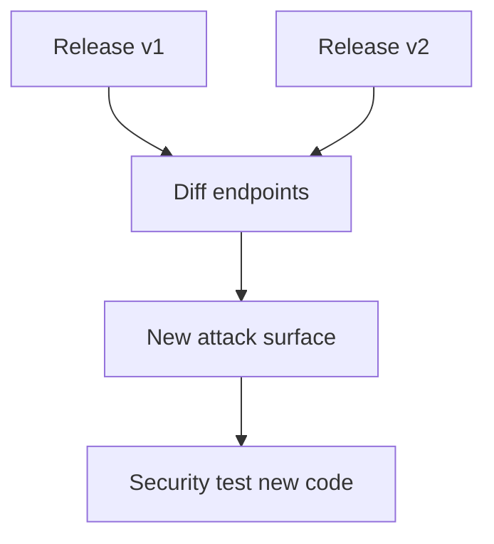
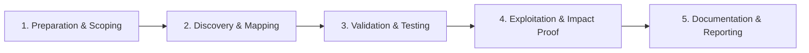

# Diffing & Change Detection

Monitor target changes for new attack surface.

## Overview Diagram

Visual summary of the **attack/data flow** and the **five-phase testing workflow** for this topic.

### Attack / Data Flow

### Testing Workflow

## How It Works

**Change detection** compares snapshots of targets over time—subdomains, HTTP responses, JavaScript bundles, OpenAPI specs, and DNS records—to surface new attack surface without re-running full manual recon.

Bug bounty programs and mature security teams baseline assets after each deploy. Diffing highlights newly exposed APIs, forgotten staging hosts, or relaxed CORS policies that static one-time scans miss.

## Exploitation

1. **Baseline**: store subs, live URLs, JS hashes, and nuclei results in dated snapshots.
2. **Schedule periodic runs**: GitHub Actions, cron, or axiom fleets on weekly cadence.
3. **Diff tools**: `diff` on sorted lists; `nuclei -compare` or custom Python set operations.
4. **OpenAPI diff**: compare Swagger versions for new parameters and auth changes.
5. **Alert on deltas**: notify Slack when new subdomains or 200 responses appear on high-value paths.
6. **Prioritize**: new `/api/v2/admin` endpoint warrants immediate manual review.

Combine passive sources (crt.sh, SecurityTrails) with active probing for complete coverage.

## Defense & Mitigation

- Maintain an **asset inventory** with ownership and expected change windows.
- Require security review for new public endpoints before production deploy.
- Monitor external attack surface continuously (ASM platforms or open-source stacks).
- Lock down staging with VPN/IP allowlists; do not rely on obscurity.
- Automate drift detection on IaC and firewall rules alongside application diffs.
- Document which assets are in scope so unauthorized new hosts are caught quickly.

## Testing Methodology

Work through each phase in order. Every step has a checkbox — complete them all for thorough, reproducible coverage.

### Phase 1 — Preparation & Scoping

- [ ] Confirm target is in program scope and ROE allows this test type
- [ ] Set up isolated lab or proxy (Burp/ZAP) with scope filters
- [ ] Document baseline application behavior and account roles
- [ ] Identify test accounts for each privilege level
- [ ] Baseline previous release endpoints and responses

### Phase 2 — Discovery & Mapping

- [ ] Capture current sitemap and API schema
- [ ] Diff URLs, parameters, and response codes
- [ ] Flag new endpoints and removed auth
- [ ] Review changelog for security-relevant changes

### Phase 3 — Validation & Testing

- [ ] Prioritize new code paths for manual test
- [ ] Run automated scans only on delta
- [ ] Validate regressions on fixed bugs
- [ ] Update asset inventory automatically

### Phase 4 — Exploitation & Impact Proof

- [ ] Report new attack surface to team
- [ ] Integrate diff into release pipeline

### Phase 5 — Documentation & Reporting

- [ ] Write step-by-step reproduction with HTTP requests/responses
- [ ] Capture screenshots or video showing impact (redact sensitive data)
- [ ] Rate severity using program CVSS or impact matrix
- [ ] Provide concrete remediation guidance for developers
- [ ] Retest after fix if program allows verification

## Tools

| Tool | Usage |
|------|-------|
| `nuclei` | [Template-based vuln scanner](../../TOOLS_GUIDE.md#nuclei) |
| `custom scripts` | [Python/Bash automation for repeatable tests](../../TOOLS_GUIDE.md) |
| `github actions` | [CI/CD pipeline security review](../../TOOLS_GUIDE.md) |

## Verification Checklist

- [ ] Review scope and rules of engagement
- [ ] Document baseline behavior
- [ ] Test edge cases and parser differentials
- [ ] Capture proof-of-concept safely
- [ ] Write remediation guidance
