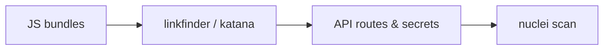
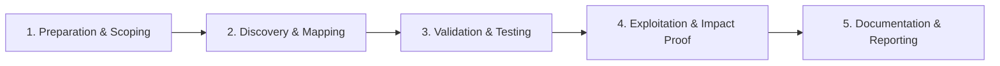

# JavaScript File Analysis

Extract endpoints, secrets, and logic from client-side code.

## Overview Diagram

Visual summary of the **attack/data flow** and the **five-phase testing workflow** for this topic.

### Attack / Data Flow

### Testing Workflow

## How It Works

Modern web apps ship large **JavaScript bundles** (webpack, Vite, Next.js) that contain API routes, internal admin paths, GraphQL queries, AWS keys, and business logic. Source maps—often left on production—reconstruct original TypeScript files.

Attackers crawl live sites, archive historical JS from Wayback/Common Crawl, and run pattern matchers to extract endpoints and secrets faster than manual browsing. Minification hides names but not string literals, so hardcoded URLs and keys remain visible.

## Exploitation

1. **Collect JS**: use Katana, gau, or browser devtools to download all `.js` assets.
2. **LinkFinder / SecretFinder**: scan for paths, API keys, S3 buckets, and JWT patterns.
3. **Source maps**: probe `main.js.map` or `webpack://` references; decompile to source.
4. **Chunk diffing**: compare bundle hashes between deployments for new hidden routes.
5. **Beautify and grep**: search for `fetch(`, `axios`, `graphql`, `admin`, `internal`.
6. **Validate findings**: probe discovered endpoints with httpx/nuclei; never assume secrets are live without testing.

Automate in CI recon pipelines to alert when new secrets appear in client bundles.

## Defense & Mitigation

- **Never embed secrets** in client-side code; use backend proxies for third-party APIs.
- Disable or restrict **source map** publication in production builds.
- Split admin and internal tooling into separate origins not linked from public JS.
- Use environment-specific builds; strip debug routes from production bundles.
- Scan releases with trufflehog or custom regex in CI before deploy.
- Implement CSP and avoid exposing sensitive logic that should live server-side only.

## Pro Tips

Practical advice from real engagements — use these to test faster and report better.

!!! tip "linkfinder pipeline"
    Every JS URL through linkfinder — APIs hide in minified bundles.

!!! tip "secretfinder pass"
    AWS keys and internal URLs in `app.*.js` chunk files.

!!! tip "katana crawl"
    `katana -u target -jc` extracts JS-linked endpoints.

!!! tip "Version diff"
    Save JS weekly — new routes appear before public changelog.

!!! tip "Scope filter"
    Auto-found hosts may be CDN or third-party — verify in program scope.

## Testing Methodology

Work through each phase in order. Every step has a checkbox — complete them all for thorough, reproducible coverage.

### Phase 1 — Preparation & Scoping

- [ ] Confirm target is in program scope and ROE allows this test type
- [ ] Set up isolated lab or proxy (Burp/ZAP) with scope filters
- [ ] Document baseline application behavior and account roles
- [ ] Identify test accounts for each privilege level
- [ ] Collect all JS bundles from in-scope apps

### Phase 2 — Discovery & Mapping

- [ ] Run linkfinder and secretfinder on bundles
- [ ] Crawl with katana for dynamic JS
- [ ] Map API routes and GraphQL endpoints
- [ ] Diff JS between releases for new surface

### Phase 3 — Validation & Testing

- [ ] Validate discovered endpoints are in scope
- [ ] Test endpoints for auth and injection
- [ ] Run nuclei on API paths found
- [ ] Archive JS versions for regression

### Phase 4 — Exploitation & Impact Proof

- [ ] Feed findings into main testing workflow
- [ ] Automate weekly JS monitoring in CI

### Phase 5 — Documentation & Reporting

- [ ] Write step-by-step reproduction with HTTP requests/responses
- [ ] Capture screenshots or video showing impact (redact sensitive data)
- [ ] Rate severity using program CVSS or impact matrix
- [ ] Provide concrete remediation guidance for developers
- [ ] Retest after fix if program allows verification

## Tools

| Tool | Usage |
|------|-------|
| `linkfinder` | [JS endpoint discovery](../../TOOLS_GUIDE.md#linkfinder) |
| `secretfinder` | JS secret extraction — [m4ll0k/SecretFinder](https://github.com/m4ll0k/SecretFinder) |
| `nuclei` | [Template-based vuln scanner](../../TOOLS_GUIDE.md#nuclei) |
| `katana` | [Web crawler](../../TOOLS_GUIDE.md#katana) |

## Verification Checklist

- [ ] Review scope and rules of engagement
- [ ] Document baseline behavior
- [ ] Test edge cases and parser differentials
- [ ] Capture proof-of-concept safely
- [ ] Write remediation guidance
