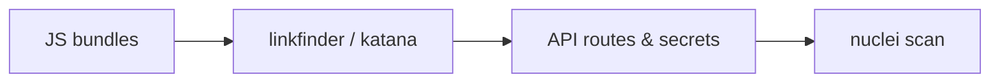

# JavaScript File Analysis

Extract endpoints, secrets, and logic from client-side code.

## Overview Diagram

## How It Works

Modern web apps ship large **JavaScript bundles** (webpack, Vite, Next.js) that contain API routes, internal admin paths, GraphQL queries, AWS keys, and business logic. Source maps—often left on production—reconstruct original TypeScript files.

Attackers crawl live sites, archive historical JS from Wayback/Common Crawl, and run pattern matchers to extract endpoints and secrets faster than manual browsing. Minification hides names but not string literals, so hardcoded URLs and keys remain visible.

## Exploitation

1. **Collect JS**: use Katana, gau, or browser devtools to download all `.js` assets.
2. **LinkFinder / SecretFinder**: scan for paths, API keys, S3 buckets, and JWT patterns.
3. **Source maps**: probe `main.js.map` or `webpack://` references; decompile to source.
4. **Chunk diffing**: compare bundle hashes between deployments for new hidden routes.
5. **Beautify and grep**: search for `fetch(`, `axios`, `graphql`, `admin`, `internal`.
6. **Validate findings**: probe discovered endpoints with httpx/nuclei; never assume secrets are live without testing.

Automate in CI recon pipelines to alert when new secrets appear in client bundles.

## Defense & Mitigation

- **Never embed secrets** in client-side code; use backend proxies for third-party APIs.
- Disable or restrict **source map** publication in production builds.
- Split admin and internal tooling into separate origins not linked from public JS.
- Use environment-specific builds; strip debug routes from production bundles.
- Scan releases with trufflehog or custom regex in CI before deploy.
- Implement CSP and avoid exposing sensitive logic that should live server-side only.

## Methodology

- [ ] Collect JS from crawlers and source maps
- [ ] Run link and secret discovery tools
- [ ] Review webpack chunks for hidden routes
- [ ] Track changes between deployments

## Tools

| Tool | Usage |
|------|-------|
| `linkfinder` | [JS endpoint discovery](../../TOOLS_GUIDE.md#linkfinder) |
| `secretfinder` | JS secret extraction — [m4ll0k/SecretFinder](https://github.com/m4ll0k/SecretFinder) |
| `nuclei` | [Template-based vuln scanner](../../TOOLS_GUIDE.md#nuclei) |
| `katana` | [Web crawler](../../TOOLS_GUIDE.md#katana) |

## Verification Checklist

- [ ] Review scope and rules of engagement
- [ ] Document baseline behavior
- [ ] Test edge cases and parser differentials
- [ ] Capture proof-of-concept safely
- [ ] Write remediation guidance
