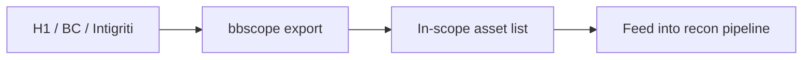
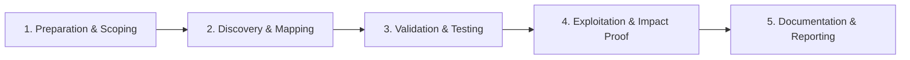

# Bug Bounty Scope Tooling

Manage program scope and asset tracking.

## Overview Diagram

Visual summary of the **attack/data flow** and the **five-phase testing workflow** for this topic.

### Attack / Data Flow

### Testing Workflow

## How It Works

Bug bounty **scope** defines which domains, apps, and IP ranges researchers may test and what is forbidden (DoS, social engineering, out-of-scope subsidiaries). Programs publish scope on HackerOne, Bugcrowd, Intigriti, or private portals—often in inconsistent formats.

**Scope tooling** parses these rules into machine-readable lists, validates targets before scanning, and tracks program-specific notes. Testing out-of-scope assets violates program rules and may have legal consequences.

## Exploitation

1. **Import scope**: use `bbscope` for HackerOne/Bugcrowd/Intigriti YAML exports.
2. **Normalize rules**: convert wildcards (`*.target.com`) to regex or explicit lists.
3. **Pre-flight check**: before nuclei/ffuf, verify hostname matches in-scope patterns.
4. **Track assets**: spreadsheet or Notion with program, asset, bounty tier, and status.
5. **Monitor scope changes**: programs add acquisitions and new APIs frequently.
6. **Respect exclusions**: shared infrastructure, third-party SaaS, and customer data are typically out of scope even if technically reachable.

When scope is ambiguous, ask the program before testing—document the response.

## Defense & Mitigation

- Publish **clear, machine-readable scope** with examples of in/out boundaries.
- Separate production from sandbox assets in scope documentation.
- Provide a **safe reporting channel** for scope questions.
- Monitor for scans against out-of-scope assets and correlate with program engagement.
- Update scope promptly when launching new products or domains.
- Use asset tags in ASM tools so internal teams know which surfaces are bounty-eligible.

## Pro Tips

Practical advice from real engagements — use these to test faster and report better.

!!! tip "bbscope export"
    `bbscope h1 -t TOKEN -p program` — canonical scope file.

!!! tip "Wildcard regex"
    Convert `*.target.com` to testable patterns for automation.

!!! tip "Out-of-scope blocklist"
    Explicit exclusions prevent accidental bans.

!!! tip "Git-track scope"
    Commit scope.json — team shares same boundaries.

!!! tip "Scheduled refresh"
    Cron weekly scope pull — programs add assets often.

## Testing Methodology

Work through each phase in order. Every step has a checkbox — complete them all for thorough, reproducible coverage.

### Phase 1 — Preparation & Scoping

- [ ] Confirm target is in program scope and ROE allows this test type
- [ ] Set up isolated lab or proxy (Burp/ZAP) with scope filters
- [ ] Document baseline application behavior and account roles
- [ ] Identify test accounts for each privilege level
- [ ] Configure bbscope with platform API tokens

### Phase 2 — Discovery & Mapping

- [ ] Export in-scope domains and wildcards
- [ ] Normalize scope rules to regex/glob
- [ ] Deduplicate overlapping program scopes
- [ ] Validate out-of-scope exclusions

### Phase 3 — Validation & Testing

- [ ] Feed scope into recon automation scripts
- [ ] Alert on scope changes via scheduled pull
- [ ] Share scope file with team via git
- [ ] Document scope version per engagement

### Phase 4 — Exploitation & Impact Proof

- [ ] Prevent testing out-of-scope assets
- [ ] Update Burp scope automatically

### Phase 5 — Documentation & Reporting

- [ ] Write step-by-step reproduction with HTTP requests/responses
- [ ] Capture screenshots or video showing impact (redact sensitive data)
- [ ] Rate severity using program CVSS or impact matrix
- [ ] Provide concrete remediation guidance for developers
- [ ] Retest after fix if program allows verification

## Tools

| Tool | Usage |
|------|-------|
| `bbscope` | [Bug bounty scope aggregation](../../TOOLS_GUIDE.md#bbscope) |
| `hackerone cli` | [HackerOne API CLI for program management](../../TOOLS_GUIDE.md) |
| `custom spreadsheets` | [Track assets, findings, and retest status](../../TOOLS_GUIDE.md) |

## Resources

- [HackerOne Hacktivity](https://hackerone.com/hacktivity)

## Verification Checklist

- [ ] Review scope and rules of engagement
- [ ] Document baseline behavior
- [ ] Test edge cases and parser differentials
- [ ] Capture proof-of-concept safely
- [ ] Write remediation guidance
