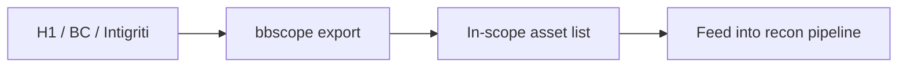

# Bug Bounty Scope Tooling

Manage program scope and asset tracking.

## Overview Diagram

## How It Works

Bug bounty **scope** defines which domains, apps, and IP ranges researchers may test and what is forbidden (DoS, social engineering, out-of-scope subsidiaries). Programs publish scope on HackerOne, Bugcrowd, Intigriti, or private portals—often in inconsistent formats.

**Scope tooling** parses these rules into machine-readable lists, validates targets before scanning, and tracks program-specific notes. Testing out-of-scope assets violates program rules and may have legal consequences.

## Exploitation

1. **Import scope**: use `bbscope` for HackerOne/Bugcrowd/Intigriti YAML exports.
2. **Normalize rules**: convert wildcards (`*.target.com`) to regex or explicit lists.
3. **Pre-flight check**: before nuclei/ffuf, verify hostname matches in-scope patterns.
4. **Track assets**: spreadsheet or Notion with program, asset, bounty tier, and status.
5. **Monitor scope changes**: programs add acquisitions and new APIs frequently.
6. **Respect exclusions**: shared infrastructure, third-party SaaS, and customer data are typically out of scope even if technically reachable.

When scope is ambiguous, ask the program before testing—document the response.

## Defense & Mitigation

- Publish **clear, machine-readable scope** with examples of in/out boundaries.
- Separate production from sandbox assets in scope documentation.
- Provide a **safe reporting channel** for scope questions.
- Monitor for scans against out-of-scope assets and correlate with program engagement.
- Update scope promptly when launching new products or domains.
- Use asset tags in ASM tools so internal teams know which surfaces are bounty-eligible.

## Methodology

- [ ] Import scope from HackerOne/Bugcrowd/Intigriti
- [ ] Validate in-scope before testing
- [ ] Track new assets against scope rules
- [ ] Maintain engagement notes per program

## Tools

| Tool | Usage |
|------|-------|
| `bbscope` | [Bug bounty scope aggregation](../../TOOLS_GUIDE.md#bbscope) |
| `hackerone cli` | [HackerOne API CLI for program management](../../TOOLS_GUIDE.md) |
| `custom spreadsheets` | [Track assets, findings, and retest status](../../TOOLS_GUIDE.md) |

## Resources

- [HackerOne Hacktivity](https://hackerone.com/hacktivity)

## Verification Checklist

- [ ] Review scope and rules of engagement
- [ ] Document baseline behavior
- [ ] Test edge cases and parser differentials
- [ ] Capture proof-of-concept safely
- [ ] Write remediation guidance
