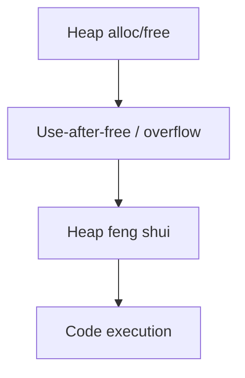
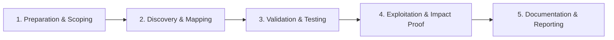

# Heap Exploitation

Exploit heap allocators through use-after-free and overflow primitives.

## Overview Diagram

Visual summary of the **attack/data flow** and the **five-phase testing workflow** for this topic.

### Attack / Data Flow

### Testing Workflow

## How It Works

**Heap exploitation** targets dynamic memory allocators (glibc malloc, jemalloc, tcmalloc). Bugs like **buffer overflows into adjacent chunks**, **use-after-free**, **double free**, and **integer overflows** corrupt heap metadata or freed object contents.

Attackers forge chunk headers or abuse allocator behavior to achieve arbitrary write primitives, then overwrite `__free_hook`, GOT entries, or function pointers for code execution. Heap attacks are less linear than stack overflows and allocator-specific.

## Exploitation

1. **Identify allocator**: glibc version from `ldd` or `/proc/version`.
2. **Trigger bug**: UAF by racing threads, or overflow into next chunk.
3. **Study allocator**: read how2heap for tcache, fastbin, unsorted bin techniques.
4. **Build primitive**: overlap chunks (house of spirit, tcache poisoning) for arbitrary write.
5. **Target**: overwrite `__malloc_hook`, `__free_hook`, or C++ vtable pointers.
6. **pwntools/gdb**: debug heap layout with `heap` commands in pwndbg/gef.

Heap exploitation is advanced; validate only in CTF/lab with explicit authorization.

## Defense & Mitigation

- Fix memory corruption at source; use **AddressSanitizer** and UBSan in CI tests.
- Update glibc and allocator libraries; enable hardened malloc options where available.
- Reduce attack surface: minimize native code, use Rust with safe defaults.
- Fuzz heap-heavy code paths continuously.
- Enable **Control Flow Integrity** and sandboxing for untrusted native modules.
- For browsers and JITs, follow industry standard isolation (site isolation, sandbox processes).

## Pro Tips

Practical advice from real engagements — use these to test faster and report better.

!!! tip "Identify allocator"
    glibc dlmalloc vs jemalloc — techniques differ completely.

!!! tip "Heap visualization"
    pwndbg `heap` and `bins` commands show layout during exploit dev.

!!! tip "Libc leak first"
    Unsorted bin leak is classic — confirm before arbitrary write.

!!! tip "tcache poisoning"
    Modern glibc — tcache is first target on 2.26+.

!!! tip "Match libc exactly"
    Download target libc from server or package mirror.

## Testing Methodology

Work through each phase in order. Every step has a checkbox — complete them all for thorough, reproducible coverage.

### Phase 1 — Preparation & Scoping

- [ ] Confirm target is in program scope and ROE allows this test type
- [ ] Set up isolated lab or proxy (Burp/ZAP) with scope filters
- [ ] Document baseline application behavior and account roles
- [ ] Identify test accounts for each privilege level
- [ ] Identify allocator (glibc dlmalloc, jemalloc)

### Phase 2 — Discovery & Mapping

- [ ] Trace malloc/free imbalance and UAF/double-free
- [ ] Layout heap with feng shui
- [ ] Leak libc address via unsorted bin
- [ ] Build exploit primitive (fastbin, tcache)

### Phase 3 — Validation & Testing

- [ ] Achieve arbitrary write or __malloc_hook overwrite
- [ ] Validate in gdb with heap visualization
- [ ] Test on exact libc version

### Phase 4 — Exploitation & Impact Proof

- [ ] Demonstrate reliable shell in lab CTF binary
- [ ] Document heap layout and primitives

### Phase 5 — Documentation & Reporting

- [ ] Write step-by-step reproduction with HTTP requests/responses
- [ ] Capture screenshots or video showing impact (redact sensitive data)
- [ ] Rate severity using program CVSS or impact matrix
- [ ] Provide concrete remediation guidance for developers
- [ ] Retest after fix if program allows verification

## Tools

| Tool | Usage |
|------|-------|
| `pwntools` | [Exploit development](https://github.com/Gallopsled/pwntools) |
| `gdb` | [GNU debugger for binary analysis](../../TOOLS_GUIDE.md) |
| `heap exploitation scripts` | [Custom heap feng shui PoCs for CTF targets](../../TOOLS_GUIDE.md) |

## Resources

- [how2heap](https://github.com/shellphish/how2heap)

## Verification Checklist

- [ ] Review scope and rules of engagement
- [ ] Document baseline behavior
- [ ] Test edge cases and parser differentials
- [ ] Capture proof-of-concept safely
- [ ] Write remediation guidance
