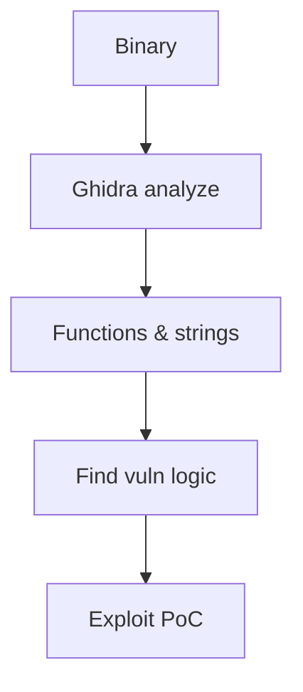

# Reverse Engineering

Analyze binaries to understand program behavior.

## Overview Diagram

## How It Works

**Reverse engineering** recovers program logic from compiled binaries without source code. Disassemblers (Ghidra, IDA) lift machine code to intermediate representations; debuggers (gdb, x64dbg) observe runtime state. Analysts identify **entry points**, **string references**, **crypto constants**, and **network protocols**.

Binaries may be stripped of symbols, obfuscated, or packed. Anti-debug and anti-VM techniques slow analysis but rarely stop determined researchers with sufficient time.

## Exploitation

1. **Initial triage**: `strings`, `file`, `binwalk`, entropy analysis for packing.
2. **Load in Ghidra**: auto-analyze, rename functions, annotate key logic.
3. **Cross-references**: follow calls from `strcmp`, `recv`, `printf` to validation routines.
4. **Dynamic trace**: gdb with breakpoints on compare instructions for license checks.
5. **Patch binary**: NOP out jumps or modify constants for proof-of-concept (authorized only).
6. **Document**: export decompiler output with comments for report appendices.

For malware, work only in isolated VMs with no network egress.

## Defense & Mitigation

- Assume binaries can be reversed; **do not rely on client-side secrecy**.
- Use server-side validation for licenses, auth, and critical business rules.
- Apply obfuscation and anti-tamper as **delay layers**, not primary security.
- Strip symbols in release builds; avoid embedding secrets in binaries.
- Monitor for cracked distributions; use legal and technical responses as appropriate.
- For sensitive firmware, encrypt payloads and verify integrity at boot.

## Methodology

- [ ] Load samples in disassembler/debugger
- [ ] Identify key functions and strings
- [ ] Trace input validation logic
- [ ] Document findings with annotations

## Tools

| Tool | Usage |
|------|-------|
| `ghidra` | [Reverse engineering suite](../../TOOLS_GUIDE.md#ghidra) |
| `ida` | Interactive disassembler — [hex-rays.com](https://hex-rays.com/ida-pro/) |
| `radare2` | Open-source reversing — [rada.re](https://rada.re/n/) |
| `binary ninja` | Commercial reverse engineering — [binary.ninja](https://binary.ninja/) |

## Resources

- [Ghidra Training](https://ghidra-sre.org/)

## Verification Checklist

- [ ] Review scope and rules of engagement
- [ ] Document baseline behavior
- [ ] Test edge cases and parser differentials
- [ ] Capture proof-of-concept safely
- [ ] Write remediation guidance
