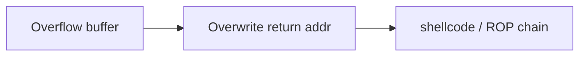
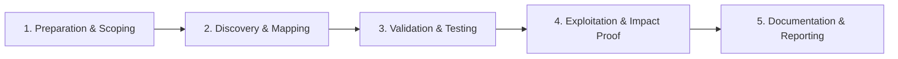

# Stack Buffer Overflow

Classic stack-based memory corruption exploitation.

## Overview Diagram

Visual summary of the **attack/data flow** and the **five-phase testing workflow** for this topic.

### Attack / Data Flow

### Testing Workflow

## How It Works

A **stack buffer overflow** writes past the end of a stack-allocated buffer, corrupting adjacent data—the saved return address, stack canaries, or frame pointers. When the function returns, execution may jump to attacker-controlled addresses, enabling arbitrary code execution.

Modern mitigations include stack canaries, ASLR, DEP/NX, and FORTIFY_SOURCE. Exploitation often requires leaking addresses, building ROP chains, or finding misconfigured binaries compiled without protections.

## Exploitation

1. **Fuzz input**: trigger crashes with long strings, format strings, or malformed packets.
2. **Determine offset**: pattern create (`pwntools cyclic`) to find return address overwrite offset.
3. **Check protections**: `checksec` for NX, canary, RELRO, PIE.
4. **Canary bypass**: leak canary via format string or partial overwrite if possible.
5. **ROP**: build chain with ropper/ROPgadget when NX is enabled.
6. **Shellcode**: direct jump to mapped executable stack only in legacy/lab binaries.

Practice on CTF binaries and authorized vuln servers; document reliability and mitigations.

## Defense & Mitigation

- Compile with **stack canaries**, `-fstack-protector-strong`, and FORTIFY_SOURCE.
- Enable **ASLR and DEP/NX**; use RELRO and PIE for shared libraries and binaries.
- Replace unsafe functions (`strcpy`, `sprintf`) with bounded alternatives.
- Use memory-safe languages for new components; sandbox native code with seccomp.
- Fuzz native code with AFL++, libFuzzer; fix crashes before release.
- Deploy WAF/IPS only as supplement; fix root cause in binary.

## Testing Methodology

Work through each phase in order. Every step has a checkbox — complete them all for thorough, reproducible coverage.

### Phase 1 — Preparation & Scoping

- [ ] Confirm target is in program scope and ROE allows this test type
- [ ] Set up isolated lab or proxy (Burp/ZAP) with scope filters
- [ ] Document baseline application behavior and account roles
- [ ] Identify test accounts for each privilege level
- [ ] Run checksec on binary

### Phase 2 — Discovery & Mapping

- [ ] Find overflow in strcpy/gets/sprintf
- [ ] Calculate offset to return address
- [ ] Check NX, ASLR, canary, PIE
- [ ] Develop pattern with cyclic or pwntools

### Phase 3 — Validation & Testing

- [ ] Bypass canary if information leak exists
- [ ] Build ret2libc or ROP chain
- [ ] Validate exploit in gdb then standalone
- [ ] Test on target libc version

### Phase 4 — Exploitation & Impact Proof

- [ ] Demonstrate EIP/RIP control and shell
- [ ] Document protections and bypass used
- [ ] Recommend safe functions and compiler flags

### Phase 5 — Documentation & Reporting

- [ ] Write step-by-step reproduction with HTTP requests/responses
- [ ] Capture screenshots or video showing impact (redact sensitive data)
- [ ] Rate severity using program CVSS or impact matrix
- [ ] Provide concrete remediation guidance for developers
- [ ] Retest after fix if program allows verification

## Tools

| Tool | Usage |
|------|-------|
| `gdb` | [GNU debugger for binary analysis](../../TOOLS_GUIDE.md) |
| `pwndbg` | GDB plugin for exploit dev — [pwndbg/pwndbg](https://github.com/pwndbg/pwndbg) |
| `gef` | GDB Enhanced Features — [hugsy/gef](https://github.com/hugsy/gef) |
| `ropper` | ROP gadget finder — [sashs/Ropper](https://github.com/sashs/Ropper) |

## Verification Checklist

- [ ] Review scope and rules of engagement
- [ ] Document baseline behavior
- [ ] Test edge cases and parser differentials
- [ ] Capture proof-of-concept safely
- [ ] Write remediation guidance
