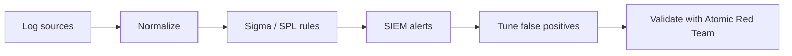
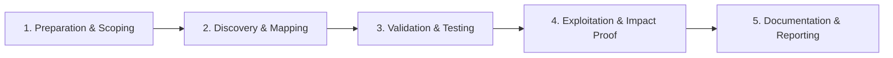

# Detection Engineering

Build detections mapped to MITRE ATT&CK techniques.

## Overview Diagram

Visual summary of the **attack/data flow** and the **five-phase testing workflow** for this topic.

### Attack / Data Flow

### Testing Workflow

## How It Works

Detection engineering is the discipline of building **reliable, actionable security detections** mapped to adversary behaviors (MITRE ATT&CK). The lifecycle:

1. **Threat prioritization** — Select techniques relevant to your industry and threat intel (ransomware, APT, insider threat).
2. **Data source identification** — Determine which logs are required (Sysmon, EDR, Windows Security, DNS, proxy, cloud audit).
3. **Detection authoring** — Write Sigma rules, Splunk SPL, KQL, or Elastic EQL queries with clear logic.
4. **Validation** — Execute atomic red team tests or purple team exercises to confirm true positives.
5. **Tuning** — Reduce false positives without blinding to true attacks.
6. **Maintenance** — Update rules when log formats, tools, or TTPs change.

Good detections specify **analytic story**: data source, logic, false positive guidance, and response playbook link.

## Exploitation

1. **Map coverage gaps** — Compare current detections to ATT&CK matrix; prioritize uncovered techniques with high threat relevance.
2. **Author Sigma rules** — Start from [SigmaHQ](https://github.com/SigmaHQ/sigma); customize for your environment.
3. **Convert to SIEM** — Use sigma-cli or Uncoder to generate Splunk/Elastic/Sentinel queries.
4. **Validate with Atomic Red Team** — `Invoke-AtomicTest T1003.001` and confirm alert fires within SLA.
5. **Define severity and MITRE tags** — Every rule links to technique ID and recommended response.
6. **Build detection-as-code** — Store rules in Git; PR review for logic changes.
7. **Measure MTTD** — Track time from attack simulation to alert in SOC dashboard.
8. **Iterate on false positives** — Add exclusions for known-good admin tools with change control.

## Defense & Mitigation

- **Establish detection engineering as a dedicated function** — Not ad-hoc analyst queries.
- **Maintain ATT&CK coverage dashboard** — Executive visibility into gaps.
- **Require validation before production** — No rule goes live without atomic test evidence.
- **Version-control all detections** — Git repo with CI conversion to SIEM formats.
- **Quarterly purple team** — Red executes; blue validates and improves detections.
- **Document runbooks** — Each high-severity detection links to IR playbook.
- **Retire noisy rules** — Failed detections erode SOC trust; fix or remove.

## Pro Tips

Practical advice from real engagements — use these to test faster and report better.

!!! tip "Start with ATT&CK"
    Pick one technique sub-technique — write detection before broad coverage.

!!! tip "Sigma portability"
    Write Sigma first, convert to Splunk/KQL — avoids vendor lock-in early.

!!! tip "Atomic Red Team validate"
    Run matching atomic test — no alert means detection gap proven.

!!! tip "Tune false positives"
    Baseline 7 days of logs before enabling production alerts.

!!! tip "Document data sources"
    Detection without required log field is a false promise in SOC.

## Testing Methodology

Work through each phase in order. Every step has a checkbox — complete them all for thorough, reproducible coverage.

### Phase 1 — Preparation & Scoping

- [ ] Confirm target is in program scope and ROE allows this test type
- [ ] Set up isolated lab or proxy (Burp/ZAP) with scope filters
- [ ] Document baseline application behavior and account roles
- [ ] Identify test accounts for each privilege level
- [ ] Define threat model and log sources available

### Phase 2 — Discovery & Mapping

- [ ] Research ATT&CK technique to detect
- [ ] Draft Sigma rule or SPL/KQL query
- [ ] Identify required log fields and parsers
- [ ] Peer review logic for false positive rate

### Phase 3 — Validation & Testing

- [ ] Test rule in dev SIEM with historical logs
- [ ] Run Atomic Red Team test to generate event
- [ ] Tune thresholds and exclusions
- [ ] Measure mean time to detect in simulation

### Phase 4 — Exploitation & Impact Proof

- [ ] Deploy to production with alerting workflow
- [ ] Document detection data source and MITRE mapping
- [ ] Schedule quarterly rule review

### Phase 5 — Documentation & Reporting

- [ ] Write step-by-step reproduction with HTTP requests/responses
- [ ] Capture screenshots or video showing impact (redact sensitive data)
- [ ] Rate severity using program CVSS or impact matrix
- [ ] Provide concrete remediation guidance for developers
- [ ] Retest after fix if program allows verification

## Tools

| Tool | Usage |
|------|-------|
| `sigma` | [Detection rule format](https://github.com/SigmaHQ/sigma) |
| `splunk` | [SIEM search & correlation](../../TOOLS_GUIDE.md) |
| `elastic` | [Elastic Security SIEM & detection](../../TOOLS_GUIDE.md) |
| `atomic red team` | [Detection validation](https://github.com/redcanaryco/atomic-red-team) |

## Resources

- [MITRE ATT&CK](https://attack.mitre.org/)
- [Sigma Rules](https://github.com/SigmaHQ/sigma)

## Verification Checklist

- [ ] Review scope and rules of engagement
- [ ] Document baseline behavior
- [ ] Test edge cases and parser differentials
- [ ] Capture proof-of-concept safely
- [ ] Write remediation guidance
