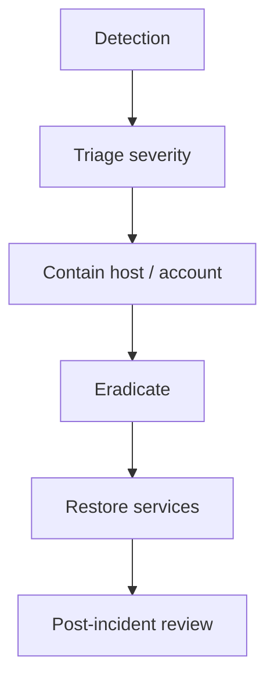
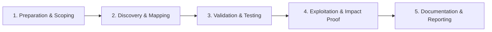

# Incident Response

Contain, eradicate, and recover from security incidents.

## Overview Diagram

Visual summary of the **attack/data flow** and the **five-phase testing workflow** for this topic.

### Attack / Data Flow

### Testing Workflow

## How It Works

Incident response (IR) is the structured process of **detecting, containing, eradicating, and recovering** from security incidents while preserving evidence. NIST SP 800-61 phases:

1. **Preparation** — Playbooks, contacts, tooling, and tabletop exercises.
2. **Detection & Analysis** — Triage alerts, determine scope and severity.
3. **Containment** — Short-term (isolate host) and long-term (block IoCs, disable accounts).
4. **Eradication** — Remove malware, close vulnerabilities, reset credentials.
5. **Recovery** — Restore systems from clean backups; monitor for re-entry.
6. **Post-incident** — Root cause analysis, lessons learned, control improvements.

IR teams balance **speed** (stop bleeding) with **forensic integrity** (chain of custody for potential legal action).

## Exploitation

1. **Activate playbook** — Declare severity (P1–P4); assign incident commander, scribe, and comms lead.
2. **Preserve evidence** — Snapshot VMs, collect EDR triage packages, export relevant SIEM logs before containment alters state.
3. **Scope the incident** — Identify compromised accounts, hosts, and data accessed; build timeline.
4. **Contain** — Network isolate endpoints, disable AD accounts, revoke tokens and API keys.
5. **Eradicate** — Reimage workstations, patch exploited vulnerability, remove persistence (scheduled tasks, registry, golden ticket requires krbtgt reset).
6. **Recover** — Restore from known-good backups; validate integrity before reconnecting to network.
7. **Communicate** — Stakeholder updates per cadence; legal/regulatory notification if PII/PHI affected.
8. **Post-mortem** — Blameless review; track remediation items with owners and deadlines.

## Defense & Mitigation

- **Maintain IR playbooks** for ransomware, BEC, insider threat, and cloud compromise.
- **Tabletop exercises** quarterly with executives and IT.
- **Pre-position tooling** — EDR, forensic workstations, immutable backups, out-of-band comms.
- **Define escalation matrix** — When to involve legal, PR, and law enforcement.
- **Backup and restore testing** — Ransomware recovery depends on clean backups.
- **Retainer with IR firm** — For surge capacity on P1 incidents.
- **Track MTTR metrics** — Containment time, recovery time, repeat incident rate.
- Follow [NIST SP 800-61 Rev. 2](https://csrc.nist.gov/publications/detail/sp/800-61/rev-2/final).

## Pro Tips

Practical advice from real engagements — use these to test faster and report better.

!!! tip "Contain before eradicate"
    Isolate host, disable account, block IOC — in that order.

!!! tip "Preserve volatile data"
    Memory and netstat before reboot — order matters.

!!! tip "Comms template"
    Pre-written stakeholder updates reduce panic during P1.

!!! tip "Don't wipe early"
    Forensics needs disk — image before rebuild.

!!! tip "30-day watch"
    Re-compromise often follows weak eradication — extend monitoring.

## Testing Methodology

Work through each phase in order. Every step has a checkbox — complete them all for thorough, reproducible coverage.

### Phase 1 — Preparation & Scoping

- [ ] Confirm target is in program scope and ROE allows this test type
- [ ] Set up isolated lab or proxy (Burp/ZAP) with scope filters
- [ ] Document baseline application behavior and account roles
- [ ] Identify test accounts for each privilege level
- [ ] Activate IR plan and assign roles
- [ ] Preserve evidence and chain of custody

### Phase 2 — Discovery & Mapping

- [ ] Triage alert severity and scope
- [ ] Contain affected hosts and accounts
- [ ] Collect volatile and disk evidence
- [ ] Communicate with stakeholders per playbook

### Phase 3 — Validation & Testing

- [ ] Eradicate malware and attacker access
- [ ] Recover systems from clean backups
- [ ] Validate eradication with scans
- [ ] Monitor for re-compromise 30+ days

### Phase 4 — Exploitation & Impact Proof

- [ ] Complete post-incident report
- [ ] Lessons learned and playbook updates
- [ ] Implement new detections from incident

### Phase 5 — Documentation & Reporting

- [ ] Write step-by-step reproduction with HTTP requests/responses
- [ ] Capture screenshots or video showing impact (redact sensitive data)
- [ ] Rate severity using program CVSS or impact matrix
- [ ] Provide concrete remediation guidance for developers
- [ ] Retest after fix if program allows verification

## Tools

| Tool | Usage |
|------|-------|
| `thehive` | [Incident response case management](../../TOOLS_GUIDE.md) |
| `velociraptor` | [Endpoint visibility](https://github.com/Velocidex/velociraptor) |
| `ftk imager` | Disk imaging — [AccessData FTK](https://www.exterro.com/ftk-imager) |

## Resources

- [NIST SP 800-61](https://csrc.nist.gov/publications/detail/sp/800-61/rev-2/final)

## Verification Checklist

- [ ] Review scope and rules of engagement
- [ ] Document baseline behavior
- [ ] Test edge cases and parser differentials
- [ ] Capture proof-of-concept safely
- [ ] Write remediation guidance
