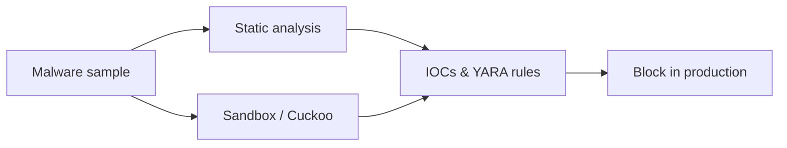
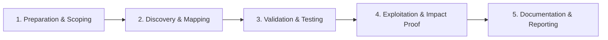

# Malware Analysis Basics

Static and dynamic analysis fundamentals for malware samples.

## Overview Diagram

Visual summary of the **attack/data flow** and the **five-phase testing workflow** for this topic.

### Attack / Data Flow

### Testing Workflow

## How It Works

Malware analysis examines malicious software to understand **capabilities, persistence, C2 infrastructure, and indicators of compromise (IoCs)**. Two complementary approaches:

- **Static analysis** — Inspect without execution: file hashes, strings, PE/ELF headers, imports, embedded resources, and disassembly (Ghidra, IDA).
- **Dynamic analysis** — Execute in sandbox (ANY.RUN, Cuckoo, FLARE VM) and observe behavior: file writes, registry keys, network connections, process injection.

Analysts classify malware families (ransomware, loader, RAT, infostealer) and extract IoCs (IPs, domains, file paths, mutexes, certificate thumbprints) for blocking and hunting. **Always work in isolated VMs** with no network route to production.

## Exploitation

1. **Set up isolated lab** — FLARE VM or custom VM with snapshots; host-only or simulated internet (INetSim).
2. **Initial triage** — `sha256sum`, VirusTotal (cautious with uploads), `file`, `peframe`, `floss` for strings.
3. **Static RE** — Load in Ghidra; identify `main`, C2 URL construction, and anti-analysis checks.
4. **Dynamic run** — Execute in sandbox; capture Procmon, Wireshark, and API monitor output.
5. **Unpack if needed** — Identify packers (UPX, custom); dump unpacked payload from memory.
6. **Extract IoCs** — Domains, IPs, mutex names, registry persistence keys, dropped file hashes.
7. **Document TTPs** — Map behaviors to MITRE ATT&CK; write YARA/Sigma from findings.
8. **Share responsibly** — IoCs to ISACs and internal block lists; not public sample repos without policy approval.

## Defense & Mitigation

- **Block IoCs at perimeter** — Firewall, DNS, and proxy deny lists updated from analysis output.
- **Deploy YARA on EDR** — Hunt for malware family signatures across endpoints.
- **Sandbox inbound email attachments** — Detonate before delivery where feasible.
- **Application allowlisting** — Block unsigned or unknown binaries on servers.
- **Train analysts** — SANS FOR610 or equivalent; maintain lab environment.
- **Retain samples securely** — Encrypted storage with access controls for re-analysis.
- **Integrate with IR** — Malware analysis feeds directly into containment and eradication steps.

## Pro Tips

Practical advice from real engagements — use these to test faster and report better.

!!! tip "Hash first"
    VirusTotal lookup before opening — may be known family.

!!! tip "Isolate the VM"
    No host clipboard, no shared folders, snapshot before run.

!!! tip "Static then dynamic"
    Strings and imports guide what to watch in sandbox.

!!! tip "YARA for family"
    Write YARA from unique strings — share with SOC.

!!! warning "C2 safely"
    Block egress or use INetSim — never let sample phone home to real C2.

## Testing Methodology

Work through each phase in order. Every step has a checkbox — complete them all for thorough, reproducible coverage.

### Phase 1 — Preparation & Scoping

- [ ] Confirm target is in program scope and ROE allows this test type
- [ ] Set up isolated lab or proxy (Burp/ZAP) with scope filters
- [ ] Document baseline application behavior and account roles
- [ ] Identify test accounts for each privilege level
- [ ] Isolate analysis VM and disable network egress

### Phase 2 — Discovery & Mapping

- [ ] Calculate file hashes and check VT
- [ ] Static analysis: strings, imports, entropy
- [ ] Dynamic analysis in sandbox (Cuckoo)
- [ ] Debug with Ghidra/x64dbg for unpacking

### Phase 3 — Validation & Testing

- [ ] Extract C2 IOCs, mutexes, and persistence
- [ ] Develop YARA rule for family
- [ ] Document TTPs mapped to ATT&CK
- [ ] Share IOCs with SOC

### Phase 4 — Exploitation & Impact Proof

- [ ] Recommend blocks and detection rules
- [ ] Securely archive sample with access controls

### Phase 5 — Documentation & Reporting

- [ ] Write step-by-step reproduction with HTTP requests/responses
- [ ] Capture screenshots or video showing impact (redact sensitive data)
- [ ] Rate severity using program CVSS or impact matrix
- [ ] Provide concrete remediation guidance for developers
- [ ] Retest after fix if program allows verification

## Tools

| Tool | Usage |
|------|-------|
| `ghidra` | [Reverse engineering suite](../../TOOLS_GUIDE.md#ghidra) |
| `ida` | Interactive disassembler — [hex-rays.com](https://hex-rays.com/ida-pro/) |
| `cuckoo` | [Malware sandbox analysis](../../TOOLS_GUIDE.md) |
| `flare-vm` | Windows malware analysis VM — [FLARE-VM](https://github.com/mandiant/flare-vm) |

## Verification Checklist

- [ ] Review scope and rules of engagement
- [ ] Document baseline behavior
- [ ] Test edge cases and parser differentials
- [ ] Capture proof-of-concept safely
- [ ] Write remediation guidance
