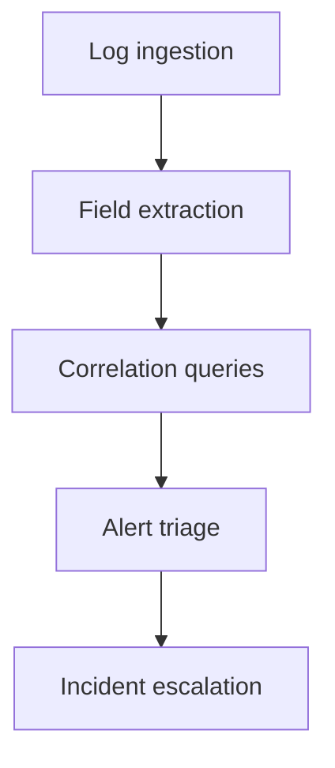
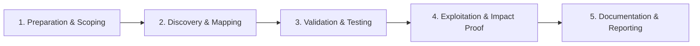

# SIEM & Log Analysis

Investigate events using centralized logging.

## Overview Diagram

Visual summary of the **attack/data flow** and the **five-phase testing workflow** for this topic.

### Attack / Data Flow

### Testing Workflow

## How It Works

Security Information and Event Management (SIEM) platforms **aggregate, normalize, and correlate** logs from across the enterprise for detection and investigation. Core capabilities:

- **Log ingestion** — Agents, syslog, API collectors (CloudTrail, Azure Activity, O365 Management API).
- **Parsing and CIM** — Field extraction for consistent searching (`src_ip`, `user`, `action`).
- **Correlation rules** — Join events across sources (failed logon + success from new geo).
- **Search and dashboards** — Ad-hoc investigation and KPI monitoring.
- **Retention and compliance** — Hot/warm/cold tiers per regulatory requirements.

Effective analysis requires understanding **what each log source actually records** and its blind spots (e.g., PowerShell Script Block Logging off = no script content).

## Exploitation

1. **Inventory log sources** — Document every onboarded source, parser version, and field mapping.
2. **Build correlation searches** — Example: 10+ failed 4625 followed by 4624 success (password spray).
3. **Create triage dashboards** — Top failed logons, new admin group members, rare process executions.
4. **Develop investigation playbooks** — "Suspicious logon" → query VPN, EDR, proxy for same user/IP.
5. **Hunt with baselines** — Compare this week's DNS queries to 30-day average; flag new domains.
6. **Use time normalization** — UTC everywhere; account for clock skew in correlation windows.
7. **Chain across clouds** — Correlate AWS CloudTrail `AssumeRole` with on-prem VPN logon.
8. **Measure ingestion health** — Alert on log source silence (possible attacker tampering).

## Defense & Mitigation

- **Centralize all critical sources** — EDR, firewall, proxy, DNS, auth, cloud audit; no silos.
- **Enable advanced logging** — Sysmon, PowerShell transcription, command-line auditing, DNS debug (where appropriate).
- **Immutable log storage** — WORM/S3 Object Lock for compliance and anti-tamper.
- **Staff SOC analysts** on query languages (SPL, KQL, Lucene) with regular training.
- **Monitor ingestion pipeline** — Parser failures silently drop fields.
- **Right-size retention** — Balance cost vs investigation window (90+ days recommended).
- **Automate enrichment** — Threat intel feeds, GeoIP, and asset context on every alert.

## Pro Tips

Practical advice from real engagements — use these to test faster and report better.

!!! tip "UTC everywhere"
    Normalize all timestamps to UTC before building timelines.

!!! tip "Entity pivot"
    Pick one user or host — pivot across DNS, proxy, auth, endpoint.

!!! tip "Rare process first"
    Statistical outliers beat keyword searches for unknown malware.

!!! tip "Save queries"
    Export working SPL/KQL as detection candidates.

!!! tip "Chain of custody"
    Note who pulled logs and when for incident reports.

## Testing Methodology

Work through each phase in order. Every step has a checkbox — complete them all for thorough, reproducible coverage.

### Phase 1 — Preparation & Scoping

- [ ] Confirm target is in program scope and ROE allows this test type
- [ ] Set up isolated lab or proxy (Burp/ZAP) with scope filters
- [ ] Document baseline application behavior and account roles
- [ ] Identify test accounts for each privilege level
- [ ] Define incident hypothesis and time window

### Phase 2 — Discovery & Mapping

- [ ] Collect logs from relevant sources (AD, endpoint, proxy)
- [ ] Normalize timestamps to UTC
- [ ] Build timeline of key events
- [ ] Filter noise with known-good baselines

### Phase 3 — Validation & Testing

- [ ] Correlate IOCs across data sources
- [ ] Pivot on user, host, and IP entities
- [ ] Identify root cause and blast radius
- [ ] Validate findings with secondary source

### Phase 4 — Exploitation & Impact Proof

- [ ] Document timeline for incident report
- [ ] Create detection queries for recurrence
- [ ] Recommend log retention and coverage gaps

### Phase 5 — Documentation & Reporting

- [ ] Write step-by-step reproduction with HTTP requests/responses
- [ ] Capture screenshots or video showing impact (redact sensitive data)
- [ ] Rate severity using program CVSS or impact matrix
- [ ] Provide concrete remediation guidance for developers
- [ ] Retest after fix if program allows verification

## Tools

| Tool | Usage |
|------|-------|
| `splunk` | [SIEM search & correlation](../../TOOLS_GUIDE.md) |
| `elastic` | [Elastic Security SIEM & detection](../../TOOLS_GUIDE.md) |
| `sentinel` | [Microsoft Sentinel analytics](../../TOOLS_GUIDE.md) |
| `chronicle` | [Google Chronicle threat detection](../../TOOLS_GUIDE.md) |

## Verification Checklist

- [ ] Review scope and rules of engagement
- [ ] Document baseline behavior
- [ ] Test edge cases and parser differentials
- [ ] Capture proof-of-concept safely
- [ ] Write remediation guidance
