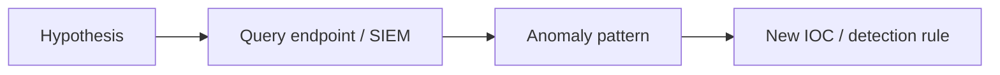

# Threat Hunting

Proactively search for adversary activity.

## Overview Diagram

## How It Works

Threat hunting is **proactive, hypothesis-driven search** for adversary activity that evades automated detections. Unlike alert-driven SOC work, hunters start with questions:

- "Is an attacker using valid credentials for lateral movement?"
- "Are there signs of Kerberoasting in our domain?"
- "Did any workstation beacon to a newly registered domain?"

The hunting loop:

1. **Hypothesis** — From threat intel, incident trends, or ATT&CK gaps.
2. **Investigation** — Query SIEM, EDR, DNS, and network telemetry.
3. **Pattern discovery** — Identify TTPs, IoCs, or behavioral anomalies.
4. **Enrichment** — Determine true positive vs benign admin activity.
5. **Outcome** — New detection rule, incident escalation, or hypothesis retired.

Hunting requires curated data, skilled analysts, and executive support for time not spent on tickets.

## Exploitation

1. **Select hypothesis** — Example: "APT uses WMI for lateral movement" → hunt Event 4688 with `wmiprvse.exe` parent processes.
2. **Gather data** — Pull 30 days of relevant logs into hunting workspace (Velociraptor, Jupyter + pandas, or SIEM).
3. **Stack counting** — Rare process paths, rare parent-child pairs, rare command-line arguments.
4. **Beaconing analysis** — Periodic HTTPS connections with low jitter to unknown domains.
5. **Credential anomaly** — Logons from new countries, impossible travel, service account interactive logons.
6. **Memory and disk hunts** — YARA scans across endpoints for known implants.
7. **Document hunt** — Hypothesis, queries, findings, and detection gaps filled.
8. **Convert wins to detections** — Successful hunts become Sigma rules with tuned thresholds.

## Defense & Mitigation

- **Dedicate hunting hours** — Weekly rotation for Tier 2+ analysts.
- **Maintain hunt library** — Reusable queries tagged by ATT&CK technique.
- **Invest in endpoint visibility** — EDR with process, network, and file telemetry.
- **Feed hunts from intel** — ISAC reports, CISA advisories, and internal incident lessons learned.
- **Measure outcomes** — Hunts resulting in new detections or confirmed incidents.
- **Purple team integration** — Red validates that hunts would catch simulated TTPs.
- **Avoid alert fatigue** — Hunts explore quietly; only escalate confirmed leads.

## Methodology

- [ ] Develop hypotheses from threat intel
- [ ] Query endpoint and network telemetry
- [ ] Stack rank anomalies
- [ ] Document hunts and outcomes

## Tools

| Tool | Usage |
|------|-------|
| `velociraptor` | [Endpoint visibility](https://github.com/Velocidex/velociraptor) |
| `sysmon` | [Windows monitoring](https://learn.microsoft.com/en-us/sysinternals/downloads/sysmon) |
| `yara` | Malware detection rules — [virustotal.github.io/yara](https://virustotal.github.io/yara/) |

## Verification Checklist

- [ ] Review scope and rules of engagement
- [ ] Document baseline behavior
- [ ] Test edge cases and parser differentials
- [ ] Capture proof-of-concept safely
- [ ] Write remediation guidance
