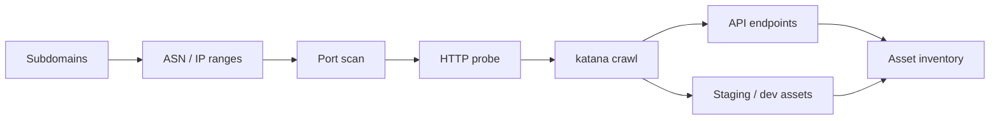
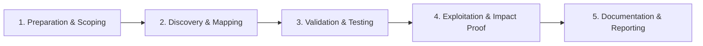

# Asset Discovery

Map all in-scope assets including APIs, mobile backends, and cloud resources.

## Overview Diagram

Visual summary of the **attack/data flow** and the **five-phase testing workflow** for this topic.

### Attack / Data Flow

### Testing Workflow

## How It Works

Asset discovery goes beyond subdomain lists to build a **complete map of in-scope resources**: web applications, APIs, mobile backends, cloud storage, IP ranges, ASN allocations, and third-party integrations.

Modern organizations expose assets across:

- **Corporate DNS** — Primary domains and acquired company brands.
- **Cloud providers** — S3 buckets, Azure blobs, GCP storage named after the company (`target-backups`, `target-dev`).
- **IP/ASN space** — Netblocks registered to the organization may host services not linked from public DNS.
- **Mobile and desktop apps** — Hardcoded API endpoints, analytics SDKs, and certificate pinning configs reveal hidden backends.
- **Code and artifact leaks** — GitHub, GitLab, npm packages, and Docker Hub images expose internal hostnames and API keys.

Attackers correlate these sources to find **forgotten properties**—acquired startups, deprecated products, and employee side projects still on corporate infrastructure.

## Exploitation

1. **Map ASN and IP ranges** — `asnmap -d target.com` and `mapcidr` to find netblocks; scan for web services not in DNS.
2. **Hunt cloud storage** — Probe `target-dev.s3.amazonaws.com`, permutations with `cloud_enum`, `s3scanner`, or nuclei S3 templates.
3. **Search code repositories** — GitHub dorks: `org:target password`, `target.com api_key`, `.env target`.
4. **Analyze mobile apps** — Decompile APK/IPA with `jadx`; extract API base URLs, staging hosts, and embedded secrets.
5. **Review acquisitions** — Enumerate domains owned by subsidiaries listed in annual reports or press releases.
6. **Crawl for assets** — `katana -u https://target.com -d 5` discovers linked domains, CDN origins, and third-party widgets.
7. **Cross-reference Shodan/Censys** — Search `ssl.cert.subject.cn:target.com` and `org:"Target Corp"` for unlisted services.
8. **Validate ownership** — Confirm each asset is in program scope before testing; document provenance for reports.

## Defense & Mitigation

- **Maintain a living asset register** tied to business owners, environment type, and decommission dates.
- **Integrate M&A due diligence** — Transfer or retire DNS, certs, and cloud accounts when acquiring companies.
- **Block public listing** of dev/staging buckets and storage; use private ACLs and IAM policies by default.
- **Scan code repositories** for secrets and internal hostnames; use `gitleaks` in CI and GitHub Advanced Security.
- **Inventory mobile app endpoints** and ensure they route through the same WAF and auth controls as web.
- **Deploy EASM** that correlates DNS, IPs, cloud APIs, and code leaks into one dashboard.
- **Run quarterly "forgotten asset" reviews** with security and infrastructure teams.

## Pro Tips

Practical advice from real engagements — use these to test faster and report better.

!!! tip "ASN mapping"
    `asnmap -d target.com` then scan owned IP ranges.

!!! tip "Acquisition hunting"
    Check acquired companies' domains still in DNS CNAME chains.

!!! tip "Mobile app strings"
    Extract API hosts from APK strings — often staging environments.

!!! tip "GitHub dorking"
    `org:target filename:.env` or `target.com password` in public repos.

!!! tip "Certificate transparency"
    New certs reveal hosts before DNS propagates publicly.

## Testing Methodology

Work through each phase in order. Every step has a checkbox — complete them all for thorough, reproducible coverage.

### Phase 1 — Preparation & Scoping

- [ ] Confirm target is in program scope and ROE allows this test type
- [ ] Set up isolated lab or proxy (Burp/ZAP) with scope filters
- [ ] Document baseline application behavior and account roles
- [ ] Identify test accounts for each privilege level
- [ ] Gather ASN, IP ranges, and acquisitions from scope

### Phase 2 — Discovery & Mapping

- [ ] Correlate IPs to cloud providers and CDNs
- [ ] Scan ports on discovered ranges
- [ ] Crawl live sites for API and mobile backends
- [ ] Search code repos and mobile apps for endpoints

### Phase 3 — Validation & Testing

- [ ] Validate each asset is in scope
- [ ] Identify forgotten acquisitions and dev environments
- [ ] Map API gateways and serverless functions
- [ ] Check S3 buckets and storage linked to org

### Phase 4 — Exploitation & Impact Proof

- [ ] Prioritize assets with weak auth or old software
- [ ] Feed inventory into vulnerability scanning
- [ ] Notify program of critical exposed assets

### Phase 5 — Documentation & Reporting

- [ ] Write step-by-step reproduction with HTTP requests/responses
- [ ] Capture screenshots or video showing impact (redact sensitive data)
- [ ] Rate severity using program CVSS or impact matrix
- [ ] Provide concrete remediation guidance for developers
- [ ] Retest after fix if program allows verification

## Tools

| Tool | Usage |
|------|-------|
| `asnmap` | [ASN mapping](https://github.com/projectdiscovery/asnmap) |
| `mapcidr` | [CIDR expansion](https://github.com/projectdiscovery/mapcidr) |
| `naabu` | [Fast port scanner](../../TOOLS_GUIDE.md#naabu) |
| `httpx` | [HTTP probing & tech detection](../../TOOLS_GUIDE.md#httpx) |
| `katana` | [Web crawler](../../TOOLS_GUIDE.md#katana) |

## Resources

- [ProjectDiscovery Tools](https://projectdiscovery.io/)

## Verification Checklist

- [ ] Review scope and rules of engagement
- [ ] Document baseline behavior
- [ ] Test edge cases and parser differentials
- [ ] Capture proof-of-concept safely
- [ ] Write remediation guidance
