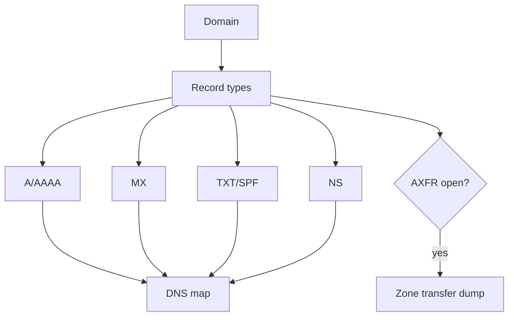
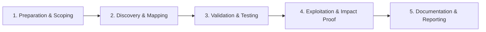

# DNS Enumeration

Extract DNS records, zone transfer opportunities, and mail infrastructure.

## Overview Diagram

Visual summary of the **attack/data flow** and the **five-phase testing workflow** for this topic.

### Attack / Data Flow

### Testing Workflow

## How It Works

DNS enumeration extracts the **naming and routing infrastructure** behind a domain: A/AAAA records (IPs), CNAME aliases (often to CDNs or cloud), MX (mail servers), NS (authoritative nameservers), TXT (SPF, DKIM, DMARC, domain verification tokens), and SRV records.

DNS data reveals:

- **Mail infrastructure** — MX records expose Microsoft 365, Google Workspace, or self-hosted Exchange (common phish and auth targets).
- **Email security posture** — SPF (`v=spf1`), DKIM selectors, and DMARC (`p=reject` vs `p=none`) indicate spoofing resistance.
- **Third-party integrations** — TXT records for Atlassian, Salesforce, Zoom, and Stripe verification prove service relationships.
- **Zone transfer (AXFR)** — If misconfigured, returns the entire zone in one query.
- **Dangling records** — CNAMEs to deleted cloud resources enable subdomain takeover.

DNS is often overlooked but provides high-impact findings without aggressive scanning.

## Exploitation

1. **Query all record types** — `dnsx -d target.com -a -aaaa -cname -mx -ns -txt -srv -resp` or `dig ANY target.com`.
2. **Attempt zone transfer** — `dig axfr @ns1.target.com target.com` against each listed nameserver.
3. **Analyze SPF/DMARC** — `dig txt target.com` and `_dmarc.target.com`; weak SPF (`+all`, overly broad includes) enables email spoofing reports.
4. **Enumerate DKIM selectors** — Common selectors: `default`, `google`, `selector1`, `k1`.
5. **Reverse DNS on discovered IPs** — `dig -x <ip>` reveals shared hosting and additional hostnames.
6. **Hunt dangling CNAMEs** — Resolve CNAME chains; probe for NXDOMAIN, NoSuchBucket, or GitHub 404 at the target.
7. **Search DNS history** — SecurityTrails, ViewDNS, and passive DNS APIs for removed records still cached.
8. **Document takeover proof** — Claim dangling resources only per program rules; serve a harmless PoC file.

## Defense & Mitigation

- **Disable AXFR** to unauthorized clients on all authoritative nameservers.
- **Implement strict DMARC** (`p=reject`) after SPF and DKIM alignment testing.
- **Tighten SPF** — Use `-all` or `~all`; avoid `+all` and excessive `include:` directives.
- **Remove DNS records** when decommissioning services; automate cleanup in terraform/CD pipelines.
- **Monitor CNAME targets** — Alert when a CNAME points to an unclaimed cloud resource.
- **Use DNSSEC** where supported to prevent cache poisoning (does not stop enumeration).
- **Audit TXT records** for leaked secrets and obsolete verification tokens.

## Testing Methodology

Work through each phase in order. Every step has a checkbox — complete them all for thorough, reproducible coverage.

### Phase 1 — Preparation & Scoping

- [ ] Confirm target is in program scope and ROE allows this test type
- [ ] Set up isolated lab or proxy (Burp/ZAP) with scope filters
- [ ] Document baseline application behavior and account roles
- [ ] Identify test accounts for each privilege level
- [ ] List root domains and approved TLD variants

### Phase 2 — Discovery & Mapping

- [ ] Query A, AAAA, MX, NS, TXT, CNAME, SRV records
- [ ] Attempt zone transfer (AXFR) on nameservers
- [ ] Extract SPF/DMARC/DKIM for email attack surface
- [ ] Find verification tokens in TXT records

### Phase 3 — Validation & Testing

- [ ] Validate dangling CNAMEs for takeover
- [ ] Map mail and third-party SaaS integrations
- [ ] Identify internal hostnames leaked in DNS
- [ ] Correlate with certificate transparency

### Phase 4 — Exploitation & Impact Proof

- [ ] Report DNS misconfigurations and takeovers
- [ ] Document email spoofing risk from SPF gaps
- [ ] Avoid publishing sensitive internal DNS externally

### Phase 5 — Documentation & Reporting

- [ ] Write step-by-step reproduction with HTTP requests/responses
- [ ] Capture screenshots or video showing impact (redact sensitive data)
- [ ] Rate severity using program CVSS or impact matrix
- [ ] Provide concrete remediation guidance for developers
- [ ] Retest after fix if program allows verification

## Tools

| Tool | Usage |
|------|-------|
| `dnsx` | [DNS toolkit](../../TOOLS_GUIDE.md#dnsx) |
| `dig` | [DNS lookup — built into Linux/macOS](../../TOOLS_GUIDE.md) |
| `dnsrecon` | DNS enumeration — [darkoperator/dnsrecon](https://github.com/darkoperator/dnsrecon) |
| `fierce` | DNS recon — [mschwager/fierce](https://github.com/mschwager/fierce) |

## Resources

- [HackTricks DNS](https://book.hacktricks.xyz/generic-methodologies-and-resources/pentesting-network/dns)

## Verification Checklist

- [ ] Review scope and rules of engagement
- [ ] Document baseline behavior
- [ ] Test edge cases and parser differentials
- [ ] Capture proof-of-concept safely
- [ ] Write remediation guidance
