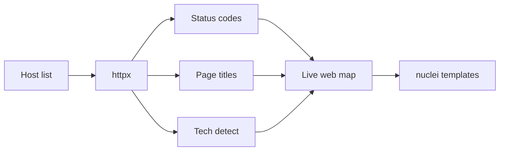
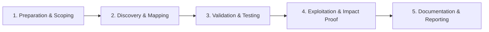

# HTTP Probing

Identify live web services, technologies, and response behaviors.

## Overview Diagram

Visual summary of the **attack/data flow** and the **five-phase testing workflow** for this topic.

### Attack / Data Flow

### Testing Workflow

## How It Works

HTTP probing determines which discovered hosts serve **live web applications** and collects metadata for prioritization: HTTP status codes, page titles, redirect chains, TLS certificates, response sizes, and technology fingerprints.

A host may resolve in DNS but return no web service; probing filters the asset list to actionable targets. Probers send HTTP/HTTPS requests (often HEAD or GET) and parse responses in parallel across thousands of hosts.

Key signals:

- **Status codes** — 200 (live app), 401/403 (auth required—interesting), 302 (redirect chains reveal internal hostnames).
- **Titles** — `Login`, `Dashboard`, `phpMyAdmin`, `Index of /` indicate high-value targets.
- **TLS cert SANs** — Certificate subject alternative names reveal additional hostnames for recursive enumeration.
- **CDN/WAF presence** — Cloudflare, Akamai, and AWS CloudFront headers affect which tests will succeed.

Tools like `httpx` integrate probing with tech detection, screenshotting, and favicon hashing for efficient pipeline stages.

## Exploitation

1. **Probe all resolved hosts** — `httpx -l hosts.txt -title -status-code -tech-detect -follow-redirects -threads 50 -o live.txt`.
2. **Test both HTTP and HTTPS** — Some apps only respond on one scheme; use `-ports 80,443,8080,8443`.
3. **Capture redirect chains** — `-follow-redirects` reveals `staging.internal` hostnames in Location headers.
4. **Hash favicons** — `httpx -favicon` matches default admin panel icons (Shodan favicon hash database).
5. **Screenshot for triage** — `gowitness` or `aquatone` visualizes hundreds of hosts for quick manual review.
6. **Filter by status** — Prioritize 200/401/403; investigate 502/503 for backend misconfigurations.
7. **Extract TLS SANs** — `httpx -tls-probe -json` feeds new subdomains back into enumeration.
8. **Build target tiers** — Tier 1: login pages and APIs; Tier 2: static sites; Tier 3: error pages worth content discovery.

## Defense & Mitigation

- **Remove or protect unused virtual hosts** — Default nginx/Apache pages on forgotten vhosts are common low-hanging fruit.
- **Normalize redirects** — Avoid leaking internal hostnames in Location headers.
- **Require authentication** on staging and admin interfaces; do not rely on obscurity.
- **Deploy WAF/CDN** consistently across all public vhosts, not only the main site.
- **Monitor for new live hosts** — Alert when httpx-equivalent scans would find new 200 responses on your IP space.
- **Use consistent TLS certificates** — Minimize SAN sprawl that expands attacker subdomain lists.
- **Return generic error pages** — Avoid verbose server banners and stack traces on probed endpoints.

## Testing Methodology

Work through each phase in order. Every step has a checkbox — complete them all for thorough, reproducible coverage.

### Phase 1 — Preparation & Scoping

- [ ] Confirm target is in program scope and ROE allows this test type
- [ ] Set up isolated lab or proxy (Burp/ZAP) with scope filters
- [ ] Document baseline application behavior and account roles
- [ ] Identify test accounts for each privilege level
- [ ] Prepare host list from subdomain enumeration

### Phase 2 — Discovery & Mapping

- [ ] Run httpx with status, title, tech-detect
- [ ] Filter by status codes (200, 301, 302, 403)
- [ ] Capture screenshots for visual triage
- [ ] Export JSON for downstream tools

### Phase 3 — Validation & Testing

- [ ] Identify interesting 403/401 for bypass testing
- [ ] Cluster by technology for targeted scans
- [ ] Detect WAF/CDN from headers
- [ ] Flag login portals and API docs

### Phase 4 — Exploitation & Impact Proof

- [ ] Hand off live URLs to manual and automated testing
- [ ] Update asset inventory with metadata
- [ ] Re-probe periodically for new services

### Phase 5 — Documentation & Reporting

- [ ] Write step-by-step reproduction with HTTP requests/responses
- [ ] Capture screenshots or video showing impact (redact sensitive data)
- [ ] Rate severity using program CVSS or impact matrix
- [ ] Provide concrete remediation guidance for developers
- [ ] Retest after fix if program allows verification

## Tools

| Tool | Usage |
|------|-------|
| `httpx` | [HTTP probing & tech detection](../../TOOLS_GUIDE.md#httpx) |
| `httprobe` | Legacy HTTP probe — prefer **httpx** |
| `aquatone` | Visual subdomain recon — [michenriksen/aquatone](https://github.com/michenriksen/aquatone) |
| `gowitness` | Screenshot live web hosts — [sensepost/gowitness](https://github.com/sensepost/gowitness) |

## Resources

- [ProjectDiscovery httpx](https://github.com/projectdiscovery/httpx)

## Verification Checklist

- [ ] Review scope and rules of engagement
- [ ] Document baseline behavior
- [ ] Test edge cases and parser differentials
- [ ] Capture proof-of-concept safely
- [ ] Write remediation guidance
