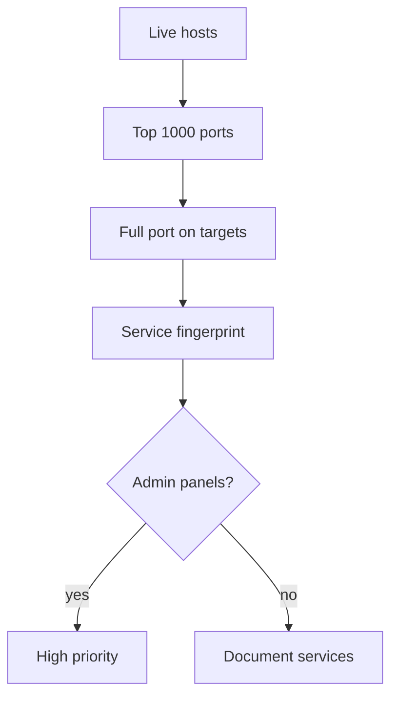
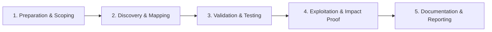

# Port Scanning

Identify open services and exposed management interfaces.

## Overview Diagram

Visual summary of the **attack/data flow** and the **five-phase testing workflow** for this topic.

### Attack / Data Flow

### Testing Workflow

## How It Works

Port scanning identifies **open TCP/UDP ports** on target hosts, revealing which network services accept connections. Each open port maps to a daemon (HTTP/443, SSH/22, RDP/3389, MySQL/3306) that may contain vulnerabilities or misconfigurations.

Scanners operate by sending probe packets and analyzing responses:

- **SYN scan** (`nmap -sS`) — Sends SYN, interprets SYN-ACK as open; stealthier than full connect.
- **Connect scan** — Completes TCP handshake; required without raw socket privileges.
- **Mass scanning** — `masscan` and `naabu` scan entire ranges at high speed using asynchronous I/O.

In bug bounty, port scanning is usually limited to **in-scope hosts** and may be restricted by program rules (rate limits, no full 65535-port sweeps). High-value findings include exposed databases, Redis/Memcached without auth, Docker APIs (2375), Kubernetes API (6443), and management panels (Jenkins 8080, Tomcat 8080).

## Exploitation

1. **Start with top ports** — `naabu -host target.com -top-ports 1000` or `nmap --top-ports 1000 target.com` for fast initial coverage.
2. **Expand on high-value hosts** — Full port scan (`-p-`) on staging, VPN gateways, and IPs from ASN mapping.
3. **Fingerprint services** — `nmap -sV -sC -p <ports> target.com` for version detection and default script output.
4. **Check UDP selectively** — DNS (53), SNMP (161), and NTP (123) when in scope; UDP scans are slow but find SNMP community strings.
5. **Hunt management interfaces** — Probe 8080, 8443, 9090, 3000, 5601 (Kibana), 9200 (Elasticsearch).
6. **Test default credentials** — Exposed Redis, MongoDB, and Elasticsearch often require no authentication.
7. **Respect rate limits** — Use `-T3` or lower; aggressive scanning may trigger abuse reports or program bans.
8. **Document service banners** — Include version strings in reports for CVE correlation.

## Defense & Mitigation

- **Default-deny firewall posture** — Only expose 443 (and 80 for redirect) to the internet; block all other ports at the perimeter.
- **No direct database exposure** — Bind MySQL, PostgreSQL, Redis to localhost or private subnets; use bastion/VPN for admin access.
- **Patch and harden exposed services** — If a port must be public, keep software current and require strong authentication.
- **Use cloud security groups** — Audit rules quarterly; remove `0.0.0.0/0` on non-HTTP ports.
- **Deploy IDS/IPS** to alert on port sweeps and connection attempts to management ports.
- **Segment internal services** — Even if one host is compromised, lateral scanning should not reach databases.
- **Continuous external scanning** — Run internal port scans from outside to verify perimeter rules hold.

## Testing Methodology

Work through each phase in order. Every step has a checkbox — complete them all for thorough, reproducible coverage.

### Phase 1 — Preparation & Scoping

- [ ] Confirm target is in program scope and ROE allows this test type
- [ ] Set up isolated lab or proxy (Burp/ZAP) with scope filters
- [ ] Document baseline application behavior and account roles
- [ ] Identify test accounts for each privilege level
- [ ] Confirm port scanning is allowed in program rules

### Phase 2 — Discovery & Mapping

- [ ] Start with top 1000 TCP ports on live hosts
- [ ] Expand to full scan on high-value targets only
- [ ] UDP scan critical services if permitted
- [ ] Document scan rate limits to avoid DoS

### Phase 3 — Validation & Testing

- [ ] Fingerprint service versions (nmap -sV)
- [ ] Identify management interfaces (8080, 8443, 3389)
- [ ] Check default credentials on exposed services
- [ ] Correlate with nuclei service templates

### Phase 4 — Exploitation & Impact Proof

- [ ] Deep test only on in-scope services
- [ ] Avoid brute force unless explicitly allowed
- [ ] Report exposed admin panels and databases

### Phase 5 — Documentation & Reporting

- [ ] Write step-by-step reproduction with HTTP requests/responses
- [ ] Capture screenshots or video showing impact (redact sensitive data)
- [ ] Rate severity using program CVSS or impact matrix
- [ ] Provide concrete remediation guidance for developers
- [ ] Retest after fix if program allows verification

## Tools

| Tool | Usage |
|------|-------|
| `naabu` | [Fast port scanner](../../TOOLS_GUIDE.md#naabu) |
| `nmap` | [Network scanner](../../TOOLS_GUIDE.md#nmap) |
| `masscan` | [High-speed port scanner](https://github.com/robertdavidgraham/masscan) |
| `rustscan` | [Fast port scanner](https://github.com/RustScan/RustScan) |

## Resources

- [Nmap Reference](https://nmap.org/book/man.html)

## Verification Checklist

- [ ] Review scope and rules of engagement
- [ ] Document baseline behavior
- [ ] Test edge cases and parser differentials
- [ ] Capture proof-of-concept safely
- [ ] Write remediation guidance
