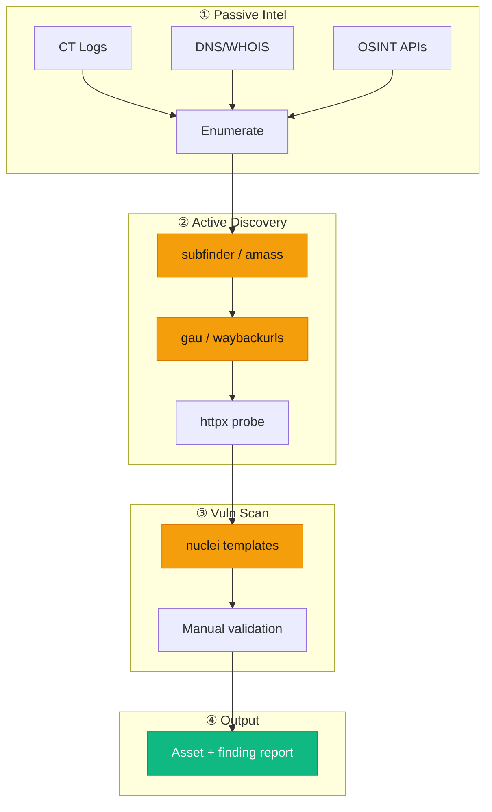
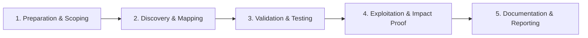

# Reconnaissance

Information gathering and target mapping for bug bounty programs.

## Overview Diagram

Visual summary of the **attack/data flow** and the **five-phase testing workflow** for this topic.

### Attack / Data Flow

<div class="sr-diagram" markdown="1">



</div>

### Testing Workflow

<div class="sr-diagram sr-diagram-methodology" markdown="1">



</div>

## How It Works

Reconnaissance is the systematic process of mapping a target's attack surface before vulnerability testing begins. In bug bounty programs, recon combines **passive intelligence** (data already published by third parties) with **active probing** (direct interaction with in-scope assets under program rules).

A typical pipeline flows through four layers:

1. **Scope validation** — Parse program rules for domains, wildcards, IP ranges, mobile apps, and out-of-scope exclusions.
2. **Passive collection** — Certificate transparency (crt.sh), DNS history, search engines, GitHub code search, Shodan/Censys, Wayback Machine, and breach databases surface hosts without touching the target directly.
3. **Active enumeration** — Subdomain brute force, DNS resolution, port scanning, and HTTP probing confirm what is live.
4. **Prioritization** — Rank assets by technology stack, authentication state, environment type (prod vs staging), and historical vulnerability density.

Effective recon produces an **asset inventory** that feeds downstream testing (nuclei, manual review, API mapping). Attackers and researchers share the same tooling; the difference is authorization and responsible disclosure.

## Exploitation

1. **Import scope** — Use `bbscope` or program JSON exports to build an authoritative domain/IP list; never test out-of-scope assets.
2. **Run passive first** — `subfinder -d target.com -all`, `amass enum -passive`, `gau target.com`, and `waybackurls` to avoid early active noise.
3. **Resolve and deduplicate** — Pipe subdomains through `puredns` or `dnsx` to filter wildcards and dead records.
4. **Probe live services** — `httpx -l subs.txt -title -status-code -tech-detect -follow-redirects` builds a prioritized web target list.
5. **Scan for exposures** — `nuclei -l live.txt -t exposures/ -t misconfiguration/` catches default panels, `.git` leaks, and misconfigured buckets.
6. **Correlate with acquisitions** — Search parent company domains and forgotten brands for shadow infrastructure.
7. **Track changes** — Re-run pipelines weekly; new subdomains and JS routes often precede public bug fixes.
8. **Document everything** — Maintain a spreadsheet or Notion board linking each asset to tests performed and findings.

## Defense & Mitigation

- **Maintain an authoritative asset inventory** updated from DNS, cloud consoles, and CMDB; unknown assets are the primary recon win for attackers.
- **Monitor certificate transparency** and alert on new subdomains under your brand; revoke or claim dangling DNS before takeover.
- **Reduce passive leakage** — Remove internal hostnames from public repos, job postings, and marketing pages.
- **Harden non-production environments** — Staging and dev hosts are recon magnets; require VPN, IP allowlists, or SSO.
- **Deploy external attack surface management (EASM)** to continuously discover what attackers see from the internet.
- **Rate-limit and alert on aggressive scanning** from unexpected ASNs while accepting good-faith researcher traffic per program policy.
- **Run your own recon pipeline internally** on a schedule; fix exposures before they appear on HackerOne.

## Pro Tips

Practical advice from real engagements — use these to test faster and report better.

!!! tip "One-liner recon chain"
    `subfinder -d target.com -silent | httpx -title -tech-detect -o live.txt`

!!! warning "Scope first"
    Load scope into Burp and all tools before touching anything — out-of-scope = instant ban.

!!! tip "Passive before active"
    Run passive enum 24h before active scans — programs notice aggressive scanning.

!!! tip "Track everything"
    Use a spreadsheet: asset, tech, status, findings, last tested.

!!! tip "Refresh weekly"
    Recon is never done — new subdomains appear on every CT log update.

## Quick Commands

```bash
# Full recon pipeline
subfinder -d target.com -all -o subs.txt
httpx -l subs.txt -title -status-code -tech-detect -o live.txt
naabu -list live.txt -top-ports 1000 -o ports.txt
nuclei -l live.txt -t exposures/ -t misconfiguration/ -o vulns.txt
```

!!! tip "Full Tool Guide"
    See the [Tools Guide](../../TOOLS_GUIDE.md) for install instructions, all flags, and pro tips.

## Testing Methodology

Work through each phase in order. Every step has a checkbox — complete them all for thorough, reproducible coverage.

### Phase 1 — Preparation & Scoping

- [ ] Confirm target is in program scope and ROE allows this test type
- [ ] Set up isolated lab or proxy (Burp/ZAP) with scope filters
- [ ] Document baseline application behavior and account roles
- [ ] Identify test accounts for each privilege level
- [ ] Export in-scope domains/IPs from program policy or bbscope
- [ ] Create asset tracker spreadsheet or notion DB

### Phase 2 — Discovery & Mapping

- [ ] Run passive subdomain enum (subfinder, amass, gau)
- [ ] Resolve DNS and filter wildcards
- [ ] Probe live hosts with httpx
- [ ] Fingerprint tech stack per host

### Phase 3 — Validation & Testing

- [ ] Prioritize high-value targets: admin, api, staging, dev
- [ ] Run nuclei on exposures and misconfigs
- [ ] Correlate findings with known CVEs
- [ ] Validate each finding manually before deep testing

### Phase 4 — Exploitation & Impact Proof

- [ ] Chain recon data into vuln testing workflows
- [ ] Document new assets for program notification if required
- [ ] Avoid aggressive scanning beyond ROE

### Phase 5 — Documentation & Reporting

- [ ] Write step-by-step reproduction with HTTP requests/responses
- [ ] Capture screenshots or video showing impact (redact sensitive data)
- [ ] Rate severity using program CVSS or impact matrix
- [ ] Provide concrete remediation guidance for developers
- [ ] Retest after fix if program allows verification

## Tools

| Tool | Usage |
|------|-------|
| `amass` | [OSINT & subdomain enum](../../TOOLS_GUIDE.md#amass) |
| `subfinder` | [Passive subdomain discovery](../../TOOLS_GUIDE.md#subfinder) |
| `assetfinder` | [Related domains & subdomains](../../TOOLS_GUIDE.md#assetfinder) |
| `httpx` | [HTTP probing & tech detection](../../TOOLS_GUIDE.md#httpx) |
| `nuclei` | [Template-based vuln scanner](../../TOOLS_GUIDE.md#nuclei) |
| `gau` | [Archive URL collection](../../TOOLS_GUIDE.md#gau) |
| `waybackurls` | [Wayback Machine URLs](../../TOOLS_GUIDE.md#waybackurls) |

## Resources

- [OWASP Testing Guide - Information Gathering](https://owasp.org/www-project-web-security-testing-guide/)
- [HackTricks Recon](https://book.hacktricks.xyz/generic-methodologies-and-resources/external-recon-methodology)

## Verification Checklist

- [ ] Review scope and rules of engagement
- [ ] Document baseline behavior
- [ ] Test edge cases and parser differentials
- [ ] Capture proof-of-concept safely
- [ ] Write remediation guidance
