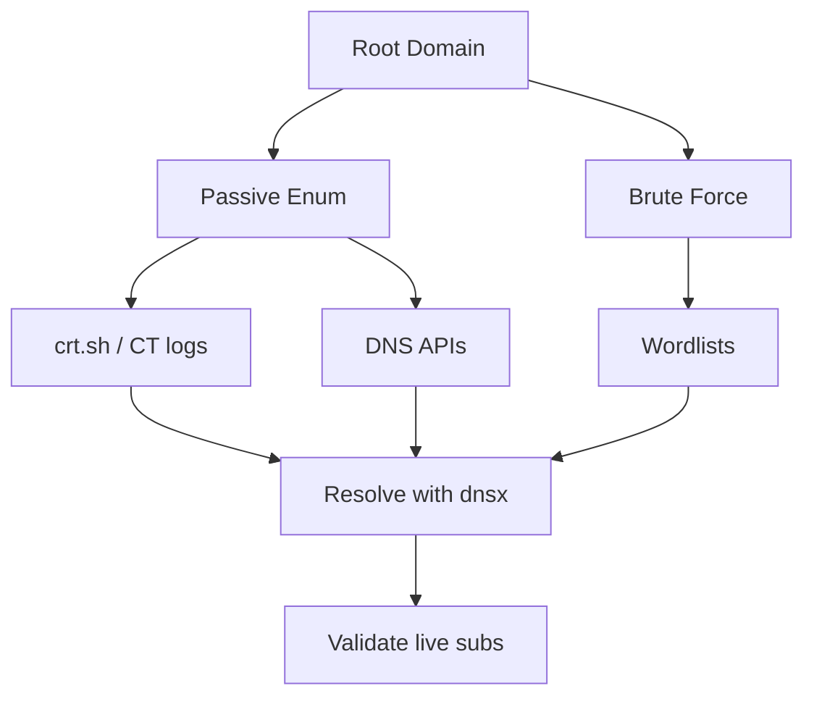

# Subdomain Enumeration

Discover subdomains and expand the attack surface.

## Overview Diagram

## How It Works

Subdomain enumeration discovers hostnames under a root domain (`*.target.com`) that expand the attack surface beyond the primary website. Hostnames are found through multiple channels:

- **Certificate Transparency (CT) logs** — Every publicly trusted TLS certificate is logged; services like crt.sh reveal `api`, `staging`, `jenkins`, and regional variants.
- **Passive DNS and search engines** — Historical resolutions and indexed pages expose hosts no longer in active use but still routable.
- **Brute force and permutation** — Tools combine wordlists (`subdomains-top1million`) with the root domain and resolve via high-speed resolvers (`massdns`, `puredns`).
- **Zone transfers and DNS records** — Misconfigured NS servers may AXFR entire zones.

**Wildcard DNS** (`*.target.com → single IP`) complicates enumeration: brute-force hits return false positives unless tools detect wildcard responses and filter them. Each discovered subdomain may host a distinct application, API, admin panel, or cloud service with different security posture.

## Exploitation

1. **Passive sweep** — `subfinder -d target.com -all -o passive.txt` and `amass enum -passive -d target.com` before sending any direct DNS traffic.
2. **CT log mining** — Query crt.sh for `%.target.com` and deduplicate SAN entries.
3. **Brute force with wildcard handling** — `puredns bruteforce wordlist.txt target.com -r resolvers.txt -w resolved.txt` filters wildcard noise.
4. **Permutation scanning** — `gotator` or `alterx` generate `dev-api`, `api-dev`, `api-staging` variants from known subdomains.
5. **Resolve and validate** — `dnsx -l candidates.txt -a -aaaa -cname -resp` confirms live records and follows CNAME chains to cloud providers.
6. **Check for takeovers** — CNAMEs pointing to deprovisioned S3, Azure, GitHub Pages, or Heroku instances are high-severity findings.
7. **Probe each live host** — Pass results to httpx and nuclei; staging subdomains often lack WAF and auth.
8. **Respect scope** — Wildcard `*.target.com` includes all subdomains unless explicitly excluded in program rules.

## Defense & Mitigation

- **Audit all DNS records quarterly**; remove dangling CNAMEs and unused subdomains.
- **Disable zone transfers** (AXFR) on authoritative nameservers except to designated secondaries.
- **Avoid wildcard DNS** where possible; if required, return NXDOMAIN for unprovisioned hosts instead of a catch-all virtual host.
- **Use CAA records** and monitor CT logs to detect unauthorized certificate issuance for your domains.
- **Claim or delete** cloud resources referenced by DNS before decommissioning services (S3, Azure Web Apps, Fastly).
- **Segment environments** — Do not point `staging.target.com` at production data; use separate accounts and credentials.
- **Alert on new subdomains** via automated CT monitoring (e.g., Facebook ct-monitor, Certstream, commercial EASM).

## Methodology

- [ ] Run passive enumeration from certificate transparency and archives
- [ ] Brute-force with curated wordlists
- [ ] Resolve and probe live hosts
- [ ] Track wildcard DNS behavior

## Tools

| Tool | Usage |
|------|-------|
| `subfinder` | [Passive subdomain discovery](../../TOOLS_GUIDE.md#subfinder) |
| `amass` | [OSINT & subdomain enum](../../TOOLS_GUIDE.md#amass) |
| `puredns` | [DNS resolver & wildcard filter](https://github.com/d3mondev/puredns) |
| `massdns` | [High-performance DNS stub](https://github.com/blechschmidt/massdns) |
| `dnsx` | [DNS toolkit](../../TOOLS_GUIDE.md#dnsx) |
| `shuffledns` | [Subdomain brute force](https://github.com/projectdiscovery/shuffledns) |

## Resources

- [Certificate Transparency](https://crt.sh/)
- [HackTricks Subdomain Enumeration](https://book.hacktricks.xyz/generic-methodologies-and-resources/external-recon-methodology#subdomain-enumeration)

## Verification Checklist

- [ ] Review scope and rules of engagement
- [ ] Document baseline behavior
- [ ] Test edge cases and parser differentials
- [ ] Capture proof-of-concept safely
- [ ] Write remediation guidance
