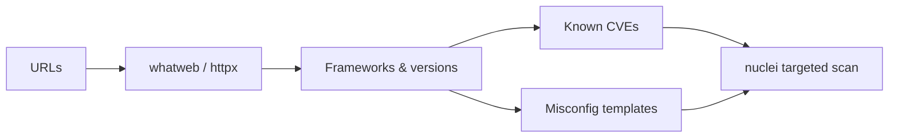
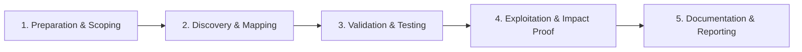

# Technology Detection

Fingerprint frameworks, CMS platforms, and third-party integrations.

## Overview Diagram

Visual summary of the **attack/data flow** and the **five-phase testing workflow** for this topic.

### Attack / Data Flow

### Testing Workflow

## How It Works

Technology detection fingerprints the **software stack** behind web applications: web servers (nginx, IIS), frameworks (Django, Rails, Spring), CMS platforms (WordPress, Drupal), JavaScript libraries, CDNs, WAFs, analytics, and payment processors.

Fingerprints come from:

- **HTTP response headers** — `Server`, `X-Powered-By`, `X-AspNet-Version`.
- **HTML patterns** — Meta generator tags, comment blocks, known DOM structures.
- **JavaScript and CSS paths** — `/wp-content/`, `/_next/static/`, `bundle.js` hashes.
- **Cookies** — `PHPSESSID`, `JSESSIONID`, `laravel_session`.
- **TLS certificate fields** — Organization names on internal services.
- **Favicon hashes** — Unique icons map to default installs (Jenkins, Grafana).

Once identified, versions are correlated with **CVE databases** and nuclei templates for targeted exploitation. Tech detection turns blind fuzzing into stack-aware testing.

## Exploitation

1. **Run automated detection** — `httpx -tech-detect`, `whatweb`, or Wappalyzer browser extension on each live host.
2. **Inspect headers manually** — Burp proxy reveals `Server`, custom `X-*` headers, and framework cookies.
3. **Map JavaScript dependencies** — Review `package.json` leaks, webpack chunks, and known library versions in source.
4. **Identify WAF/CDN** — `wafw00f` or nuclei WAF detection; adjust payloads for bypass techniques.
5. **Correlate versions to CVEs** — Search NVD for detected nginx 1.18, Struts 2.5, or Log4j versions.
6. **Run targeted nuclei templates** — `nuclei -t cves/ -tags wordpress` based on fingerprint.
7. **Check for end-of-life software** — PHP 7.4, Python 2.7, Windows Server 2012 indicate patch gaps.
8. **Document stack in reports** — Include version evidence (banner, file path) for triage teams.

## Defense & Mitigation

- **Suppress version banners** — Remove `Server` and `X-Powered-By` headers at reverse proxies.
- **Patch aggressively** — Subscribe to vendor advisories for your exact stack; test patches in staging first.
- **Remove unused plugins and modules** — WordPress plugins and npm dependencies expand CVE surface.
- **Deploy WAF rules** tuned to your framework's common attack patterns.
- **Use dependency scanning** — Dependabot, Snyk, and OWASP Dependency-Check in CI/CD.
- **Segment EOL systems** — Isolate unpatchable legacy apps behind VPN until replaced.
- **Inventory third-party scripts** — Analytics and chat widgets introduce supply-chain risk.

## Testing Methodology

Work through each phase in order. Every step has a checkbox — complete them all for thorough, reproducible coverage.

### Phase 1 — Preparation & Scoping

- [ ] Confirm target is in program scope and ROE allows this test type
- [ ] Set up isolated lab or proxy (Burp/ZAP) with scope filters
- [ ] Document baseline application behavior and account roles
- [ ] Identify test accounts for each privilege level
- [ ] Build URL list from live host inventory

### Phase 2 — Discovery & Mapping

- [ ] Run whatweb, httpx -tech-detect, Wappalyzer
- [ ] Identify frameworks, CMS, and server versions
- [ ] Check JS libraries for known vulnerable versions
- [ ] Map CDN, WAF, and load balancer products

### Phase 3 — Validation & Testing

- [ ] Cross-reference versions with CVE databases
- [ ] Run targeted nuclei templates per stack
- [ ] Identify outdated WordPress plugins, etc.
- [ ] Note default install paths for each tech

### Phase 4 — Exploitation & Impact Proof

- [ ] Prioritize CVE exploitation on in-scope targets
- [ ] Document tech stack per asset for reporting
- [ ] Retest after vendor patches

### Phase 5 — Documentation & Reporting

- [ ] Write step-by-step reproduction with HTTP requests/responses
- [ ] Capture screenshots or video showing impact (redact sensitive data)
- [ ] Rate severity using program CVSS or impact matrix
- [ ] Provide concrete remediation guidance for developers
- [ ] Retest after fix if program allows verification

## Tools

| Tool | Usage |
|------|-------|
| `whatweb` | [Web technology fingerprinting](https://github.com/urbanadventurer/WhatWeb) |
| `wappalyzer` | [Stack detection](https://www.wappalyzer.com/) |
| `nuclei` | [Template-based vuln scanner](../../TOOLS_GUIDE.md#nuclei) |
| `httpx -tech-detect` | [Technology fingerprinting](../../TOOLS_GUIDE.md#httpx) |

## Resources

- [Wappalyzer](https://www.wappalyzer.com/)

## Verification Checklist

- [ ] Review scope and rules of engagement
- [ ] Document baseline behavior
- [ ] Test edge cases and parser differentials
- [ ] Capture proof-of-concept safely
- [ ] Write remediation guidance
