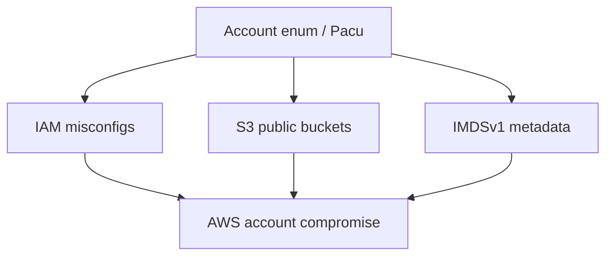
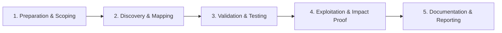

# AWS Security Testing

Assess Amazon Web Services misconfigurations and IAM issues.

## Overview Diagram

Visual summary of the **attack/data flow** and the **five-phase testing workflow** for this topic.

### Attack / Data Flow

### Testing Workflow

## How It Works

Amazon Web Services (AWS) security testing evaluates **Identity and Access Management (IAM)**, resource misconfigurations, and network exposure across accounts and regions. Core services under review:

- **IAM** — Users, roles, policies; privilege escalation via `iam:PassRole`, `sts:AssumeRole`, and overly permissive `*` actions.
- **S3** — Bucket policies and ACLs; public read/write buckets are top findings.
- **EC2** — Security groups with `0.0.0.0/0` on SSH/RDP; IMDSv1 SSRF to instance metadata credentials.
- **Lambda/API Gateway** — Overprivileged execution roles and unauthenticated APIs.
- **RDS/Secrets Manager** — Publicly accessible databases and hardcoded keys.

Attackers chain **credential leaks** (git, SSRF) to IAM roles, then enumerate and escalate within the account using tools like Pacu and Prowler.

## Exploitation

1. **Enumerate with leaked creds** — `aws sts get-caller-identity`; `aws iam list-users` and `list-attached-user-policies`.
2. **Run Prowler/ScoutSuite** — Automated misconfiguration scan across services.
3. **Hunt public S3** — `aws s3 ls`, nuclei S3 templates, and bucket name permutations.
4. **Test SSRF to IMDS** — From app SSRF, request `http://169.254.169.254/latest/meta-data/iam/security-credentials/` (IMDSv2 requires token header).
5. **Privilege escalation paths** — Pacu modules for `iam:CreateAccessKey`, `lambda:UpdateFunctionCode`, and `ec2:RunInstances` with admin instance profile.
6. **Security group audit** — `0.0.0.0/0` on ports 22, 3389, 3306, 6379.
7. **Cross-account roles** — Assume roles with external trust policies.
8. **Document per account/region** — Findings must map to resource ARNs.

## Defense & Mitigation

- **Enable AWS Organizations SCPs** — Guardrails against public S3 and unauthorized regions.
- **Require IMDSv2** on all EC2 instances; block SSRF metadata theft.
- **Least-privilege IAM** — No `*` actions; use permission boundaries and IAM Access Analyzer.
- **S3 Block Public Access** at account level; enable default encryption.
- **Enable CloudTrail** in all regions; ship to immutable S3 + SIEM.
- **MFA for console** and short-lived credentials via IAM Identity Center.
- **Regular Prowler/Config** compliance scans; remediate before external testers.

## Testing Methodology

Work through each phase in order. Every step has a checkbox — complete them all for thorough, reproducible coverage.

### Phase 1 — Preparation & Scoping

- [ ] Confirm target is in program scope and ROE allows this test type
- [ ] Set up isolated lab or proxy (Burp/ZAP) with scope filters
- [ ] Document baseline application behavior and account roles
- [ ] Identify test accounts for each privilege level
- [ ] Confirm AWS account IDs and regions in scope

### Phase 2 — Discovery & Mapping

- [ ] Enumerate IAM users, roles, policies with Pacu/ScoutSuite
- [ ] Check S3 bucket permissions and public access
- [ ] Review EC2 metadata IMDSv1 exposure
- [ ] Map Lambda, RDS, and secrets manager usage

### Phase 3 — Validation & Testing

- [ ] Exploit overly permissive IAM policies
- [ ] Access public or misconfigured S3 buckets
- [ ] Steal IAM creds from IMDS on compromised EC2
- [ ] Test privilege escalation paths in Pacu

### Phase 4 — Exploitation & Impact Proof

- [ ] Demonstrate account or data compromise
- [ ] Document ARN and policy granting access
- [ ] Recommend least privilege and IMDSv2

### Phase 5 — Documentation & Reporting

- [ ] Write step-by-step reproduction with HTTP requests/responses
- [ ] Capture screenshots or video showing impact (redact sensitive data)
- [ ] Rate severity using program CVSS or impact matrix
- [ ] Provide concrete remediation guidance for developers
- [ ] Retest after fix if program allows verification

## Tools

| Tool | Usage |
|------|-------|
| `pacu` | [AWS exploitation framework](../../TOOLS_GUIDE.md#pacu) |
| `prowler` | [Cloud security assessment](../../TOOLS_GUIDE.md#prowler) |
| `scout suite` | [Multi-cloud audit](../../TOOLS_GUIDE.md#scout-suite) |
| `cloudfox` | [AWS situational awareness](https://github.com/BishopFox/cloudfox) |

## Resources

- [AWS Security Best Practices](https://docs.aws.amazon.com/security/)

## Verification Checklist

- [ ] Review scope and rules of engagement
- [ ] Document baseline behavior
- [ ] Test edge cases and parser differentials
- [ ] Capture proof-of-concept safely
- [ ] Write remediation guidance
