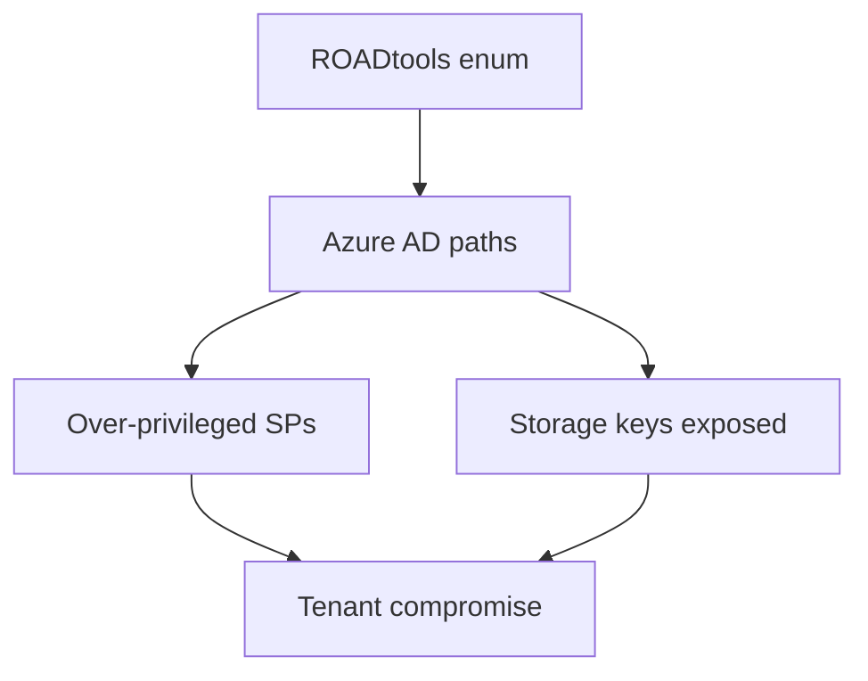
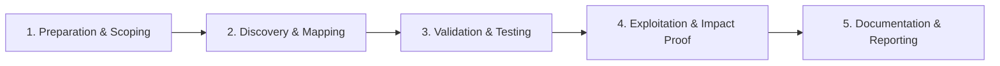

# Azure Security Testing

Assess Microsoft Azure identity and resource misconfigurations.

## Overview Diagram

Visual summary of the **attack/data flow** and the **five-phase testing workflow** for this topic.

### Attack / Data Flow

### Testing Workflow

## How It Works

Microsoft Azure security spans **Azure Active Directory (Entra ID)**, subscriptions, resource groups, and platform services. Key attack surfaces:

- **Entra ID** — User enumeration, password spray, OAuth consent phishing, misconfigured app registrations with excessive API permissions.
- **Storage accounts** — Public blob containers and shared access signatures (SAS) with long expiry.
- **Virtual machines** — NSG rules exposing RDP/SSH; managed identities with broad RBAC.
- **Key Vault** — Access policies granting secrets to overprivileged principals.
- **Azure DevOps / GitHub** — Pipeline secrets and service connections.

Azure uses **RBAC** (Owner, Contributor, Reader) at subscription/resource scope. Managed identities allow VMs and functions to authenticate without stored keys—but over-assigned roles create lateral movement paths.

## Exploitation

1. **Enumerate Entra ID** — `ROADtools` or `azurehound` for users, groups, apps, and role assignments.
2. **Password spray** — `MSOLSpray` or `o365creeper` against synced accounts (authorized only).
3. **Hunt storage exposure** — `MicroBurst` `Get-AzureBlobContent` and public container scanners.
4. **Abuse managed identities** — From compromised VM, request tokens from `http://169.254.169.254/metadata/identity/oauth2/token`.
5. **App registration abuse** — Excessive `Microsoft Graph` permissions (`Directory.ReadWrite.All`).
6. **Conditional access bypass** — Legacy auth protocols, device code flow.
7. **Key Vault access** — `az keyvault secret list` with compromised Contributor role.
8. **Map to MITRE** — Document Entra vs Azure Resource Manager attack paths.

## Defense & Mitigation

- **Enforce Conditional Access** — MFA, compliant devices, block legacy auth.
- **Disable public blob access** on storage accounts by default.
- **Use Privileged Identity Management (PIM)** — Just-in-time admin roles.
- **Audit app registrations** — Restrict admin consent; review API permissions.
- **Enable Defender for Cloud** and Entra ID Protection.
- **NSG default deny** — No RDP/SSH from internet; use Bastion or VPN.
- **Log Analytics** — Centralize Activity Log, Sign-in logs, and Sentinel analytics.

## Pro Tips

Practical advice from real engagements — use these to test faster and report better.

!!! tip "ROADtools enum"
    `roadrecon auth` then `roadrecon gather` maps entire AAD tenant.

!!! tip "Storage public blobs"
    `az storage blob list` with anonymous auth on guessed accounts.

!!! tip "PIM gaps"
    Permanent Global Admin assignments bypass PIM — hunt in AzureHound.

!!! tip "Service principal secrets"
    Expired secrets in repos — search GitHub for `client_secret`.

!!! tip "Conditional Access"
    Note MFA gaps on legacy auth protocols in report.

## Testing Methodology

Work through each phase in order. Every step has a checkbox — complete them all for thorough, reproducible coverage.

### Phase 1 — Preparation & Scoping

- [ ] Confirm target is in program scope and ROE allows this test type
- [ ] Set up isolated lab or proxy (Burp/ZAP) with scope filters
- [ ] Document baseline application behavior and account roles
- [ ] Identify test accounts for each privilege level
- [ ] Obtain tenant ID and test credentials

### Phase 2 — Discovery & Mapping

- [ ] Run ROADtools and AzureHound for AAD enum
- [ ] Map subscriptions, resource groups, and RBAC
- [ ] Check storage account public access
- [ ] Review conditional access and MFA coverage

### Phase 3 — Validation & Testing

- [ ] Exploit privileged service principals
- [ ] Access storage blobs and key vaults
- [ ] Test cross-tenant sync and federation issues
- [ ] Validate PIM and admin role assignments

### Phase 4 — Exploitation & Impact Proof

- [ ] Demonstrate subscription or tenant compromise path
- [ ] Document misconfigured role assignment
- [ ] Recommend Conditional Access and PIM

### Phase 5 — Documentation & Reporting

- [ ] Write step-by-step reproduction with HTTP requests/responses
- [ ] Capture screenshots or video showing impact (redact sensitive data)
- [ ] Rate severity using program CVSS or impact matrix
- [ ] Provide concrete remediation guidance for developers
- [ ] Retest after fix if program allows verification

## Tools

| Tool | Usage |
|------|-------|
| `roadtools` | [Azure AD exploration](https://github.com/dirkjanm/ROADtools) |
| `azurehound` | [Azure BloodHound collector](https://github.com/BloodHoundAD/AzureHound) |
| `microburst` | [Azure security assessment](https://github.com/NetSPI/MicroBurst) |

## Resources

- [HackTricks Azure](https://book.hacktricks.xyz/cloud-security/azure-security)

## Verification Checklist

- [ ] Review scope and rules of engagement
- [ ] Document baseline behavior
- [ ] Test edge cases and parser differentials
- [ ] Capture proof-of-concept safely
- [ ] Write remediation guidance
