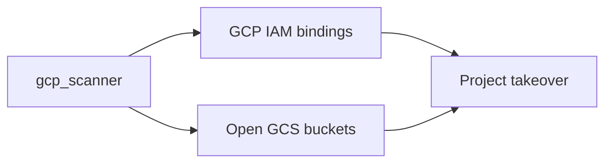
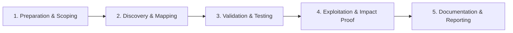

# GCP Security Testing

Assess Google Cloud Platform IAM and storage security.

## Overview Diagram

Visual summary of the **attack/data flow** and the **five-phase testing workflow** for this topic.

### Attack / Data Flow

### Testing Workflow

## How It Works

Google Cloud Platform (GCP) organizes resources in a hierarchy: **Organization → Folders → Projects**. IAM bindings attach roles to principals at any level with inheritance.

Critical services and risks:

- **Compute Engine** — Firewall rules tagged `0.0.0.0/0`; metadata server at `169.254.169.254` (similar SSRF risk to AWS).
- **Cloud Storage (GCS)** — `allUsers` or `allAuthenticatedUsers` IAM bindings.
- **Service accounts** — JSON key leaks; keys do not expire by default.
- **GKE (Kubernetes)** — Cluster admin bindings, workload identity misconfigs.
- **Cloud Functions** — Overprivileged runtime service accounts.

GCP's **Organization Policy Service** can enforce constraints (no public IPs, require OS Login) but is often not fully deployed.

## Exploitation

1. **Authenticate** — `gcloud auth activate-service-account` with leaked JSON key or metadata token from compromised VM.
2. **Enumerate IAM** — `gcloud projects get-iam-policy <project>`; hunt `roles/owner` and `roles/editor`.
3. **Scan storage** — `gsutil ls -p <project>`; check `allUsers:objectViewer`.
4. **Test SSRF to metadata** — Request metadata with `Metadata-Flavor: Google` header.
5. **Service account impersonation** — `roles/iam.serviceAccountTokenCreator` allows token minting.
6. **Firewall audit** — `gcloud compute firewall-rules list` for open SSH/RDP.
7. **GKE access** — `kubectl` with exposed endpoints or stolen kubeconfig.
8. **Privilege escalation** — `iam.serviceAccounts.setIamPolicy` to grant self access to powerful SAs.

## Defense & Mitigation

- **Disable service account key creation** org policy; use Workload Identity.
- **No `allUsers` on buckets** — Use uniform bucket-level access and IAM Conditions.
- **VPC Service Controls** — Perimeter around sensitive projects.
- **OS Login** for SSH instead of metadata-propagated SSH keys.
- **Enable Security Command Center** and audit logs to BigQuery/SIEM.
- **Least-privilege IAM** — Custom roles; avoid primitive Owner/Editor.
- **Regular Forseti/Scout Suite** assessments.

## Pro Tips

Practical advice from real engagements — use these to test faster and report better.

!!! tip "gcloud auth list"
    Stolen `application_default_credentials.json` unlocks project APIs.

!!! tip "GCS IAM fuzz"
    `gsutil iam get gs://bucket` on naming-convention buckets.

!!! tip "Default SA on GCE"
    Compute default SA often has editor — metadata token is the key.

!!! tip "Org policy bypass"
    Test cross-project SA impersonation when folder policies look strict.

!!! tip "gcp_scanner"
    Run on every project ID found in DNS or JS bundles.

## Testing Methodology

Work through each phase in order. Every step has a checkbox — complete them all for thorough, reproducible coverage.

### Phase 1 — Preparation & Scoping

- [ ] Confirm target is in program scope and ROE allows this test type
- [ ] Set up isolated lab or proxy (Burp/ZAP) with scope filters
- [ ] Document baseline application behavior and account roles
- [ ] Identify test accounts for each privilege level
- [ ] Identify GCP projects in scope

### Phase 2 — Discovery & Mapping

- [ ] Run gcp_scanner and Scout Suite
- [ ] Enumerate IAM bindings and service accounts
- [ ] Check GCS bucket IAM and public access
- [ ] Review compute default service account usage

### Phase 3 — Validation & Testing

- [ ] Exploit iam.serviceAccountUser chains
- [ ] Access open GCS buckets
- [ ] Steal metadata tokens from GCE instances
- [ ] Test org policy bypass

### Phase 4 — Exploitation & Impact Proof

- [ ] Demonstrate project data access or priv esc
- [ ] Document binding and resource affected
- [ ] Recommend workload identity and bucket policies

### Phase 5 — Documentation & Reporting

- [ ] Write step-by-step reproduction with HTTP requests/responses
- [ ] Capture screenshots or video showing impact (redact sensitive data)
- [ ] Rate severity using program CVSS or impact matrix
- [ ] Provide concrete remediation guidance for developers
- [ ] Retest after fix if program allows verification

## Tools

| Tool | Usage |
|------|-------|
| `gcp_scanner` | [GCP misconfiguration scan](https://github.com/google/gcp_scanner) |
| `scout suite` | [Multi-cloud audit](../../TOOLS_GUIDE.md#scout-suite) |

## Resources

- [HackTricks GCP](https://book.hacktricks.xyz/cloud-security/gcp-security)

## Verification Checklist

- [ ] Review scope and rules of engagement
- [ ] Document baseline behavior
- [ ] Test edge cases and parser differentials
- [ ] Capture proof-of-concept safely
- [ ] Write remediation guidance
