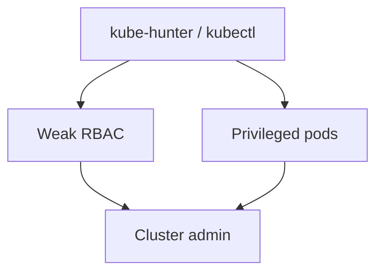
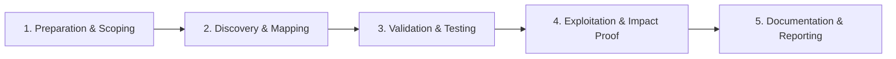

# Kubernetes Security

Assess cluster RBAC, secrets, and workload isolation.

## Overview Diagram

Visual summary of the **attack/data flow** and the **five-phase testing workflow** for this topic.

### Attack / Data Flow

### Testing Workflow

## How It Works

Kubernetes orchestrates containerized workloads across clusters of nodes. Security boundaries include:

- **API server** — Authenticates and authorizes all cluster operations via RBAC, admission controllers, and optional OPA/Gatekeeper policies.
- **etcd** — Stores all cluster state including Secrets (base64, not encrypted by default).
- **Nodes** — Run kubelet, container runtime; compromise grants access to all pods on the node.
- **Pods** — Service accounts with projected tokens; privileged pods can escape to the host.
- **Network policies** — Optional L3/L4 firewall between pods (often not deployed).

Common misconfigs: anonymous API access, cluster-admin bindings to default service accounts, secrets mounted in env vars, and exposed Dashboard/etcd.

## Exploitation

1. **Enumerate RBAC** — `kubectl auth can-i --list`; `kubectl get clusterrolebindings -o wide`.
2. **Hunt secrets** — `kubectl get secrets -A`; decode base64 values.
3. **Privileged pods** — `kubectl run pwn --image=alpine --privileged --overrides='...hostPID:true'` for node escape.
4. **Service account token abuse** — Steal mounted tokens; test permissions with `kubectl --token=`.
5. **kube-hunter/kube-bench** — Scan for exposed API, dashboard, and CIS benchmark failures.
6. **etcd exposure** — Port 2379 without TLS/auth dumps entire cluster state.
7. **Supply chain** — Malicious images in registries without admission scanning.
8. **Document namespace scope** — Findings per namespace and ClusterRole impact.

## Defense & Mitigation

- **Enable RBAC** — No anonymous access; audit cluster-admin bindings.
- **Pod Security Standards** (restricted) — No privileged, host namespaces, or root users.
- **Network policies** — Default deny inter-namespace traffic.
- **Encrypt etcd at rest**; restrict etcd to control plane only.
- **Rotate service account tokens**; use bound tokens with short TTL.
- **Admission controllers** — OPA/Gatekeeper, Kyverno for policy enforcement.
- **Image scanning** — Trivy/Grype in CI; sign with cosign.
- Follow [OWASP Kubernetes Top 10](https://owasp.org/www-project-kubernetes-top-ten/).

## Testing Methodology

Work through each phase in order. Every step has a checkbox — complete them all for thorough, reproducible coverage.

### Phase 1 — Preparation & Scoping

- [ ] Confirm target is in program scope and ROE allows this test type
- [ ] Set up isolated lab or proxy (Burp/ZAP) with scope filters
- [ ] Document baseline application behavior and account roles
- [ ] Identify test accounts for each privilege level
- [ ] Confirm cluster names and access level

### Phase 2 — Discovery & Mapping

- [ ] Run kube-hunter and kubectl auth can-i --list
- [ ] Enumerate pods, services, secrets, RBAC
- [ ] Check privileged pods and host mounts
- [ ] Review network policies and admission controllers

### Phase 3 — Validation & Testing

- [ ] Exploit weak RBAC (create pods, read secrets)
- [ ] Escape to node from privileged pod
- [ ] Access etcd or API server anonymously
- [ ] Test supply chain via malicious images

### Phase 4 — Exploitation & Impact Proof

- [ ] Demonstrate cluster-admin or namespace compromise
- [ ] Document RoleBinding and exploited permission
- [ ] Recommend RBAC least privilege and Pod Security

### Phase 5 — Documentation & Reporting

- [ ] Write step-by-step reproduction with HTTP requests/responses
- [ ] Capture screenshots or video showing impact (redact sensitive data)
- [ ] Rate severity using program CVSS or impact matrix
- [ ] Provide concrete remediation guidance for developers
- [ ] Retest after fix if program allows verification

## Tools

| Tool | Usage |
|------|-------|
| `kubectl` | [Kubernetes CLI](https://kubernetes.io/docs/reference/kubectl/) |
| `kube-hunter` | [Kubernetes pentest](../../TOOLS_GUIDE.md#kube-hunter) |
| `kubescape` | [K8s security posture](https://github.com/kubescape/kubescape) |

## Resources

- [OWASP Kubernetes Top 10](https://owasp.org/www-project-kubernetes-top-ten/)

## Verification Checklist

- [ ] Review scope and rules of engagement
- [ ] Document baseline behavior
- [ ] Test edge cases and parser differentials
- [ ] Capture proof-of-concept safely
- [ ] Write remediation guidance
