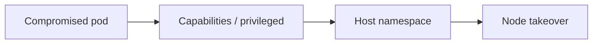
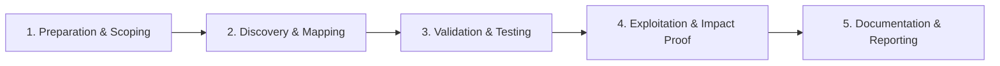

# Container Escape

Break out of container isolation to the host.

## Overview Diagram

Visual summary of the **attack/data flow** and the **five-phase testing workflow** for this topic.

### Attack / Data Flow

### Testing Workflow

## How It Works

**Container escape** breaks isolation between a container and the host kernel or other containers. Vectors include **privileged containers**, **host namespace sharing**, mounted **host paths** (`/`, `/proc`, docker.sock), **kernel exploits**, and abuse of **Linux capabilities** (CAP_SYS_ADMIN, CAP_DAC_READ_SEARCH).

cgroups v1 `release_agent` attacks write commands executed on the host when cgroup limits are exceeded. CVEs in runc, containerd, and the kernel periodically enable new escape primitives.

## Exploitation

1. **Enumerate**: `capsh --print`, check `/proc/1/cgroup`, mount points, and `id`.
2. **docker.sock**: instantiate host-root container as described in Docker section.
3. **Privileged + hostPath**: mount host disk and chroot into host filesystem.
4. **release_agent**: CDK/deepce automate cgroup escape on vulnerable configurations.
5. **Kernel exploits**: match `uname -r` to known CVEs (Dirty Pipe, etc.) in lab only.
6. **Confirm escape**: create file on host or read `/etc/shadow` from host mount.

Document exact misconfiguration; escapes are often configuration bugs not kernel bugs.

## Defense & Mitigation

- Never run **privileged** containers in production; validate with admission policy.
- Block hostPath mounts except tightly controlled exceptions.
- Keep kernel, runc, and containerd **patched**; subscribe to security advisories.
- Use gVisor or Kata Containers for stronger isolation on multi-tenant workloads.
- Monitor for escape indicators: unexpected mounts, cgroup writes, docker API from pods.
- Regularly pentest cluster configurations with kube-hunter from both outside and inside.

## Pro Tips

Practical advice from real engagements — use these to test faster and report better.

!!! tip "deepce checklist"
    Run deepce inside container — scores escape vectors automatically.

!!! tip "CAP_SYS_ADMIN + mount"
    Mount host filesystem when cgroup devices allow it.

!!! tip "Kernel match matters"
    Escape CVEs are kernel-specific — match exact host kernel.

!!! warning "Lab clusters only"
    Never test escape primitives on production orchestrators.

!!! tip "Proof from host"
    Screenshot `hostname` from host namespace — not container ID.

## Testing Methodology

Work through each phase in order. Every step has a checkbox — complete them all for thorough, reproducible coverage.

### Phase 1 — Preparation & Scoping

- [ ] Confirm target is in program scope and ROE allows this test type
- [ ] Set up isolated lab or proxy (Burp/ZAP) with scope filters
- [ ] Document baseline application behavior and account roles
- [ ] Identify test accounts for each privilege level
- [ ] Gain shell in target container

### Phase 2 — Discovery & Mapping

- [ ] Run deepce and CDK auto-scan
- [ ] Check privileged mode, caps, host mounts
- [ ] Review seccomp/AppArmor profiles
- [ ] Identify kernel version for CVE escape

### Phase 3 — Validation & Testing

- [ ] Exploit cap_sys_admin, docker.sock, or kernel bug
- [ ] Validate host filesystem access
- [ ] Document cgroup and namespace breakout path
- [ ] Test only in authorized lab cluster

### Phase 4 — Exploitation & Impact Proof

- [ ] Capture proof from host (not container) hostname
- [ ] Recommend gVisor/Kata and drop capabilities

### Phase 5 — Documentation & Reporting

- [ ] Write step-by-step reproduction with HTTP requests/responses
- [ ] Capture screenshots or video showing impact (redact sensitive data)
- [ ] Rate severity using program CVSS or impact matrix
- [ ] Provide concrete remediation guidance for developers
- [ ] Retest after fix if program allows verification

## Tools

| Tool | Usage |
|------|-------|
| `deepce` | [Container escape enumeration](../../TOOLS_GUIDE.md) |
| `cdk` | Container penetration toolkit — [cdk](https://github.com/cdk-team/CDK) |

## Resources

- [HackTricks Docker Escape](https://book.hacktricks.xyz/linux-hardening/privilege-escalation/docker-security/docker-breakout-privilege-escalation)

## Verification Checklist

- [ ] Review scope and rules of engagement
- [ ] Document baseline behavior
- [ ] Test edge cases and parser differentials
- [ ] Capture proof-of-concept safely
- [ ] Write remediation guidance
