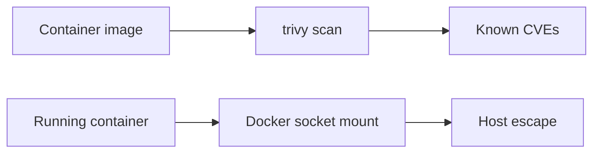

# Docker Security

Assess container images and runtime configurations.

## Overview Diagram

## How It Works

**Docker** packages applications with dependencies into images run as isolated containers on shared kernels. Security depends on namespace/cgroup isolation, image contents, runtime flags (`--privileged`, volume mounts, capabilities), and daemon configuration.

Images often contain CVEs, leaked secrets in layers, and root-default processes. The Docker socket (`/var/run/docker.sock`) mounted into a container grants host-level control—equivalent to root on the host.

## Exploitation

1. **Image scan**: `trivy image target:tag` and `grype` for CVEs and secrets.
2. **Runtime config**: check `docker inspect` for privileged mode, cap_add, host PID/network.
3. **Socket mount**: if `docker.sock` is mounted, run `docker -H unix:///var/run/docker.sock run` to escape to host.
4. **Secrets in layers**: `docker history` and dive for env vars and files in image history.
5. **Registry exposure**: scan for public registries with pull access to prod images.
6. **Container escape**: test known kernel CVEs only in authorized lab scope.

Use Docker Bench for Security for host-level configuration checks.

## Defense & Mitigation

- Run containers as **non-root**; use read-only root filesystems where possible.
- Drop all capabilities; add only required ones; apply default seccomp/AppArmor profiles.
- Never mount **docker.sock** into containers; use dedicated CI builders.
- Scan images in CI/CD; block deploy on critical CVEs.
- Use minimal base images (distroless, Alpine) and pin digests.
- Follow CIS Docker Benchmark; enable user namespaces and rootless Docker where feasible.

## Methodology

- [ ] Scan images for CVEs and secrets
- [ ] Check privileged mode and volume mounts
- [ ] Review capabilities and seccomp profiles
- [ ] Test container escape primitives

## Tools

| Tool | Usage |
|------|-------|
| `trivy` | [Container vulnerability scan](../../TOOLS_GUIDE.md#trivy) |
| `docker bench` | Docker CIS benchmark — [docker-bench-security](https://github.com/docker/docker-bench-security) |
| `grype` | Container vulnerability scanner — [Anchore Grype](https://github.com/anchore/grype) |

## Resources

- [CIS Docker Benchmark](https://www.cisecurity.org/benchmark/docker)

## Verification Checklist

- [ ] Review scope and rules of engagement
- [ ] Document baseline behavior
- [ ] Test edge cases and parser differentials
- [ ] Capture proof-of-concept safely
- [ ] Write remediation guidance
