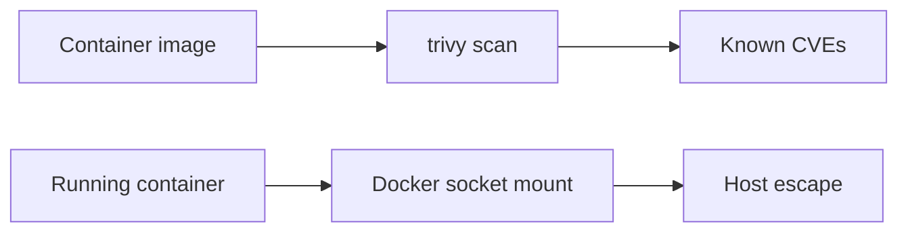
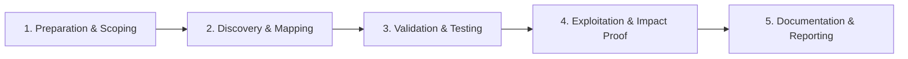

# Docker Security

Assess container images and runtime configurations.

## Overview Diagram

Visual summary of the **attack/data flow** and the **five-phase testing workflow** for this topic.

### Attack / Data Flow

### Testing Workflow

## How It Works

**Docker** packages applications with dependencies into images run as isolated containers on shared kernels. Security depends on namespace/cgroup isolation, image contents, runtime flags (`--privileged`, volume mounts, capabilities), and daemon configuration.

Images often contain CVEs, leaked secrets in layers, and root-default processes. The Docker socket (`/var/run/docker.sock`) mounted into a container grants host-level control—equivalent to root on the host.

## Exploitation

1. **Image scan**: `trivy image target:tag` and `grype` for CVEs and secrets.
2. **Runtime config**: check `docker inspect` for privileged mode, cap_add, host PID/network.
3. **Socket mount**: if `docker.sock` is mounted, run `docker -H unix:///var/run/docker.sock run` to escape to host.
4. **Secrets in layers**: `docker history` and dive for env vars and files in image history.
5. **Registry exposure**: scan for public registries with pull access to prod images.
6. **Container escape**: test known kernel CVEs only in authorized lab scope.

Use Docker Bench for Security for host-level configuration checks.

## Defense & Mitigation

- Run containers as **non-root**; use read-only root filesystems where possible.
- Drop all capabilities; add only required ones; apply default seccomp/AppArmor profiles.
- Never mount **docker.sock** into containers; use dedicated CI builders.
- Scan images in CI/CD; block deploy on critical CVEs.
- Use minimal base images (distroless, Alpine) and pin digests.
- Follow CIS Docker Benchmark; enable user namespaces and rootless Docker where feasible.

## Pro Tips

Practical advice from real engagements — use these to test faster and report better.

!!! tip "Socket exposure"
    `-v /var/run/docker.sock` in compose files = host root.

!!! tip "trivy in CI"
    Scan images before runtime — CVEs in base images are common.

!!! tip "Secrets in layers"
    `docker history` and dive reveal env vars baked into images.

!!! tip "CAP_SYS_ADMIN"
    Capabilities not dropped? Container escape primitives multiply.

!!! tip "Registry auth"
    Anonymous pull from private registry leaks proprietary images.

## Testing Methodology

Work through each phase in order. Every step has a checkbox — complete them all for thorough, reproducible coverage.

### Phase 1 — Preparation & Scoping

- [ ] Confirm target is in program scope and ROE allows this test type
- [ ] Set up isolated lab or proxy (Burp/ZAP) with scope filters
- [ ] Document baseline application behavior and account roles
- [ ] Identify test accounts for each privilege level
- [ ] Inventory container images and registries in scope

### Phase 2 — Discovery & Mapping

- [ ] Scan images with trivy and grype
- [ ] Run docker bench-security on hosts
- [ ] Check exposed Docker socket and API
- [ ] Review Dockerfile USER and capability drops

### Phase 3 — Validation & Testing

- [ ] Exploit CVE in container image
- [ ] Escape via mounted docker.sock
- [ ] Access secrets in env vars and layers
- [ ] Test registry authentication bypass

### Phase 4 — Exploitation & Impact Proof

- [ ] Demonstrate host escape or secret theft
- [ ] Document image tag and CVE
- [ ] Recommend non-root users and socket protection

### Phase 5 — Documentation & Reporting

- [ ] Write step-by-step reproduction with HTTP requests/responses
- [ ] Capture screenshots or video showing impact (redact sensitive data)
- [ ] Rate severity using program CVSS or impact matrix
- [ ] Provide concrete remediation guidance for developers
- [ ] Retest after fix if program allows verification

## Tools

| Tool | Usage |
|------|-------|
| `trivy` | [Container vulnerability scan](../../TOOLS_GUIDE.md#trivy) |
| `docker bench` | Docker CIS benchmark — [docker-bench-security](https://github.com/docker/docker-bench-security) |
| `grype` | Container vulnerability scanner — [Anchore Grype](https://github.com/anchore/grype) |

## Resources

- [CIS Docker Benchmark](https://www.cisecurity.org/benchmark/docker)

## Verification Checklist

- [ ] Review scope and rules of engagement
- [ ] Document baseline behavior
- [ ] Test edge cases and parser differentials
- [ ] Capture proof-of-concept safely
- [ ] Write remediation guidance
