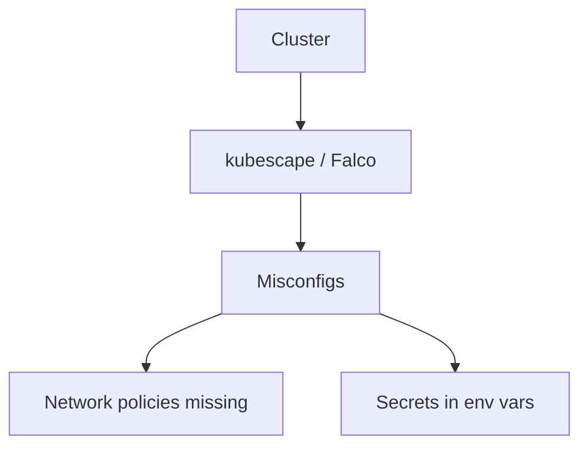
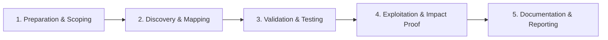

# Kubernetes Hardening

Secure Kubernetes clusters and workloads.

## Overview Diagram

Visual summary of the **attack/data flow** and the **five-phase testing workflow** for this topic.

### Attack / Data Flow

### Testing Workflow

## How It Works

**Kubernetes** orchestrates containers across nodes with RBAC, admission controllers, network policies, and secrets stored in etcd. Misconfigurations—overly permissive ClusterRoleBindings, default service accounts with API access, secrets in ConfigMaps, missing NetworkPolicies—allow lateral movement and cluster takeover.

The API server, kubelet, and etcd are high-value targets. Workloads in the same cluster often share flat network visibility unless policies segment traffic.

## Exploitation

1. **Recon from pod**: `kubectl auth can-i --list` if kubeconfig or token is available.
2. **Enumerate**: pods, secrets, configmaps, rolebindings across namespaces.
3. **Privileged pods**: create or exec into pods with hostPath, hostPID, or privileged securityContext.
4. **Secrets theft**: read secrets in accessible namespaces; decode base64 credentials.
5. **kube-hunter / kubescape**: automated misconfiguration scans.
6. **Network**: if no NetworkPolicy, scan cluster internal services from compromised pod.

Peirates and CDK automate common K8s privilege escalation paths from inside a pod.

## Defense & Mitigation

- Apply **least-privilege RBAC**; avoid cluster-admin bindings for applications.
- Enable **Pod Security Standards** (restricted baseline) via admission controllers.
- Encrypt etcd; restrict API server access; enable audit logging.
- Use **NetworkPolicies** for default-deny between namespaces.
- Rotate service account tokens; disable auto-mount where not needed.
- Run kubescape, kube-bench, and Falco for policy and runtime threat detection.

## Testing Methodology

Work through each phase in order. Every step has a checkbox — complete them all for thorough, reproducible coverage.

### Phase 1 — Preparation & Scoping

- [ ] Confirm target is in program scope and ROE allows this test type
- [ ] Set up isolated lab or proxy (Burp/ZAP) with scope filters
- [ ] Document baseline application behavior and account roles
- [ ] Identify test accounts for each privilege level
- [ ] Map namespaces and workloads in scope

### Phase 2 — Discovery & Mapping

- [ ] Run kubescape and Falco rule review
- [ ] Check Kyverno/Gatekeeper policy coverage
- [ ] Audit secrets mounted as env vars
- [ ] Review ingress and egress network policies

### Phase 3 — Validation & Testing

- [ ] Validate policy gaps with test deployments
- [ ] Trigger Falco alerts with benign attacks
- [ ] Test admission controller bypass
- [ ] Review RBAC for namespace admins

### Phase 4 — Exploitation & Impact Proof

- [ ] Demonstrate policy violation impact
- [ ] Document missing control and MITRE mapping
- [ ] Recommend policy-as-code in CI

### Phase 5 — Documentation & Reporting

- [ ] Write step-by-step reproduction with HTTP requests/responses
- [ ] Capture screenshots or video showing impact (redact sensitive data)
- [ ] Rate severity using program CVSS or impact matrix
- [ ] Provide concrete remediation guidance for developers
- [ ] Retest after fix if program allows verification

## Tools

| Tool | Usage |
|------|-------|
| `kubescape` | [K8s security posture](https://github.com/kubescape/kubescape) |
| `falco` | Runtime threat detection — [falco.org](https://falco.org/) |
| `kyverno` | Kubernetes policy engine — [kyverno.io](https://kyverno.io/) |

## Verification Checklist

- [ ] Review scope and rules of engagement
- [ ] Document baseline behavior
- [ ] Test edge cases and parser differentials
- [ ] Capture proof-of-concept safely
- [ ] Write remediation guidance
