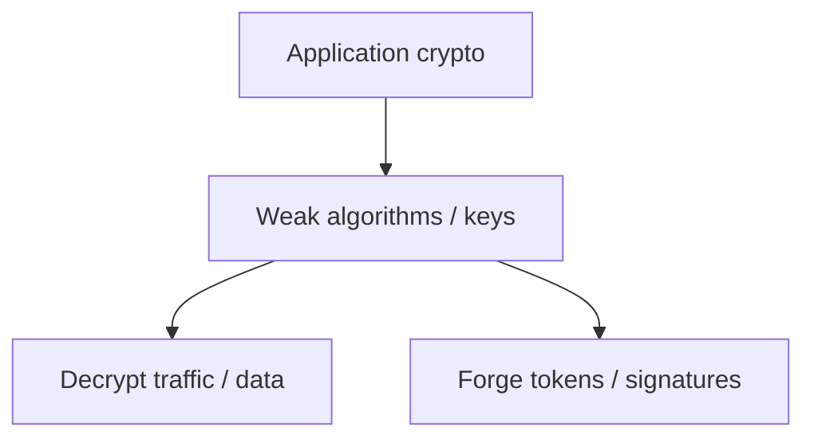
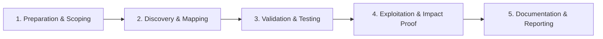

# Cryptographic Flaws

Identify weak algorithms, modes, and key management issues.

## Overview Diagram

Visual summary of the **attack/data flow** and the **five-phase testing workflow** for this topic.

### Attack / Data Flow

### Testing Workflow

## How It Works

Applications misuse cryptography in predictable ways: **weak algorithms** (MD5, SHA1 for passwords, DES, RC4), **ECB mode** leaking block patterns, **static IVs** enabling replay, **hardcoded keys** in source, and **insufficient entropy** in tokens.

Custom crypto implementations almost always fail. Even standard libraries are misused when developers skip authentication (encrypt-only AES-CBC), truncate HMACs, or compose primitives incorrectly.

## Exploitation

1. **Inventory crypto usage**: search code for `Cipher.getInstance`, `AES`, `RSA`, `random`, `Math.random`.
2. **Protocol review**: identify what is encrypted vs signed vs both (encrypt-then-MAC).
3. **Test weak modes**: ECB ciphertext reveals repeated blocks; compare identical plaintext blocks across messages.
4. **Key recovery**: grep for PEM files, base64 keys in configs, and default passwords.
5. **Token analysis**: decode session tokens; check length, charset, and predictability.
6. **Oracle conditions**: distinguish error messages for padding vs MAC failures.

Use testssl.sh and manual review for TLS; Burp for application-layer crypto tokens.

## Defense & Mitigation

- Use **AES-GCM or ChaCha20-Poly1305** for authenticated encryption; avoid ECB.
- Hash passwords with **Argon2id** or bcrypt with per-user salts.
- Generate keys and IVs with `SecureRandom` or platform CSPRNG APIs.
- Never implement custom ciphers or MAC constructions.
- Rotate keys with documented procedures; use HSMs or KMS for master keys.
- Follow OWASP Cryptographic Storage Cheat Sheet and NIST SP 800-57.

## Testing Methodology

Work through each phase in order. Every step has a checkbox — complete them all for thorough, reproducible coverage.

### Phase 1 — Preparation & Scoping

- [ ] Confirm target is in program scope and ROE allows this test type
- [ ] Set up isolated lab or proxy (Burp/ZAP) with scope filters
- [ ] Document baseline application behavior and account roles
- [ ] Identify test accounts for each privilege level
- [ ] Inventory crypto usage: TLS, at-rest, tokens, passwords

### Phase 2 — Discovery & Mapping

- [ ] Review algorithms and key lengths
- [ ] Test for hardcoded keys in source/binaries
- [ ] Analyze random number generation
- [ ] Check password hashing (bcrypt vs MD5)

### Phase 3 — Validation & Testing

- [ ] Exploit weak crypto to decrypt or forge
- [ ] Demonstrate token forgery with weak HMAC
- [ ] Validate TLS with testssl.sh
- [ ] Document deprecated algorithms in use

### Phase 4 — Exploitation & Impact Proof

- [ ] Show plaintext recovery or signature bypass
- [ ] Recommend modern algorithms and key management

### Phase 5 — Documentation & Reporting

- [ ] Write step-by-step reproduction with HTTP requests/responses
- [ ] Capture screenshots or video showing impact (redact sensitive data)
- [ ] Rate severity using program CVSS or impact matrix
- [ ] Provide concrete remediation guidance for developers
- [ ] Retest after fix if program allows verification

## Tools

| Tool | Usage |
|------|-------|
| `testssl.sh` | [TLS configuration testing](../../TOOLS_GUIDE.md#testsslsh) |
| `sslscan` | [SSL/TLS scanner](https://github.com/rbsec/sslscan) |
| `burp` | [Intercept, repeater & scanner](../../TOOLS_GUIDE.md#burp-suite) |

## Resources

- [OWASP Cryptographic Storage](https://cheatsheetseries.owasp.org/cheatsheets/Cryptographic_Storage_Cheat_Sheet.html)

## Verification Checklist

- [ ] Review scope and rules of engagement
- [ ] Document baseline behavior
- [ ] Test edge cases and parser differentials
- [ ] Capture proof-of-concept safely
- [ ] Write remediation guidance
