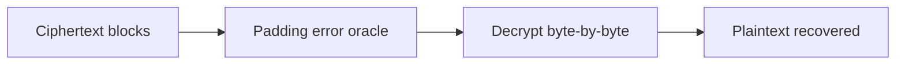

# Padding Oracle Attacks

Decrypt ciphertext by observing padding error differences.

## Overview Diagram

## How It Works

A **padding oracle** arises when an application using **CBC mode** returns different errors for invalid padding vs invalid plaintext—often after decryption. The attacker can submit modified ciphertext blocks and learn whether padding is valid, enabling **byte-by-byte decryption** without the key.

Classic examples include ASP.NET `ViewState`, WAF-decrypted cookies, and legacy APIs that decrypt client-supplied blobs. Modern **authenticated encryption** (GCM) and proper error handling eliminate this class when implemented correctly.

## Exploitation

1. **Identify encrypted cookies or parameters** (base64, block-aligned lengths).
2. **Confirm oracle**: flip bits in the last byte of a block; observe padding error vs success/other error.
3. **Automate**: PadBuster, Poracle, or custom scripts for byte-at-a-time decryption.
4. **Decrypt**: recover session tokens, serialized objects, or JSON claims.
5. **Encrypt/forgery**: reverse the oracle to craft valid ciphertext (e.g., elevate role in decrypted cookie).
6. **Validate impact**: replay forged tokens in the application.

Timing-based oracles require statistical analysis of response times instead of error strings.

## Defense & Mitigation

- Use **AES-GCM, AES-CCM, or ChaCha20-Poly1305** instead of CBC without authentication.
- If CBC is required, apply **encrypt-then-MAC** with constant-time MAC verification.
- Return **generic errors** for all decryption failures; log details server-side only.
- Implement constant-time comparison for MACs and tags.
- Migrate legacy ViewState and cookie encryption to signed, authenticated formats.
- Test with padding oracle scanners during security assessments.

## Methodology

- [ ] Identify CBC mode with error side channels
- [ ] Automate byte-by-byte decryption
- [ ] Forge valid ciphertext blocks
- [ ] Recommend authenticated encryption

## Tools

| Tool | Usage |
|------|-------|
| `padbuster` | [Padding oracle attacks](https://github.com/AonCyberLabs/PadBuster) |
| `custom scripts` | [Python/Bash automation for repeatable tests](../../TOOLS_GUIDE.md) |

## Verification Checklist

- [ ] Review scope and rules of engagement
- [ ] Document baseline behavior
- [ ] Test edge cases and parser differentials
- [ ] Capture proof-of-concept safely
- [ ] Write remediation guidance
