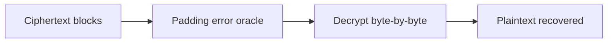
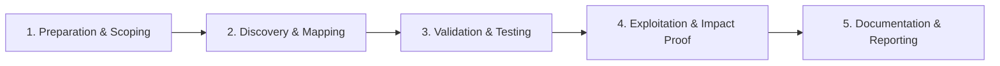

# Padding Oracle Attacks

Decrypt ciphertext by observing padding error differences.

## Overview Diagram

Visual summary of the **attack/data flow** and the **five-phase testing workflow** for this topic.

### Attack / Data Flow

### Testing Workflow

## How It Works

A **padding oracle** arises when an application using **CBC mode** returns different errors for invalid padding vs invalid plaintext—often after decryption. The attacker can submit modified ciphertext blocks and learn whether padding is valid, enabling **byte-by-byte decryption** without the key.

Classic examples include ASP.NET `ViewState`, WAF-decrypted cookies, and legacy APIs that decrypt client-supplied blobs. Modern **authenticated encryption** (GCM) and proper error handling eliminate this class when implemented correctly.

## Exploitation

1. **Identify encrypted cookies or parameters** (base64, block-aligned lengths).
2. **Confirm oracle**: flip bits in the last byte of a block; observe padding error vs success/other error.
3. **Automate**: PadBuster, Poracle, or custom scripts for byte-at-a-time decryption.
4. **Decrypt**: recover session tokens, serialized objects, or JSON claims.
5. **Encrypt/forgery**: reverse the oracle to craft valid ciphertext (e.g., elevate role in decrypted cookie).
6. **Validate impact**: replay forged tokens in the application.

Timing-based oracles require statistical analysis of response times instead of error strings.

## Defense & Mitigation

- Use **AES-GCM, AES-CCM, or ChaCha20-Poly1305** instead of CBC without authentication.
- If CBC is required, apply **encrypt-then-MAC** with constant-time MAC verification.
- Return **generic errors** for all decryption failures; log details server-side only.
- Implement constant-time comparison for MACs and tags.
- Migrate legacy ViewState and cookie encryption to signed, authenticated formats.
- Test with padding oracle scanners during security assessments.

## Pro Tips

Practical advice from real engagements — use these to test faster and report better.

!!! tip "Error differential"
    Compare response size, status, and body on bad padding vs good.

!!! tip "padbuster automation"
    `padbuster URL ciphertext 8` — block size 8 or 16.

!!! tip "Every encrypted field"
    Cookies, URL params, hidden form fields — test all.

!!! warning "Lab only decrypt"
    Decrypting live user sessions needs explicit authorization.

!!! tip "Fix is AEAD"
    Recommend AES-GCM or ChaCha20-Poly1305 — not just PKCS padding tweak.

## Testing Methodology

Work through each phase in order. Every step has a checkbox — complete them all for thorough, reproducible coverage.

### Phase 1 — Preparation & Scoping

- [ ] Confirm target is in program scope and ROE allows this test type
- [ ] Set up isolated lab or proxy (Burp/ZAP) with scope filters
- [ ] Document baseline application behavior and account roles
- [ ] Identify test accounts for each privilege level
- [ ] Identify CBC-mode encryption with error feedback

### Phase 2 — Discovery & Mapping

- [ ] Capture encrypted cookie or parameter
- [ ] Send modified ciphertext blocks
- [ ] Observe padding error vs valid responses
- [ ] Automate with padbuster or custom script

### Phase 3 — Validation & Testing

- [ ] Decrypt ciphertext byte-by-byte
- [ ] Forge valid ciphertext for chosen plaintext
- [ ] Validate on every encrypted field
- [ ] Test in lab before production

### Phase 4 — Exploitation & Impact Proof

- [ ] Demonstrate account takeover via forged cookie
- [ ] Recommend AES-GCM or encrypt-then-MAC

### Phase 5 — Documentation & Reporting

- [ ] Write step-by-step reproduction with HTTP requests/responses
- [ ] Capture screenshots or video showing impact (redact sensitive data)
- [ ] Rate severity using program CVSS or impact matrix
- [ ] Provide concrete remediation guidance for developers
- [ ] Retest after fix if program allows verification

## Tools

| Tool | Usage |
|------|-------|
| `padbuster` | [Padding oracle attacks](https://github.com/AonCyberLabs/PadBuster) |
| `custom scripts` | [Python/Bash automation for repeatable tests](../../TOOLS_GUIDE.md) |

## Verification Checklist

- [ ] Review scope and rules of engagement
- [ ] Document baseline behavior
- [ ] Test edge cases and parser differentials
- [ ] Capture proof-of-concept safely
- [ ] Write remediation guidance
