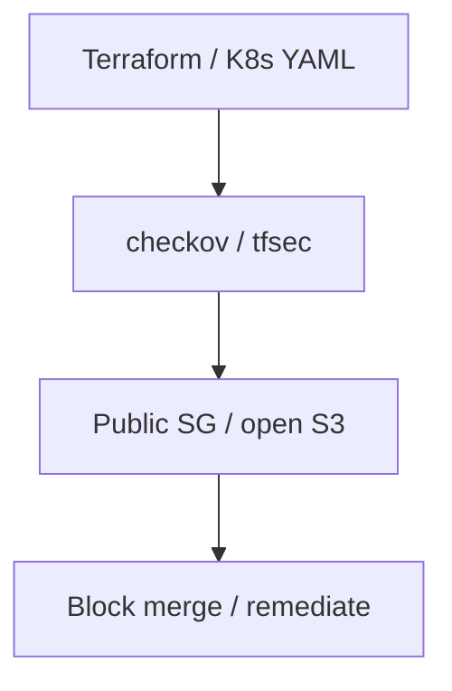

# Infrastructure as Code Security

Scan Terraform, CloudFormation, and Kubernetes manifests.

## Overview Diagram

## How It Works

**Infrastructure as Code** (Terraform, CloudFormation, Pulumi, Kubernetes YAML) defines cloud resources declaratively. Misconfigurations—public S3 buckets, open security groups, overly permissive IAM, unencrypted databases—are committed to git and deployed at scale.

State files (Terraform `.tfstate`) often contain secrets in plaintext. PR-based IaC changes bypass traditional change boards if policy checks are not enforced in CI.

## Exploitation

1. **Static scan**: `checkov -d .`, `tfsec`, `kics` on all IaC directories.
2. **Manual review**: `0.0.0.0/0` ingress, `Principal: *`, missing encryption flags.
3. **State file access**: if `.tfstate` is in S3 without encryption/IAM, extract secrets.
4. **Drift detection**: compare deployed resources vs templates for shadow admin accounts.
5. **Module supply chain**: third-party Terraform modules pulling unexpected providers.
6. **Kubernetes manifests**: privileged pods, hostNetwork, wildcard RBAC in git.

Integrate IaC scanning in PR checks; block merge on critical findings.

## Defense & Mitigation

- Run **policy-as-code** (OPA, Sentinel, Kyverno) on every IaC PR.
- Encrypt and restrict access to **Terraform state**; use remote backends with locking.
- Prohibit public access defaults; use SCPs at org level as guardrails.
- Peer review all infrastructure changes; separate prod apply roles.
- Scan for secrets in IaC with git-secrets and trufflehog.
- Maintain golden modules with secure defaults; deprecate risky patterns.

## Methodology

- [ ] Run static analysis on IaC templates
- [ ] Check for public resources and open security groups
- [ ] Enforce policy as code in PRs
- [ ] Review state file access controls

## Tools

| Tool | Usage |
|------|-------|
| `checkov` | [IaC security scanner](../../TOOLS_GUIDE.md#checkov) |
| `tfsec` | [Terraform security scanner](https://github.com/aquasecurity/tfsec) |
| `kics` | [IaC security (multi-cloud)](https://github.com/Checkmarx/kics) |

## Verification Checklist

- [ ] Review scope and rules of engagement
- [ ] Document baseline behavior
- [ ] Test edge cases and parser differentials
- [ ] Capture proof-of-concept safely
- [ ] Write remediation guidance
