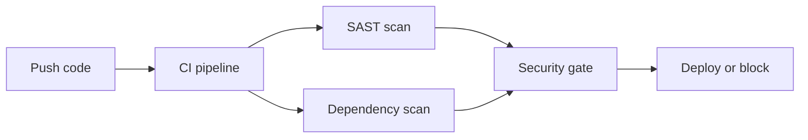

# CI/CD Pipeline Security

Secure build pipelines against secret leakage and supply chain attacks.

## Overview Diagram

## How It Works

**CI/CD pipelines** build, test, and deploy software with access to source code, cloud credentials, signing keys, and production deploy triggers. Compromise of a pipeline job (malicious PR, stolen `GITHUB_TOKEN`, poisoned action) equals compromise of everything the pipeline can touch.

GitHub Actions, GitLab CI, Jenkins, and CircleCI each have distinct permission models. Fork PR workflows, cached secrets in logs, and unpinned third-party actions are recurring vulnerability patterns.

## Exploitation

1. **Review workflows**: read `.github/workflows` for `pull_request_target`, excessive permissions.
2. **Poisoned PR**: submit workflow change that exfiltrates secrets on `pull_request_target`.
3. **Action pinning**: unpinned `@main` actions can be swapped to malicious versions.
4. **Log leakage**: trigger builds that print secrets to stdout (env vars, masked poorly).
5. **Artifact tampering**: replace build artifacts if signing and provenance are absent.
6. **OIDC abuse**: misconfigured cloud trust policies accepting tokens from any repo.

Use GitHub's workflow permission settings and branch protection as baseline controls.

## Defense & Mitigation

- Use **least-privilege** workflow permissions; default `contents: read` only.
- Pin actions to **full commit SHAs**; verify with allowed-actions policies.
- Avoid `pull_request_target` unless strictly necessary; never checkout untrusted PR code with secrets.
- Store secrets in vault/OIDC; rotate tokens; never echo secrets in logs.
- Sign artifacts with **Sigstore/cosign**; verify provenance with SLSA builders.
- Follow OWASP Top 10 CI/CD Security Risks; audit pipelines quarterly.

## Methodology

- [ ] Protect pipeline secrets and tokens
- [ ] Restrict who can modify workflows
- [ ] Sign artifacts and verify provenance
- [ ] Scan dependencies in CI

## Tools

| Tool | Usage |
|------|-------|
| `github actions` | [CI/CD pipeline security review](../../TOOLS_GUIDE.md) |
| `gitlab ci` | [Pipeline config & secret exposure review](../../TOOLS_GUIDE.md) |
| `snyk` | Dependency scanning — [snyk.io](https://snyk.io/) |
| `dependabot` | [GitHub dependency alerts & automated PRs](../../TOOLS_GUIDE.md) |

## Resources

- [OWASP CI/CD Security](https://owasp.org/www-project-top-10-ci-cd-security-risks/)

## Verification Checklist

- [ ] Review scope and rules of engagement
- [ ] Document baseline behavior
- [ ] Test edge cases and parser differentials
- [ ] Capture proof-of-concept safely
- [ ] Write remediation guidance
