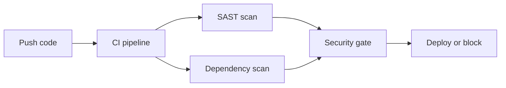
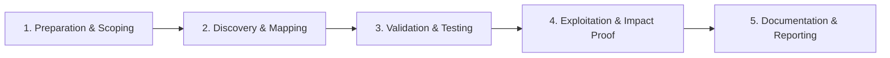

# CI/CD Pipeline Security

Secure build pipelines against secret leakage and supply chain attacks.

## Overview Diagram

Visual summary of the **attack/data flow** and the **five-phase testing workflow** for this topic.

### Attack / Data Flow

### Testing Workflow

## How It Works

**CI/CD pipelines** build, test, and deploy software with access to source code, cloud credentials, signing keys, and production deploy triggers. Compromise of a pipeline job (malicious PR, stolen `GITHUB_TOKEN`, poisoned action) equals compromise of everything the pipeline can touch.

GitHub Actions, GitLab CI, Jenkins, and CircleCI each have distinct permission models. Fork PR workflows, cached secrets in logs, and unpinned third-party actions are recurring vulnerability patterns.

## Exploitation

1. **Review workflows**: read `.github/workflows` for `pull_request_target`, excessive permissions.
2. **Poisoned PR**: submit workflow change that exfiltrates secrets on `pull_request_target`.
3. **Action pinning**: unpinned `@main` actions can be swapped to malicious versions.
4. **Log leakage**: trigger builds that print secrets to stdout (env vars, masked poorly).
5. **Artifact tampering**: replace build artifacts if signing and provenance are absent.
6. **OIDC abuse**: misconfigured cloud trust policies accepting tokens from any repo.

Use GitHub's workflow permission settings and branch protection as baseline controls.

## Defense & Mitigation

- Use **least-privilege** workflow permissions; default `contents: read` only.
- Pin actions to **full commit SHAs**; verify with allowed-actions policies.
- Avoid `pull_request_target` unless strictly necessary; never checkout untrusted PR code with secrets.
- Store secrets in vault/OIDC; rotate tokens; never echo secrets in logs.
- Sign artifacts with **Sigstore/cosign**; verify provenance with SLSA builders.
- Follow OWASP Top 10 CI/CD Security Risks; audit pipelines quarterly.

## Pro Tips

Practical advice from real engagements — use these to test faster and report better.

!!! tip "Fork PR secrets"
    GitHub Actions secrets unavailable on forks — test poisoned PR paths.

!!! tip "OIDC over long-lived tokens"
    Recommend `id-token: write` + cloud OIDC — no AWS keys in YAML.

!!! tip "PPE attacks"
    Pull Request Target workflows run with base repo secrets — high risk.

!!! tip "Branch protection"
    Require reviews and block force-push on default branch.

!!! tip "Artifact signing"
    cosign/sigstore for images — verify in deploy stage.

## Testing Methodology

Work through each phase in order. Every step has a checkbox — complete them all for thorough, reproducible coverage.

### Phase 1 — Preparation & Scoping

- [ ] Confirm target is in program scope and ROE allows this test type
- [ ] Set up isolated lab or proxy (Burp/ZAP) with scope filters
- [ ] Document baseline application behavior and account roles
- [ ] Identify test accounts for each privilege level
- [ ] Map CI/CD pipeline stages and secrets usage

### Phase 2 — Discovery & Mapping

- [ ] Review GitHub Actions / GitLab CI YAML
- [ ] Check secret storage and fork PR exposure
- [ ] Audit pipeline permissions and tokens
- [ ] Scan dependencies with Snyk/Dependabot

### Phase 3 — Validation & Testing

- [ ] Attempt poisoned PR pipeline execution
- [ ] Test secret exfiltration from workflow
- [ ] Validate branch protection rules
- [ ] Review artifact signing and provenance

### Phase 4 — Exploitation & Impact Proof

- [ ] Demonstrate supply chain attack path in fork
- [ ] Recommend OIDC, least privilege, and approval gates

### Phase 5 — Documentation & Reporting

- [ ] Write step-by-step reproduction with HTTP requests/responses
- [ ] Capture screenshots or video showing impact (redact sensitive data)
- [ ] Rate severity using program CVSS or impact matrix
- [ ] Provide concrete remediation guidance for developers
- [ ] Retest after fix if program allows verification

## Tools

| Tool | Usage |
|------|-------|
| `github actions` | [CI/CD pipeline security review](../../TOOLS_GUIDE.md) |
| `gitlab ci` | [Pipeline config & secret exposure review](../../TOOLS_GUIDE.md) |
| `snyk` | Dependency scanning — [snyk.io](https://snyk.io/) |
| `dependabot` | [GitHub dependency alerts & automated PRs](../../TOOLS_GUIDE.md) |

## Resources

- [OWASP CI/CD Security](https://owasp.org/www-project-top-10-ci-cd-security-risks/)

## Verification Checklist

- [ ] Review scope and rules of engagement
- [ ] Document baseline behavior
- [ ] Test edge cases and parser differentials
- [ ] Capture proof-of-concept safely
- [ ] Write remediation guidance
