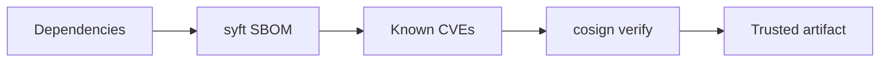
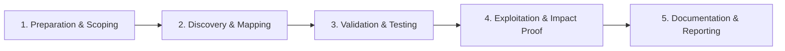

# Supply Chain Security

Protect software dependencies and build integrity.

## Overview Diagram

Visual summary of the **attack/data flow** and the **five-phase testing workflow** for this topic.

### Attack / Data Flow

### Testing Workflow

## How It Works

**Software supply chain** attacks compromise dependencies, build tools, or distribution channels so malicious code reaches downstream users. Examples include npm/PyPI typosquatting, compromised maintainer accounts, SolarWinds-style build injection, and unsigned container images.

Modern apps depend on hundreds of transitive packages. A single hijacked dependency version can steal environment variables, add backdoors, or sabotage builds.

## Exploitation

1. **Dependency audit**: `npm audit`, `pip-audit`, Dependabot alerts; review transitive deps.
2. **Typosquatting hunt**: search registries for packages mimicking internal names.
3. **SBOM diff**: compare Syft-generated SBOMs between releases for new publishers.
4. **Build review**: inspect CI for unpinned tools and post-install scripts (`preinstall`).
5. **Registry hygiene**: verify image signatures before deploy (`cosign verify`).
6. **Maintainer impersonation**: monitor for sudden major version bumps from new contributors.

Researcher perspective: report malicious packages to registries; publish IOCs responsibly.

## Defense & Mitigation

- **Pin dependencies** to exact versions; commit lockfiles; review lockfile changes in PRs.
- Generate and store **SBOMs** (CycloneDX, SPDX) for every release.
- Sign artifacts and images; enforce signature verification in deploy pipelines.
- Use private registries and npm/pypi proxies with malware scanning.
- Disable arbitrary post-install scripts in CI sandboxes where possible.
- Adopt **SLSA** levels incrementally; monitor CISA guidance on supply chain security.

## Pro Tips

Practical advice from real engagements — use these to test faster and report better.

!!! tip "SBOM on release"
    syft + grype in pipeline — block on critical CVEs.

!!! tip "Typosquat watch"
    Monitor npm/PyPI names similar to internal packages.

!!! tip "cosign verify"
    Enforce signature verification in admission controller.

!!! tip "Dependency confusion"
    Private package names claimed on public registries — namespace packages.

!!! tip "Pin digests"
    Image tags move — use `@sha256:` in production manifests.

## Testing Methodology

Work through each phase in order. Every step has a checkbox — complete them all for thorough, reproducible coverage.

### Phase 1 — Preparation & Scoping

- [ ] Confirm target is in program scope and ROE allows this test type
- [ ] Set up isolated lab or proxy (Burp/ZAP) with scope filters
- [ ] Document baseline application behavior and account roles
- [ ] Identify test accounts for each privilege level
- [ ] Generate SBOM with syft for critical apps

### Phase 2 — Discovery & Mapping

- [ ] Scan dependencies for known CVEs
- [ ] Review typosquatting and maintainer risks
- [ ] Verify image signatures with cosign
- [ ] Audit private registry access controls

### Phase 3 — Validation & Testing

- [ ] Demonstrate dependency confusion in lab
- [ ] Test compromised package update path
- [ ] Validate provenance attestation
- [ ] Document third-party risk tiering

### Phase 4 — Exploitation & Impact Proof

- [ ] Recommend SBOM in releases and signed artifacts

### Phase 5 — Documentation & Reporting

- [ ] Write step-by-step reproduction with HTTP requests/responses
- [ ] Capture screenshots or video showing impact (redact sensitive data)
- [ ] Rate severity using program CVSS or impact matrix
- [ ] Provide concrete remediation guidance for developers
- [ ] Retest after fix if program allows verification

## Tools

| Tool | Usage |
|------|-------|
| `syft` | [SBOM generator](https://github.com/anchore/syft) |
| `cosign` | [Container signing](https://github.com/sigstore/cosign) |
| `dependabot` | [GitHub dependency alerts & automated PRs](../../TOOLS_GUIDE.md) |

## Resources

- [SLSA Framework](https://slsa.dev/)

## Verification Checklist

- [ ] Review scope and rules of engagement
- [ ] Document baseline behavior
- [ ] Test edge cases and parser differentials
- [ ] Capture proof-of-concept safely
- [ ] Write remediation guidance
