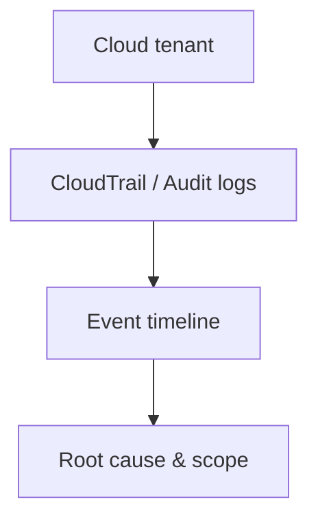
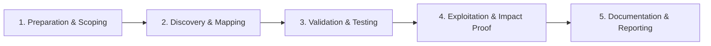

# Cloud Forensics

Investigate incidents in cloud environments.

## Overview Diagram

Visual summary of the **attack/data flow** and the **five-phase testing workflow** for this topic.

### Attack / Data Flow

### Testing Workflow

## How It Works

**Cloud forensics** investigates incidents in AWS, Azure, and GCP where attackers lack physical access but abuse IAM, APIs, and misconfigurations. Evidence lives in **audit logs** (CloudTrail, Azure Activity Log, GCP Audit Logs), flow logs, snapshot APIs, and SaaS integrations.

Multi-region deployments, ephemeral instances, and shared responsibility models complicate acquisition. Logs may be disabled, encrypted, or in attacker-controlled accounts.

## Exploitation

1. **Preserve logs**: export CloudTrail to immutable S3; enable organization trail.
2. **Snapshot volumes**: EBS/Azure disk snapshots for offline disk forensics.
3. **Memory**: SSM Run Command or vendor-specific memory capture where supported.
4. **IAM trace**: session issuer, `AssumeRole` chains, access key creation events.
5. **Network**: VPC Flow Logs, GuardDuty findings, WAF logs.
6. **Cross-account**: identify role trust policies abused for pivot.

Use dedicated forensics account with read-only roles; avoid modifying evidence in-place.

## Defense & Mitigation

- **Organization-wide audit logging** with log file validation and MFA delete on buckets.
- Central SIEM ingestion for all cloud audit and flow logs.
- Restrict IAM ability to disable logging or delete trails (SCPs).
- Automated snapshots and **Velociraptor/osquery** on cloud workloads.
- Incident response runbooks specific to cloud API abuse.
- Regular purple-team exercises simulating credential theft in cloud consoles.

## Pro Tips

Practical advice from real engagements — use these to test faster and report better.

!!! tip "Pull logs fast"
    CloudTrail retention defaults — export before expiry.

!!! tip "AssumeRole trail"
    Attacker pivot often shows as cross-account AssumeRole.

!!! tip "GuardDuty correlation"
    Use findings as index into raw CloudTrail events.

!!! tip "Region sweep"
    Attackers create resources in unused regions.

!!! tip "IAM change timeline"
    New access keys and policy attachments = priority events.

## Testing Methodology

Work through each phase in order. Every step has a checkbox — complete them all for thorough, reproducible coverage.

### Phase 1 — Preparation & Scoping

- [ ] Confirm target is in program scope and ROE allows this test type
- [ ] Set up isolated lab or proxy (Burp/ZAP) with scope filters
- [ ] Document baseline application behavior and account roles
- [ ] Identify test accounts for each privilege level
- [ ] Identify cloud account and incident timeframe

### Phase 2 — Discovery & Mapping

- [ ] Pull CloudTrail / Azure Activity / GCP Audit logs
- [ ] Review IAM changes and API calls
- [ ] Correlate with GuardDuty/Sentinel alerts
- [ ] Preserve logs before retention expiry

### Phase 3 — Validation & Testing

- [ ] Reconstruct attacker API sequence
- [ ] Identify compromised credentials and resources
- [ ] Scope data access and exfiltration
- [ ] Document region and account affected

### Phase 4 — Exploitation & Impact Proof

- [ ] Recommend credential rotation and policy fixes
- [ ] Enable additional logging if gaps found

### Phase 5 — Documentation & Reporting

- [ ] Write step-by-step reproduction with HTTP requests/responses
- [ ] Capture screenshots or video showing impact (redact sensitive data)
- [ ] Rate severity using program CVSS or impact matrix
- [ ] Provide concrete remediation guidance for developers
- [ ] Retest after fix if program allows verification

## Tools

| Tool | Usage |
|------|-------|
| `aws cli` | [Cloud forensics with `aws cloudtrail lookup-events`](../../TOOLS_GUIDE.md) |
| `azure monitor` | [Azure log analytics & Sentinel queries](../../TOOLS_GUIDE.md) |
| `gcp logging` | [Cloud Logging & Chronicle investigation](../../TOOLS_GUIDE.md) |

## Verification Checklist

- [ ] Review scope and rules of engagement
- [ ] Document baseline behavior
- [ ] Test edge cases and parser differentials
- [ ] Capture proof-of-concept safely
- [ ] Write remediation guidance
