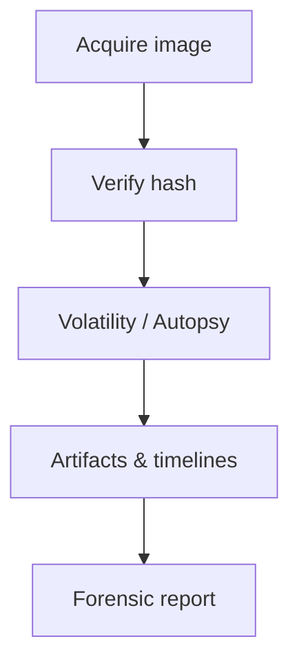
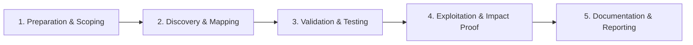

# Disk & Memory Forensics

Acquire and analyze disk images and memory dumps.

## Overview Diagram

Visual summary of the **attack/data flow** and the **five-phase testing workflow** for this topic.

### Attack / Data Flow

### Testing Workflow

## How It Works

**Disk forensics** analyzes filesystem images acquired with write blockers to recover deleted files, registry hives, browser history, and malware persistence. **Memory forensics** examines RAM dumps for running processes, network connections, injected code, and credentials not present on disk.

Timestamps (MFT, USN journal, prefetch) build activity timelines. Volatility/Rekall parse kernel structures to extract artifacts without booting the suspect system.

## Exploitation

1. **Acquire**: FTK Imager or `dd` with hardware write blocker; document hashes.
2. **Mount safely**: read-only loop mount or forensic suites (Autopsy, Arsenal Image Mounter).
3. **Parse artifacts**: MFT entries, `$LogFile`, registry `Run` keys, Shimcache.
4. **Memory dump**: WinPMEM, LiME on Linux; capture before power-off when possible.
5. **Volatility**: `windows.pslist`, `windows.malfind`, `windows.netscan` for IoCs.
6. **Timeline**: Plaso/log2timeline to correlate file, registry, and event log activity.

Maintain chain of custody documentation for legal admissibility.

## Defense & Mitigation

- Enable **centralized logging** and EDR memory scanning for live response.
- Full disk encryption with secure key management; TPM binding.
- Restrict physical access; secure boot and measured boot where applicable.
- Regular forensic readiness drills; pre-approved acquisition playbooks.
- Retain logs and images per policy; immutable WORM storage for evidence.
- Train IR team on proper acquisition to avoid spoliation.

## Testing Methodology

Work through each phase in order. Every step has a checkbox — complete them all for thorough, reproducible coverage.

### Phase 1 — Preparation & Scoping

- [ ] Confirm target is in program scope and ROE allows this test type
- [ ] Set up isolated lab or proxy (Burp/ZAP) with scope filters
- [ ] Document baseline application behavior and account roles
- [ ] Identify test accounts for each privilege level
- [ ] Secure legal authority and chain of custody forms

### Phase 2 — Discovery & Mapping

- [ ] Acquire disk image with FTK Imager/write-blocker
- [ ] Verify SHA-256 hash of image
- [ ] Run Volatility on memory dump
- [ ] Mount read-only for Autopsy analysis

### Phase 3 — Validation & Testing

- [ ] Extract timeline, browser history, and malware
- [ ] Recover deleted files and registry hives
- [ ] Correlate artifacts across users
- [ ] Document tool versions and methods

### Phase 4 — Exploitation & Impact Proof

- [ ] Produce forensic report admissible to process
- [ ] Preserve original media securely

### Phase 5 — Documentation & Reporting

- [ ] Write step-by-step reproduction with HTTP requests/responses
- [ ] Capture screenshots or video showing impact (redact sensitive data)
- [ ] Rate severity using program CVSS or impact matrix
- [ ] Provide concrete remediation guidance for developers
- [ ] Retest after fix if program allows verification

## Tools

| Tool | Usage |
|------|-------|
| `ftk imager` | Disk imaging — [AccessData FTK](https://www.exterro.com/ftk-imager) |
| `volatility` | [Memory forensics](../../TOOLS_GUIDE.md#volatility) |
| `autopsy` | Digital forensics — [Autopsy](https://www.autopsy.com/) |

## Verification Checklist

- [ ] Review scope and rules of engagement
- [ ] Document baseline behavior
- [ ] Test edge cases and parser differentials
- [ ] Capture proof-of-concept safely
- [ ] Write remediation guidance
