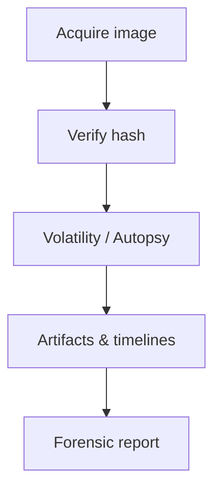

# Disk & Memory Forensics

Acquire and analyze disk images and memory dumps.

## Overview Diagram

## How It Works

**Disk forensics** analyzes filesystem images acquired with write blockers to recover deleted files, registry hives, browser history, and malware persistence. **Memory forensics** examines RAM dumps for running processes, network connections, injected code, and credentials not present on disk.

Timestamps (MFT, USN journal, prefetch) build activity timelines. Volatility/Rekall parse kernel structures to extract artifacts without booting the suspect system.

## Exploitation

1. **Acquire**: FTK Imager or `dd` with hardware write blocker; document hashes.
2. **Mount safely**: read-only loop mount or forensic suites (Autopsy, Arsenal Image Mounter).
3. **Parse artifacts**: MFT entries, `$LogFile`, registry `Run` keys, Shimcache.
4. **Memory dump**: WinPMEM, LiME on Linux; capture before power-off when possible.
5. **Volatility**: `windows.pslist`, `windows.malfind`, `windows.netscan` for IoCs.
6. **Timeline**: Plaso/log2timeline to correlate file, registry, and event log activity.

Maintain chain of custody documentation for legal admissibility.

## Defense & Mitigation

- Enable **centralized logging** and EDR memory scanning for live response.
- Full disk encryption with secure key management; TPM binding.
- Restrict physical access; secure boot and measured boot where applicable.
- Regular forensic readiness drills; pre-approved acquisition playbooks.
- Retain logs and images per policy; immutable WORM storage for evidence.
- Train IR team on proper acquisition to avoid spoliation.

## Methodology

- [ ] Create forensic images with write blockers
- [ ] Parse filesystem artifacts
- [ ] Extract processes and network connections from memory
- [ ] Maintain chain of custody

## Tools

| Tool | Usage |
|------|-------|
| `ftk imager` | Disk imaging — [AccessData FTK](https://www.exterro.com/ftk-imager) |
| `volatility` | [Memory forensics](../../TOOLS_GUIDE.md#volatility) |
| `autopsy` | Digital forensics — [Autopsy](https://www.autopsy.com/) |

## Verification Checklist

- [ ] Review scope and rules of engagement
- [ ] Document baseline behavior
- [ ] Test edge cases and parser differentials
- [ ] Capture proof-of-concept safely
- [ ] Write remediation guidance
