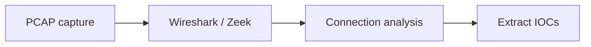
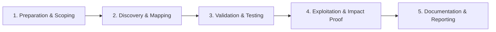

# Network Forensics

Analyze PCAPs and network logs during investigations.

## Overview Diagram

Visual summary of the **attack/data flow** and the **five-phase testing workflow** for this topic.

### Attack / Data Flow

### Testing Workflow

## How It Works

**Network forensics** reconstructs incidents from PCAP files, firewall logs, proxy logs, DNS queries, and NetFlow. Analysts extract C2 channels, exfiltration volumes, lateral movement paths, and malware downloads embedded in HTTP/SMTP traffic.

Encrypted traffic limits payload visibility; metadata (SNI, JA3, timing, volumes) still supports detection. SSL decryption in enterprise proxies enables deeper inspection where lawful.

## Exploitation

1. **Collect PCAP**: span ports, Zeek logs, or full packet capture during incidents.
2. **Wireshark**: filter `http`, `dns`, `tls.handshake`; export objects from HTTP.
3. **Zeek/Suricata**: generate structured logs for long-term retention vs raw PCAP size.
4. **Session rebuild**: NetworkMiner or `tcpflow` for file extraction.
5. **Timeline**: correlate firewall deny/allow with endpoint telemetry.
6. **C2 identification**: beaconing intervals, rare JA3 fingerprints, DGA domains.

Document IoCs: IPs, domains, URIs, user-agents, certificate serials.

## Defense & Mitigation

- **Retain logs** with sufficient TTL for investigation (90+ days minimum for many threats).
- Deploy Zeek/Suricata at network boundaries and critical VLANs.
- Enable DNS logging; block known malicious resolvers at egress.
- Network segmentation limits PCAP scope during lateral movement.
- TLS inspection on corporate proxies with privacy policy compliance.
- Regular PCAP exercises in IR tabletop scenarios.

## Pro Tips

Practical advice from real engagements — use these to test faster and report better.

!!! tip "Zeek for scale"
    Wireshark for detail, Zeek for enterprise PCAP volume.

!!! tip "Beacon detection"
    Regular interval connections — plot time delta in spreadsheet.

!!! tip "JA3/JA3S"
    TLS fingerprint survives IP rotation.

!!! tip "DNS exfil"
    Long TXT queries and rare domains in PCAP.

!!! tip "Privacy minimization"
    Redact unrelated user traffic in shared PCAP extracts.

## Testing Methodology

Work through each phase in order. Every step has a checkbox — complete them all for thorough, reproducible coverage.

### Phase 1 — Preparation & Scoping

- [ ] Confirm target is in program scope and ROE allows this test type
- [ ] Set up isolated lab or proxy (Burp/ZAP) with scope filters
- [ ] Document baseline application behavior and account roles
- [ ] Identify test accounts for each privilege level
- [ ] Define capture window and legal authorization

### Phase 2 — Discovery & Mapping

- [ ] Collect PCAP from tap or SPAN port
- [ ] Analyze with Wireshark and Zeek
- [ ] Reconstruct sessions and file extractions
- [ ] Identify C2 beaconing patterns

### Phase 3 — Validation & Testing

- [ ] Extract IOCs: IPs, domains, JA3, URIs
- [ ] Correlate with endpoint and DNS logs
- [ ] Build attack timeline from packets
- [ ] Document retention and privacy handling

### Phase 4 — Exploitation & Impact Proof

- [ ] Deliver IOC package to SOC for blocking
- [ ] Archive PCAP with access controls

### Phase 5 — Documentation & Reporting

- [ ] Write step-by-step reproduction with HTTP requests/responses
- [ ] Capture screenshots or video showing impact (redact sensitive data)
- [ ] Rate severity using program CVSS or impact matrix
- [ ] Provide concrete remediation guidance for developers
- [ ] Retest after fix if program allows verification

## Tools

| Tool | Usage |
|------|-------|
| `wireshark` | [Packet analysis](https://www.wireshark.org/) |
| `zeek` | Network security monitoring — [zeek.org](https://zeek.org/) |
| `networkminer` | Network forensics — [networkminer.com](https://www.networkminer.com/) |

## Verification Checklist

- [ ] Review scope and rules of engagement
- [ ] Document baseline behavior
- [ ] Test edge cases and parser differentials
- [ ] Capture proof-of-concept safely
- [ ] Write remediation guidance
