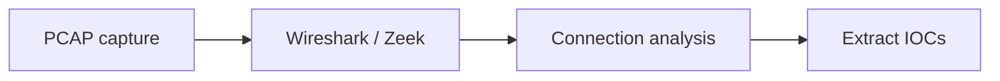

# Network Forensics

Analyze PCAPs and network logs during investigations.

## Overview Diagram

## How It Works

**Network forensics** reconstructs incidents from PCAP files, firewall logs, proxy logs, DNS queries, and NetFlow. Analysts extract C2 channels, exfiltration volumes, lateral movement paths, and malware downloads embedded in HTTP/SMTP traffic.

Encrypted traffic limits payload visibility; metadata (SNI, JA3, timing, volumes) still supports detection. SSL decryption in enterprise proxies enables deeper inspection where lawful.

## Exploitation

1. **Collect PCAP**: span ports, Zeek logs, or full packet capture during incidents.
2. **Wireshark**: filter `http`, `dns`, `tls.handshake`; export objects from HTTP.
3. **Zeek/Suricata**: generate structured logs for long-term retention vs raw PCAP size.
4. **Session rebuild**: NetworkMiner or `tcpflow` for file extraction.
5. **Timeline**: correlate firewall deny/allow with endpoint telemetry.
6. **C2 identification**: beaconing intervals, rare JA3 fingerprints, DGA domains.

Document IoCs: IPs, domains, URIs, user-agents, certificate serials.

## Defense & Mitigation

- **Retain logs** with sufficient TTL for investigation (90+ days minimum for many threats).
- Deploy Zeek/Suricata at network boundaries and critical VLANs.
- Enable DNS logging; block known malicious resolvers at egress.
- Network segmentation limits PCAP scope during lateral movement.
- TLS inspection on corporate proxies with privacy policy compliance.
- Regular PCAP exercises in IR tabletop scenarios.

## Methodology

- [ ] Extract IoCs from packet captures
- [ ] Rebuild sessions and file transfers
- [ ] Correlate firewall and proxy logs
- [ ] Timeline attacker activity

## Tools

| Tool | Usage |
|------|-------|
| `wireshark` | [Packet analysis](https://www.wireshark.org/) |
| `zeek` | Network security monitoring — [zeek.org](https://zeek.org/) |
| `networkminer` | Network forensics — [networkminer.com](https://www.networkminer.com/) |

## Verification Checklist

- [ ] Review scope and rules of engagement
- [ ] Document baseline behavior
- [ ] Test edge cases and parser differentials
- [ ] Capture proof-of-concept safely
- [ ] Write remediation guidance
